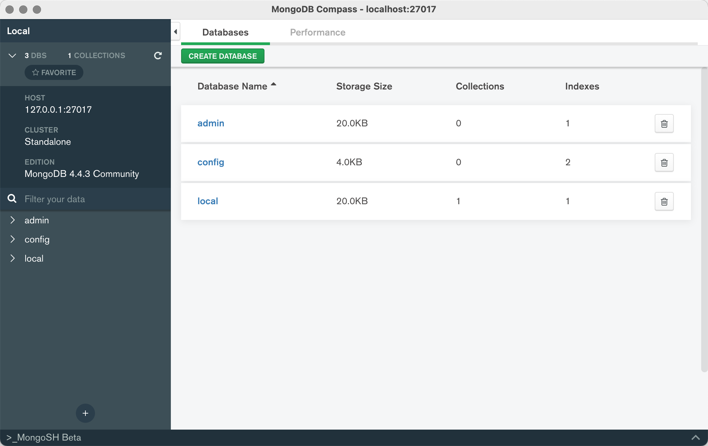

```
{
    "url": "mongo-install",
    "time": "2018/12/10 06:37",
    "tag": "MongoDB"
}
```

通过官方下载社区版本（MongoDB Community Server），选择对应平台下载后解压即可看到可执行程序。

```
$ ls ~/data/mongodb-macos-x86_64-4.4.3/
LICENSE-Community.txt MPL-2                 README                THIRD-PARTY-NOTICES   bin

$ ll ~/data/mongodb-macos-x86_64-4.4.3/bin/
total 320808
-rwxr-xr-x@ 1 peng  staff      7683 12 22 07:42 install_compass
-rwxr-xr-x  1 peng  staff  43147504 12 22 07:39 mongo
-rwxr-xr-x  1 peng  staff  68692572 12 22 07:40 mongod
-rwxr-xr-x  1 peng  staff  52399600 12 22 07:32 mongos
```

方便访问以设置bin目录到环境变量，创建配置文件`mongod.conf`：

```
systemLog:
    destination: file
    path: "/Users/peng/data/mongodb-macos-x86_64-4.4.3/logs/mongodb.log"
    logAppend: true
storage:
    dbPath: "/Users/peng/data/mongodb-macos-x86_64-4.4.3/data/"
    journal:
        enabled: true
net:
    port: 27017
    bindIp: 127.0.0.1
processManagement:
    fork: true
    pidFilePath: "/Users/peng/data/mongodb-macos-x86_64-4.4.3/logs/mongod.pid"

```

启动服务

```
$ mongod -f ~/data/mongodb-macos-x86_64-4.4.3/mongod.conf
about to fork child process, waiting until server is ready for connections.
forked process: 49268
child process started successfully, parent exiting

$ mongod -f ~/data/mongodb-macos-x86_64-4.4.3/mongod.conf shutdown
```

通过官方安装MongoDB GUI管理工具：MongoDB Compass，效果图如下：




---

- [1] [MongoDB官网](https://www.mongodb.com)
- [2] [MongoDB数据库系列](https://www.kancloud.cn/noahs/linux/1425612)