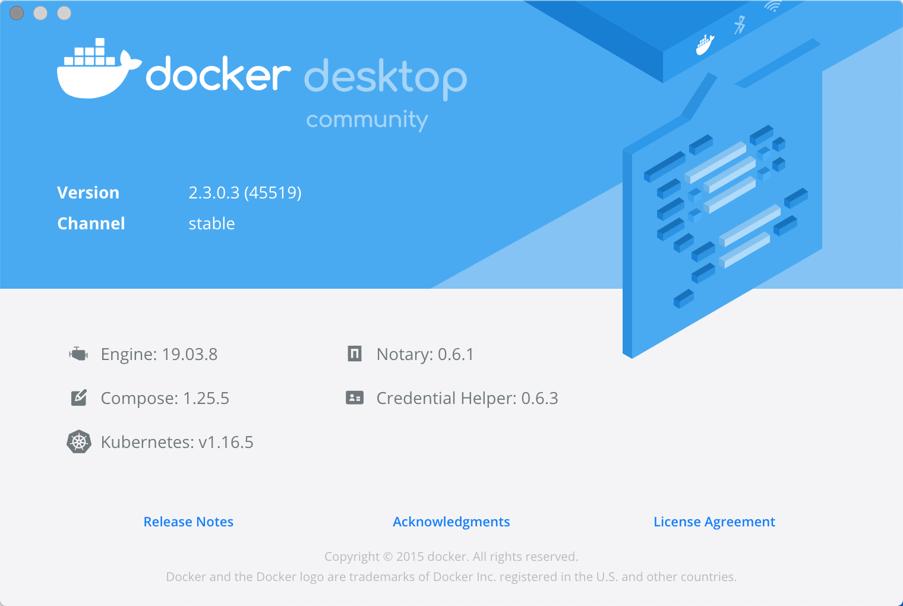
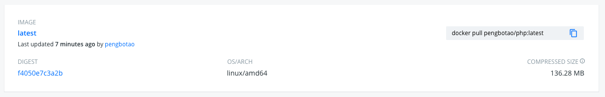

```
{
    "url": "docker-start",
    "time": "2020/06/14 09:30",
    "tag": "Docker,容器化"
}
```

# 一、关于Docker

关于Docker介绍可以看这篇文章：10分钟看懂Docker和K8S [<sup>1</sup>](#refer)。

## 1.1 安装

通过`docker.com`即可下载`Docker Desktop`，这里本机为Mac，安装好之后如下图（Win也类似），`Docker`环境就配置好了。



## 1.2 概念说明

Docker中有几个基本概念，仓库、镜像、容器，看看下面的理解。

### 1.2.1 仓库

仓库就和现实中的仓库差不多的意思，用来存放镜像文件。Docker官方的仓库地址：`hub.docker.com`。但国内访问官方仓库可能比较慢，国内常用的镜像仓库有：

- Docker中国区官方镜像：https://registry.docker-cn.com
- 网易：http://hub-mirror.c.163.com
- 中国科技大学：https://docker.mirrors.ustc.edu.cn

### 1.2.2 镜像

镜像就跟以前的ISO系统镜像文件类似，打包好的一套程序。有一些基础镜像，比如

- 系统层级：`CentOS`、`Ubuntu`、`debian`
- 应用层级：`Nginx`、`Python`、`Mysql`

简单理解，如果要安装个Nginx，把镜像下载到本地，执行下启动命令就可以了。

### 1.2.3 容器

镜像实例化之后运行起来就是容器了，容器才有生命力。按以往理解类似运行起来的虚拟机，容器里有一套系统，应用程序能在这里面执行。但容器里的这套系统对比虚拟机要轻量很多。我们可以运行`CentOS`容器，也可以在`CentOS`里安装好`Nginx`后打包为镜像，下次就可以直接复用了。

## 1.3 配置示例

这里以`Nginx`为例来看看`Docker`的操作流程。

### 1.3.1 搜索仓库镜像

```
$ docker search nginx

NAME            DESCRIPTION                 STARS    OFFICIAL    AUTOMATED
nginx           Official build of Nginx.    13610    [OK]
```

### 1.3.2 拉取镜像

```
$ docker pull nginx

Using default tag: latest
latest: Pulling from library/nginx
bf5952930446: Pull complete
cb9a6de05e5a: Pull complete
9513ea0afb93: Pull complete
b49ea07d2e93: Pull complete
a5e4a503d449: Pull complete
Digest: sha256:b0ad43f7ee5edbc0effbc14645ae7055e21bc1973aee5150745632a24a752661
Status: Downloaded newer image for nginx:latest
docker.io/library/nginx:latest
```

就像从`Github`上拉代码仓库一样，将`nginx`镜像拉取到本地。可以看到`Using default tag: latest`，获取的默认标签为`latest`标签的镜像，标签的含义就类似`v1`、`v2`版本，不指定就拉的最新版。如果要指定标签可以这么拉：`docker pull nginx:1.19.2`，冒号后面跟标签，一般指定标签比较好。


### 1.3.3 查看镜像

```
# 查看所有本地镜像
$ docker images

# 只查看nginx的镜像
$ docker images nginx

REPOSITORY          TAG                 IMAGE ID            CREATED             SIZE
nginx               latest              4bb46517cac3        4 hours ago         133MB
```

### 1.3.4 创建容器并启动

```
# 创建一个容器并启动
$ docker run -p 6001:80 --name nginx-docker-test nginx

# 创建容器并在后台执行
$ docker run -d -p 6001:80 --name nginx-docker-test nginx
20678b82bf9d94d55219830da931efc6ce35280f339e00c53ad0e2225615cccf
```

通过`docker run`可以从镜像创建一个容器，上面示例可以创建一个容器，容器名称为`nginx-docker-test`。可以不指定名称，会随机给一个名称。需要注意的是并不是每次启动都使用`run`命令，`run`命令用途是创建容器。如果重复执行上面命名会报容器名冲突：`Conflict. The container name "/nginx-docker-test" is already in use by container`。容器的启停可以看后面章节。

### 1.3.5 访问服务

前一章节就启动了容器，其中启动参数`-p 6001:80`表示将容器的80端口映射到本机的6001端口上，所以可以直接通过本机来访问：`http://127.0.0.1:6001/`，也可以在配置文件里指定`server_name`，

```
server {
    listen       80;
    listen  [::]:80;
    server_name  t.local;
```

容器里多个项目监听同一端口，宿主机器配置host后就相当于多站点支持了。

### 1.3.6 日常管理

已经创建的容器，通过`Docker-Desktop`可以方便的进行管理，本章节的功能上面都可以看到。

**1. 查看容器**

```
# 查看正在运行的容器
$ docker ps

CONTAINER ID        IMAGE    COMMAND                  CREATED             STATUS              PORTS                  NAMES
6eaf423678ed        nginx   "/docker-entrypoint.…"   2 minutes ago       Up 2 minutes        0.0.0.0:6001->80/tcp   nginx-docker-test

# 查看所有容器
$ docker ps -a
```

**2. 查看容器日志**

```
docker logs nginx-docker-test
```

**3. 查看容器配置**

```
$ docker inspect nginx-docker-test
```

**4. 查看容器统计**

```
$ docker stats nginx-docker-test
```

**5. 容器启停与删除**

```
# 启动
$ docker start nginx-docker-test
nginx-docker-test

# 停止
$ docker stop nginx-docker-test
nginx-docker-test

# 重启
$ docker restart nginx-docker-test
nginx-docker-test

# Kill
$ docker kill nginx-docker-test
nginx-docker-test

# 删除
$ docker rm nginx-docker-test
nginx-docker-test
```

**6. 查看端口映射**

```
$ docker port nginx-docker-test
80/tcp -> 0.0.0.0:6001
```

**7. 重启服务内的Nginx**
```
$ docker exec nginx-docker-test bash -c '/usr/sbin/nginx -t'
nginx: the configuration file /etc/nginx/nginx.conf syntax is ok
nginx: configuration file /etc/nginx/nginx.conf test is successful
```

# 二、示例容器

## 2.1 容器说明

到这一步Nginx示例容器就搭建好了，他其实是一套精简的`Linux`系统，在这套系统上事先配好了`Nginx`，装好之后大小是`133M`，可以通过下面的命令进入到容器，之后就类似在日常的ECS里操作了，但因为比较精简，所以部分功能需要自己安装。

```
$ docker exec -it nginx-docker-test bash
root@6eaf423678ed:/# more /etc/issue
Debian GNU/Linux 10 \n \l
```

`Linux`也有不同的版本，比如`Alpine Linux`就只有5MB，对比起来就更轻量级了。`nginx`也有对应的镜像：`docker pull nginx:alpine`。

所以像`Ubuntu`，`Centos`也都有相应的镜像，通过`https://hub.docker.com/search?q=&type=image`可以看看常见的一些镜像。

## 2.2 nginx-docker-test

回到的`nginx-docker-test`这个容器，服务确实启起来了，但日常配置文件、web目录这些都还在容器里，直接进容器操作也比较麻烦。端口可以映射，目录也可以，可以将相应的配置目录映射到本机来，这样子日常会更方便些。


建立本地路径

```
$ mkdir -p ~/docker/nginx/{conf,conf.d,html,logs}
```

拷贝下配置文件，如果熟悉Nginx的话可以不用拷贝。

```
$ docker cp 4bb46517cac3:/etc/nginx/nginx.conf ~/docker/nginx/conf/
$ docker cp 4bb46517cac3:/etc/nginx/conf.d/default.conf ~/docker/nginx/conf.d/
```

删掉容器后，重新创建一个容器

```
docker run -d -p 6001:80 \
-v ~/docker/nginx/html:/usr/share/nginx/html \
-v ~/docker/nginx/conf/nginx.conf:/etc/nginx/nginx.conf \
-v ~/docker/nginx/logs:/var/log/nginx \
-v ~/docker/nginx/conf.d/:/etc/nginx/conf.d \
--name nginx-docker-test nginx

2af759e3527a2177c0f1d27f8a82f4478688eae44d3c2ca14beabefbf0e38d82
```

`-v` 相当于做个文件目录的映射，前面是本机目录，后面是容器里的目录，挂载之后，在本机改动即可生效。再次访问6001端口可以看到403，这是因为我们的html是个空目录，创建文件后访问即可。

## 2.3 修改容器配置

容器创建之后是否可以修改启动配置？比如`Nginx`新增一个站点，想增加一个端口映射。

- Linux: /var/lib/docker/containers/容器/{config.v2.json, hostconfig.json}
- Mac:
    - 进入linux虚拟机: cd  ~/Library/Containers/com.docker.docker/Data/vms/0
    - screen tty
    - 后续同Linux

大概就是可以改，Mac下改起来似乎不太方便，未实际操作，等Dokcer官方GUI做的更方便些。

# 三、搭建Web环境

## 3.1 安装PHP

```
$ mkdir -p ~/docker/www
$ docker pull php:7.4.8-fpm
$ docker run -d -v ~/docker/www:/var/www/html --name php-7.4.8 php:7.4.8-fpm
```

默认有一些扩展没装，进容器安装pdo_mysql扩展

```
$ docker exec -it php-7.4.8 bash
$ docker-php-ext-install pdo_mysql
```

## 3.2 安装Ngnix

```
$ mkdir -p ~/docker/nginx/{conf,conf.d,html,logs}
$ docker pull nginx
$ docker run -d -p 6001:80 \
-v ~/docker/www:/usr/share/nginx/html \
-v ~/docker/nginx/conf/nginx.conf:/etc/nginx/nginx.conf \
-v ~/docker/nginx/logs:/var/log/nginx \
-v ~/docker/nginx/conf.d/:/etc/nginx/conf.d \
--link php-7.4.8:php748 \
--name nginx-latest nginx
```

比前面多了一条`--link php-7.4.8:php748`。会修改Nginx容器下的`/etc/hosts`文件：`172.17.0.3	php748 b6f4269fba2a php-7.4.8`，nginx访问php748就访问到PHP容器上去。调整配置文件，主要`root`和`fastcgi_param`两个目录对应服务器上的地址，按对应服务器上目录能获取到就行。

```
vi ~/docker/nginx/conf.d/default.conf

location ~ \.php$ {
    fastcgi_pass   php748:9000;
    fastcgi_index  index.php;
    fastcgi_param  SCRIPT_FILENAME  /var/www/html/$fastcgi_script_name;
    include        fastcgi_params;
}
```


## 3.3 安装Mysql

```
$ mkdir -p ~/docker/mysql/{conf,data,logs}
$ docker pull mysql:5.7
$ docker run -p 3406:3306 --name mysql \
-v ~/docker/mysql/conf:/etc/mysql \
-v ~/docker/mysql/logs:/var/log/mysql \
-v ~/docker/mysql/data:/var/lib/mysql \
-e MYSQL_ROOT_PASSWORD=123456 \
-d mysql:5.7
```

该方式下安装方式都类似，容器里已经打包好了对应的服务，做一些端口、环境变量或者目录的映射，然后就可以使用了。要增加站点就在Nginx里配置一下；增加数据库也可以直接在容器里添加；如果需要不同的PHP版本，Nginx也可以再link不同的php容器版本，conf文件里指定一下就可以了。同时，上面服务都是运行Debian系统中，相当于启了3个Linux系统，每个容器都有百兆级别了。也可以搜索lnmp的镜像，一个系统里包含了多个服务，但整个容器就有几个G了。


所以镜像里究竟需要提供什么样的功能，怎么样的组合方式会更友好呢？这个留待我们以后在分析。


# 四、镜像操作

前面有说过我们可以通过`docker images`查看镜像，也可以通过`docker image rm 镜像ID`删除镜像。但前面的镜像都是公共镜像，接下来看看如何创建及提交自己的镜像。

## 4.1 创建镜像

### 4.1.1 基于容器创建

我们以PHP为例，需要先运行一个容器，然后进入容器后可以做一些修改，这里增加了`pdo_mysql`扩展，接下来可以根据容器创建一个新镜像。

```
$ docker run -it php:7.4.8-fpm bash
root@5b98ecfd12e6:/var/www/html# docker-php-ext-install pdo_mysql
Configuring for:
PHP Api Version:         20190902
Zend Module Api No:      20190902
Zend Extension Api No:   320190902
checking for grep that handles long lines and -e... /bin/grep
```

用`commit`命令创建镜像

```
$ docker commit -m "ADD pdo_mysql" -a "peng" 5b98ecfd12e6 pengbotao/php
sha256:ca0d0db3b3f9540dc9a7611ecd87a66dd56384971a42dd91e99b85666e7acdd1
```

再次查看镜像，可以看到有一个新的镜像产生，接下来我们就可以根据这个镜像产生新的容器，新容器里就包含了`pdo_mysql`扩展。

```
$ docker images
REPOSITORY        TAG               IMAGE ID            CREATED             SIZE
pengbotao/php     latest            ca0d0db3b3f9        10 seconds ago      405MB
nginx             latest            4bb46517cac3        3 days ago          133MB
php               7.4.8-fpm         4fca4012a2d7        12 days ago         405MB

$ docker run -it pengbotao/php bash
root@4d04e5e3c73b:/var/www/html# php -m | grep pdo_mysql
pdo_mysql
```

也可以删除镜像，操作方式和删除容器类似（也可以用`docker image rm pengbotao/php`）：

```
$ docker rmi pengbotao/php
Untagged: pengbotao/php:latest
Deleted: sha256:ca0d0db3b3f9540dc9a7611ecd87a66dd56384971a42dd91e99b85666e7acdd1
Deleted: sha256:7d6334b5e82cbe2eed96dae6429c989053c445be20068f64ba58948fdb8b2e21
```

### 4.1.2 基于Dockfile创建

一般不推荐使用`docker commit`来创建镜像，常见的镜像创建方式是通过`Dockfile`来创建，通过文本的方式来描述镜像的创建过程，以本博客为例，找系统内任意空目录，创建`Dockerfile`文件并写入下面内容：

```
FROM golang:1.14

EXPOSE 8001

RUN go env -w GOPROXY=https://goproxy.io,direct \
&& go get -v github.com/pengbotao/itopic.go \
&& mv /go/bin/itopic.go /go/src/github.com/pengbotao/itopic.go/ 

VOLUME [ "/go/src/github.com/pengbotao/itopic.go/" ]

WORKDIR /go/src/github.com/pengbotao/itopic.go/

CMD [ "/go/src/github.com/pengbotao/itopic.go/itopic.go", "-host", "0.0.0.0:8001"]
```

切换到该目录执行创建镜像

```
$ docker build -t pengbotao/itopic.go .
Sending build context to Docker daemon  2.048kB
Step 1/6 : FROM golang:1.14
 ---> baaca3151cdb
Step 2/6 : EXPOSE 8001
 ---> Running in 801cf0f4023e
Removing intermediate container 801cf0f4023e
 ---> 283da70700dc
Step 3/6 : RUN go env -w GOPROXY=https://goproxy.io,direct && go get -v github.com/pengbotao/itopic.go && mv /go/bin/itopic.go /go/src/github.com/pengbotao/itopic.go/
 ---> Running in bb86d3308fde
github.com/pengbotao/itopic.go (download)
github.com/pengbotao/itopic.go/vendor/github.com/russross/blackfriday
github.com/pengbotao/itopic.go/models
github.com/pengbotao/itopic.go
Removing intermediate container bb86d3308fde
 ---> af70d34ad3f4
Step 4/6 : VOLUME [ "/go/src/github.com/pengbotao/itopic.go/" ]
 ---> Running in a9329d31d558
Removing intermediate container a9329d31d558
 ---> f9cbffdff0f1
Step 5/6 : WORKDIR /go/src/github.com/pengbotao/itopic.go/
 ---> Running in ab89245f47d2
Removing intermediate container ab89245f47d2
 ---> d6a675b4cf39
Step 6/6 : CMD [ "/go/src/github.com/pengbotao/itopic.go/itopic.go", "-host", "0.0.0.0:8001"]
 ---> Running in 6b601add4806
Removing intermediate container 6b601add4806
 ---> 36e405364fd8
Successfully built 36e405364fd8
Successfully tagged pengbotao/itopic.go:latest
```

通过镜像创建容器：

```
docker run -d -p 8001:8001 --name itopic pengbotao/itopic.go
```

第一种方式在容器中的更改来对更隐蔽，使用者可能并不知道容器里做了什么操作，后者则更清晰，通常情况下更推荐用`Dockerfile`来构建镜像。下一篇将单独介绍`Dockerfile`。

## 4.2 镜像导入导出

主要使用以下2个命令，用于将镜像存储到本地或者从本地导入到docker，就像apk的安装包可以从应用市场安装，也可以通过导出的镜像文件安装：

- docker save
- docker load

### 4.2.1 导出镜像

比如将`nginx:alpine`这个镜像导出到本地：

`docker save -o ~/docker/nginx.alpine.tar nginx:alpine`

### 4.2.2 导入镜像

将导出的镜像导入：

`docker load -i ~/docker/nginx.alpine.tar`


## 4.3 提交镜像

```
Usage:	docker push [OPTIONS] NAME[:TAG]
```

```
$ docker push pengbotao/php

The push refers to repository [docker.io/pengbotao/php]
cd012f031239: Pushed
6e0f79ac7957: Mounted from library/php
25f8331c0efb: Mounted from library/php
bb8384bbf720: Pushed
1bee48636e6c: Mounted from library/php
f81b47f51846: Mounted from library/php
55a7c860d3b5: Mounted from library/php
65bff11b305b: Mounted from library/php
de5ed450c2e9: Mounted from library/php
8bf7a47284aa: Mounted from library/php
d0f104dc0a1f: Mounted from library/mysql
latest: digest: sha256:f4050e7c3a2b0ea2051d103edcccde42326524a6dfe5f483dc1d84ca3b260865 size: 2619
```

这个是推送到docker官方的hub去了， 如果没有登录可以通过`docker login`进行登录操作。也可以通过`docker tag`对镜像重命名，

```
docker tag nginx:alpine pengbotao/nginx
```

用法和`git`类似，冒号前面的表示`REPOSITORY`，仓库默认地址是`docker.io`可以看到第一行有补全，如果想推到其他仓库手动补全一下即可；后面的表示`TAG`，`TAG`可以省略，默认`latest`。

提交之后docker hub上就可以看到了。




我们也可以创建自己的仓库，道理就和`gitlab`类似了，将镜像推送到自己的私有仓库，或者文件的方式传递等。基本就可以解决镜像管理和分享问题了。

# 五、小结

本篇主要介绍了`Docker`的基本用法、容器的启停、镜像的基本制作与分享，接下来我们着重看看通过`Dockerfile`构建自己的镜像。

---
<div id="refer"></div>

- [1] [10分钟看懂Docker和K8S](https://www.cnblogs.com/itbsl/p/10178698.html)
- [2] [使用Docker搭建MySQL服务](https://www.cnblogs.com/sablier/p/11605606.html)
- [3] [关于 Docker 镜像的操作，看完这篇就够啦 !（下）](https://www.cnblogs.com/quanxiaoha/p/10632039.html)
