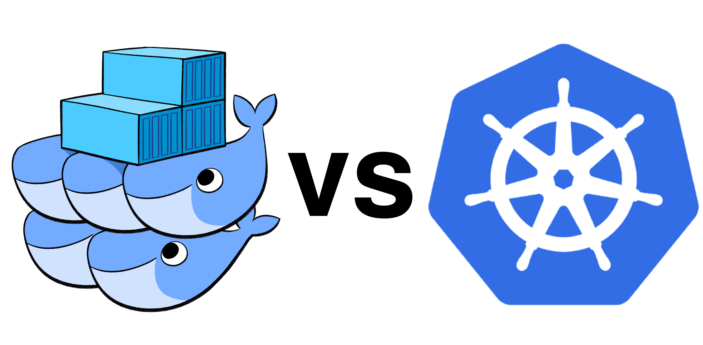

```
{
    "url": "docker-summary",
    "time": "2020/08/15 20:44",
    "tag": "Docker,容器化"
}
```

# 一、概述

## 1.1 Docker是什么？

`Docker`是一个开源的应用容器引擎，让开发者可以打包他们的应用以及依赖包到一个可移植的镜像中，然后发布到任何流行的`Linux`或`Windows`机器上，也可以实现虚拟化。容器是完全使用沙箱机制，相互之间不会有任何接口。


## 1.2 Docker回顾

通过前面几章我们大概了解到：

- Docker的基本概念与用法
- 通过Dockerfile来构建自己的镜像
- 通过Docker Compose来将多个容器组合在一起。
- 简单介绍了Docker的架构以及Docker API

接下来，还有几块内容可以简单了解下。

# 二、数据卷

- （1）volumes：Docker管理宿主机文件系统的一部分，默认位于 /var/lib/docker/volumes 目录中；（**最常用的方式**）

- （2）bind mounts：意为着可以存储在宿主机系统的任意位置；（**比较常用的方式**）

- （3）tmpfs：挂载存储在宿主机系统的内存中，而不会写入宿主机的文件系统；（**一般都不会用的方式**）

# 三、网络模式

| Docker网络模式 | 配置                      | 说明                                                         |
| -------------- | ------------------------- | ------------------------------------------------------------ |
| host模式       | –net=host                 | 容器和宿主机共享Network namespace。                          |
| container模式  | –net=container:NAME_or_ID | 容器和另外一个容器共享Network namespace。 kubernetes中的pod就是多个容器共享一个Network namespace。 |
| none模式       | –net=none                 | 容器有独立的Network namespace，但并没有对其进行任何网络设置，如分配veth pair 和网桥连接，配置IP等。 |
| bridge模式     | –net=bridge               | （默认为该模式）                                             |

# 四、资源分配

## 4.1 限制内存

在Docker中可以强行限制容器的资源使用的限制，即只允许容器使用不超过给定数量的系统内存或其他软限制。下面介绍几个最常用的选项，我们可以在docker run或docker create创建容器时指定，用以限制容器的资源使用限制。

| 选项            | 描述                                                         |
| --------------- | ------------------------------------------------------------ |
| -m 或 -memory=  | 容器可以使用的最大内存量。如果你设置了此选项，那么允许的最小值为4m（4MB）。 |
| --memory-swap   | 允许此容器交换到磁盘的内存量。                               |
| --kernel-memory | 容器可以使用的最大内核内存量，允许的最小值是4m（4MB）。由于内核内存无法换出，因此内核内存不足的容器可能会阻塞主机资源，这可能会对主机和其他容器产生副作用。 |

## 4.2 限制CPU

默认情况下，每个容器对主机CPU周期的访问权限是不受限制的。我们可以设置各种约束来限制给定容器访问主机的CPU周期。大多数用户使用和配置CFS调度程序（默认）或实时调度程序。下面介绍几个常用的选项，用于配置默认的CFS调度程序，以限制容器对于CPU的使用。

| 选项           | 描述                                                         |
| -------------- | ------------------------------------------------------------ |
| --cpus=<value> | 指定容器可以使用的可用CPU资源量，例如宿主机有4个CPU，那你可以给容器设置--cpus="3.5"，则限制容器最多使用3.5个CPU。 |
| --cpuset-cpus  | 限制容器可以使用的特定CPU或核心，例如宿主机有4个CPU，那你可以给容器设置--cpuset-cpus="1,3"，则限制容器只能使用第2个和第4个CPU。 |

# 五、容器监控

## 5.1 监控命令

**5.1.1 查看运行中的容器**

```
$ docker ps
107aad3347d3        redis:6.0.6-alpine               "docker-entrypoint.s…"   3 weeks ago         Up 19 hours         0.0.0.0:6479->6379/tcp   redis
2cfcdb001b7f        nginx:1.19.2-alpine              "/docker-entrypoint.…"   3 weeks ago         Up 19 hours         0.0.0.0:80->80/tcp       nginx
d18931b1bd1b        registry:latest                  "/entrypoint.sh /etc…"   4 weeks ago         Up 19 hours         0.0.0.0:5000->5000/tcp   registry
```

**5.1.2 查看运行容器的进程**

```
$ docker top nginx
PID                 USER                TIME                COMMAND
2421                root                0:00                nginx: master process nginx -g daemon off;
2730                101                 0:00                nginx: worker process
2731                101                 0:00                nginx: worker process
2732                101                 0:00                nginx: worker process
2733                101                 0:00                nginx: worker process
```

**5.1.3 统计容器运行资源**

统计容器的资源利用情况，去掉nginx显示所有运行中容器

```
$ docker stats nginx
CONTAINER ID        NAME                CPU %               MEM USAGE / LIMIT     MEM %               NET I/O             BLOCK I/O           PIDS
2cfcdb001b7f        nginx               0.00%               4.312MiB / 1.944GiB   0.22%               1.84MB / 3.32MB     0B / 0B             5
```

# 六、小结

Docker容器可以让我们以一种不同的方式来运行应用程序，彻底解耦应用程序对环境的依赖，还是值得试一试。Docker本身的学习曲线还好，Docker官方的文档 [<sup>[1]</sup>](#refer)算是比较丰富，学习起来也不怎么费劲。

但学到这里可以想想该如何将Docker用于生产环境呢？通过手动映射端口、维护容器请求代理吗？这就有点为了容器化而容器化了。Docker真正繁琐的地方在于如何有效的管理Docker容器，容器的扩容缩，服务端口的暴露，存储卷的管理，而Docker容器本身没有提供这些功能，这正是Docker Swarm、Kubernetes要做的事情。

所以，容器只是最底层的那一个步骤，是第一步，如何有效管理容器并运用到生产环境才是接下来要学习的内容。



---

<div id="refer"></div>

- [1] [docs.docker.com](https://docs.docker.com)
- [2]《第一本Ddocker书》
- [3] [Docker —— 从入门到实践](https://yeasy.gitbook.io/docker_practice/)
- [4] [你必须知道的Docker数据卷(Volume)](https://www.cnblogs.com/edisonchou/p/docker_volumes_introduction.html)
- [5] [Docker四种网络模式](https://www.jianshu.com/p/22a7032bb7bd)
- [6] [你可能不知道的Docker资源限制](https://www.cnblogs.com/edisonchou/p/docker_resource_limitation_introduction.html)

