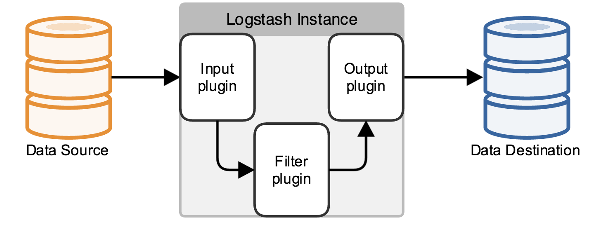

```
{
    "url": "logstash",
    "time": "2021/12/01 22:15",
    "tag": "logstash",
    "toc": "yes"
}
```

# 一、概述

## 1.1 关于Logstash



Logstash 是免费且开放的服务器端数据处理管道，能够从多个来源采集数据，转换数据，然后将数据发送到您最喜欢的“存储库”中。

## 1.2 操作流程

- 安装Logstash：[Download Logstash Free](https://www.elastic.co/cn/downloads/logstash)
- 定义配置文件：通过该文件配置数据源、可以进行数据处理并输出到对应存储中。
- 启动收集程序：`bin/logstash -f logstash.conf`

## 1.3 运行示例

创建配置文件:logstash.conf

```
input {
    stdin { }
}

filter {}

output {
    stdout { }
}
```

执行：`logstash -f logstash.conf --config.reload.automatic`

接下来对Logstash各模块的插件做个简单介绍，详细文档可查看：[Logstash Reference](https://www.elastic.co/guide/en/logstash/current/index.html)

# 二、数据源

官网文档上列了不下50种数据源的计入方式，可见Logstash支持的数据源有多强大。

## 2.1 文件输入

通过File Input 插件进行收集，文档地址：，示例：

```
input {
  file {
    path => "/data/logs/nginx.log"
    start_position => "beginning"
  }
}
```

## 2.2 Kafka输入


# 三、过滤器

## 3.1 Json

```
filter {
    json {
        source => "message"
    }
}
```

## 3.2 grok


# 四、输出

## 4.1 输出到文件


## 4.2 输出到Elasticsearch


---

- [1] [Input Plugins](https://www.elastic.co/guide/en/logstash/current/input-plugins.html)
- [2] [Filter Plugins](https://www.elastic.co/guide/en/logstash/current/filter-plugins.html)
- [3] [Output Plugins](https://www.elastic.co/guide/en/logstash/current/output-plugins.html)
- [4] [Transforming and sending Nginx log data to Elasticsearch using Filebeat and Logstash - Part 1](https://krakensystems.co/blog/2018/logstash-nginx-logs-part-1)
