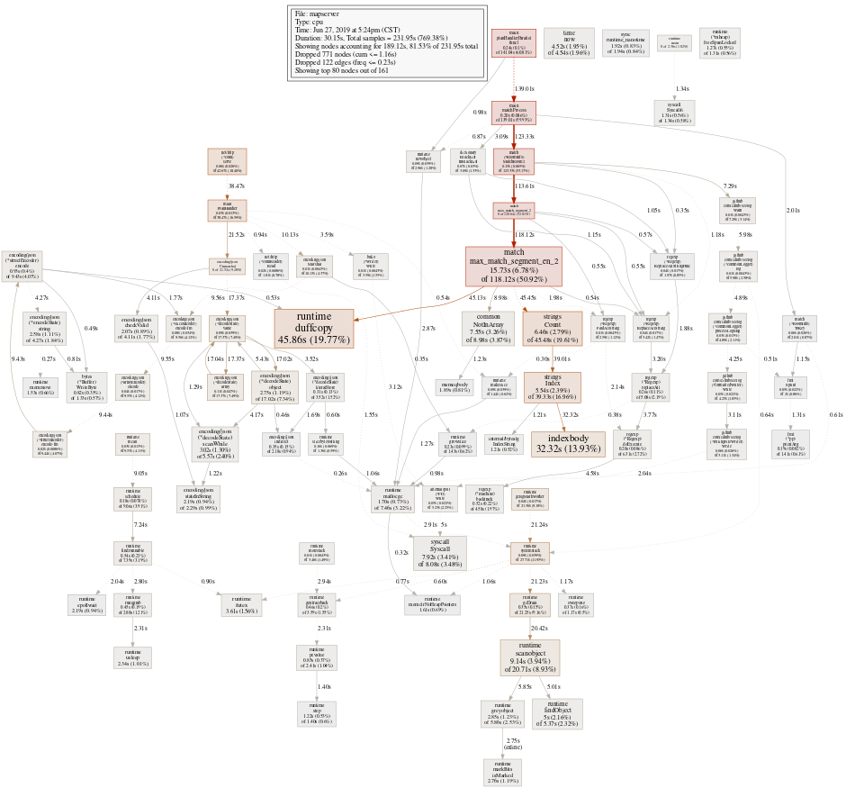

```
{
    "url": "go-pprof",
    "time": "2022/04/05 21:00",
    "tag": "Golang",
    "toc": "yes"
}
```

# 一、关于PProf



# 二、如何集成

- runtime/pprof：自定义设置监测开始与结束点
- net/http/pprof：用于在线服务，里头也是调用`runtime/pprof`

## 2.1 HTTP方式集成

以Http的方式集成比较方便，引入`pprof`包即可。

```
package main

import (
	"net/http"
	_ "net/http/pprof"
)

func main() {
	go func() {
		http.ListenAndServe("localhost:8181", nil)
	}()
	select {}
}
```

## 2.2自定义集成

可手动开启CPU文件的写入。

```
package main

import (
	"fmt"
	"os"
	"runtime/pprof"
)

func main() {
	file, err := os.Create("profile.pprof")
	if err != nil {
		fmt.Println(err)
		return
	}
	pprof.StartCPUProfile(file)
	defer pprof.StopCPUProfile()
}
```

# 三、查看结果

## 3.1 查看CPU

对于非Http服务集成会生成文件；对于Http服务可以访问Http站点，点击`profile`也可下载文件，或者通过curl重定向来下载，默认是采集30s。然后通过`go tool pprof`来查看。

```
$ go tool pprof profile
File: demo
Type: cpu
Time: Feb 21, 2022 at 2:42pm (CST)
Duration: 60s, Total samples = 440ms ( 0.73%)
Entering interactive mode (type "help" for commands, "o" for options)
(pprof) top
Showing nodes accounting for 290ms, 65.91% of 440ms total
Showing top 10 nodes out of 190
      flat  flat%   sum%        cum   cum%
     110ms 25.00% 25.00%      110ms 25.00%  runtime.futex
      40ms  9.09% 34.09%       40ms  9.09%  syscall.Syscall
      30ms  6.82% 40.91%       50ms 11.36%  runtime.newobject
      20ms  4.55% 45.45%       20ms  4.55%  internal/poll.runtime_pollSetDeadline
      20ms  4.55% 50.00%       20ms  4.55%  runtime.epollwait
```

其中，`profile`也可以是远程URL，会先生成文件，然后进入命令交互模式，通过help可查看支持的命令，如：

> go tool pprof http://localhost:8181/debug/pprof/profile?seconds=60

也可以通过启动HTTP服务的方式来查看分析结果，呈现方式更直观、多样。执行下面命令会启动web服务，可以查看调用方式、火焰图等。

> go tool pprof -http :8181 profile

## 3.2 查看内存

> go tool pprof -alloc_space/-inuse_space http://localhost:8181/debug/pprof/heap

```
$ go tool pprof -inuse_space http://localhost:8181/debug/pprof/heap
Fetching profile over HTTP from http://localhost:8181/debug/pprof/heap
Saved profile in pprof\pprof.alloc_objects.alloc_space.inuse_objects.inuse_space.001.pb.gz
Type: inuse_space
Time: Apr 6, 2022 at 11:20am (CST)
Entering interactive mode (type "help" for commands, "o" for options)
(pprof) top
Showing nodes accounting for 17911.99kB, 100% of 17911.99kB total
Showing top 10 nodes out of 15
      flat  flat%   sum%        cum   cum%
15347.76kB 85.68% 85.68% 15347.76kB 85.68%  main.Test (inline)
 1536.01kB  8.58% 94.26%  1536.01kB  8.58%  runtime.doaddtimer
  516.01kB  2.88% 97.14%   516.01kB  2.88%  unicode.init
  512.20kB  2.86%   100%   512.20kB  2.86%  runtime.malg
         0     0%   100% 15347.76kB 85.68%  main.main.func1
         0     0%   100%  1536.01kB  8.58%  runtime.bgscavenge
         0     0%   100%   516.01kB  2.88%  runtime.doInit
         0     0%   100%   516.01kB  2.88%  runtime.main
         0     0%   100%  1536.01kB  8.58%  runtime.modtimer
         0     0%   100%   512.20kB  2.86%  runtime.newproc.func1
(pprof) png
```

生成文件后也可以直接已web的方式来查看结果，会更直观。

