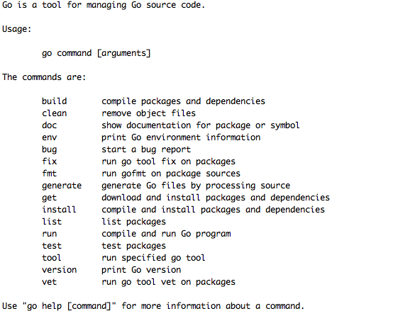

```
{
    "url": "go-start",
    "time": "2016/11/10 19:00",
    "tag": "Golang",
    "toc": "yes"
}
```

# 一、Go安装
Go的安装方式比较简单，没有什么依赖，直接通过官网下载即可。

- 下载地址：`https://golang.org/dl/`。
- win下选择`go1.8.windows-amd64.zip`，mac下选择`go1.8.darwin-amd64.tar.gz`

**说明：**这里直接选择编译好的包，自己再去配置相关环境变量，正常情况下go环境就可以运行了，执行go命令后可以下图效果。

```
# /usr/local/server/go1.8/bin/go
```




## 1.1 添加环境变量
GO的开发过程中还需要配置一些环境变量，GO程序依赖这些配置，所以必须得配。

- GOROOT：go的安装路径
- GOPATH：go的工作目录，可以设置多个目录。`go get`会将包安装在第一个目录，自己的开发习惯是将第一个作为公用库目录，后面的目录才是自己的开发目录，方便区分公用目录和个人目录。`import`的时候会按照GOPATH配置的路径从前往后找。多个路径的分隔符mac下后`冒号`，win下为`分号`。

**mac/linux**

```
# vi ~/.bash_profile
# export GOROOT=/usr/local/server/go1.8
# export GOPATH=/usr/local/server/gopath:/Users/peng/workspace/golang
# export PATH=$PATH:$GOROOT/bin
# source ~/.bash_profile
```

**win**

win下类似，新建GOROOT和GOPATH两个环境变量，将GOROOT/bin目录添加到PATH。

执行`go env`即可看到配置的信息。到这里Golang的安装就配置完了。这里还有个约定，我们把工作目录设置在了`/Users/peng/workspace/golang`，但并不是直接把代码放在这里目录下，这里还约定由三个目录：

- bin: 编译后的可执行文件
- src: 源代码目录
- pkg: 编译后生成的文件（.a）

接下来试试Hello World.

## 1.2 Go Hello World

在`/Users/peng/workspace/golang/src`下创建`hello.go`，内容如下：

```
package main

import "fmt"

func main() {
    fmt.Println("Hello, 世界")
}
```

相关说明：

- 每个go的项目都需要有且仅有一个main函数，为程序的入口函数
- 每个文件也需要定义一个包名，不同的文件可以属于同一个包，效果跟写在一个文件一样，一般同一个目录下的包名相同。
- fmt为系统提供的包，有一些常用的输入输出等，类似这样的包还有很多。

执行，正常将可看到`Hello, 世界`的输出。

``
go run hello.go
``

## 1.3 常用命令
前面执行`go`命令的过程就可以看到go的一些常用命令。介绍几个常用的命令：

- `go version`: 查看go的版本。
- `go run`: 编译并运行go的程序。
- `go build`: 编译项目，生产可执行文件。
- `go fmt`: go有统一的代码风格，此命令用来格式化go代码文件，如：`go fmt hello.go`
- `go get`: 安装go包，通常用来安装github、Google Code上的包。

到这里已经对go有个基本的认识，接下来说下一下IDE的配置，接触过的IDE有LiteIDE和VScode，两个都跨平台，开发go程序也非常方便，还有一些其他的IDE，比如：sublime、GoEclipse等等。这里着重介绍下vscode。

# 二、VsCode IDE介绍
安装vscode的`Go`扩展，首选项里配置GO路径(win下为分号)：

```
"go.gopath":"/usr/local/server/gopath:/Users/peng/workspace/golang",
"go.goroot": "/usr/local/server/go1.8",
```

同时还需要安装一些相应的包，来提升我们的开发效率，比如可以自动提示、代码自动格式化等等，下面为go扩展需要安装的包。

```
go get -v github.com/nsf/gocode
go get -v github.com/rogpeppe/godef
go get -v github.com/zmb3/gogetdoc
go get -v github.com/golang/lint/golint
go get -v github.com/lukehoban/go-outline
go get -v sourcegraph.com/sqs/goreturns
go get -v golang.org/x/tools/cmd/gorename
go get -v github.com/tpng/gopkgs
go get -v github.com/newhook/go-symbols
go get -v golang.org/x/tools/cmd/guru
go get -v github.com/cweill/gotests/...
```

有一点需要注意的是，有些包因为防火墙等原因无法下载，比如`golang.org/x/crypto`直接`go get`可能无法安装，则我们可以在gopath创建对应的目录，然后下载github上的包放到同样的目录即可，比如：`git clone git@github.com:golang/crypto.git`。上面有一些依赖包不翻墙可能无法下载， 则可以通过这种方式来下载。

有代理的可以手动指定代理

```
$ export http_proxy=127.0.0.1:9090 https_proxy=127.0.0.1:9090
```

go的包管理非集中式的，当一个地方不通的时候，可以考虑换个仓库去试。

## 2.1 VsCode常用操作

- `ctrl+shift+p`(`cmd+shift+p`)或`F1`:打开命令面板。
- `ctrl+p`(`cmd+p`):转到文件。输入 `>` 可进入命令面板，同样命令面板按`Backspace`也可进入转到文件操作。在Ctrl+P窗口下还可以
	- 直接输入文件名，快速打开文件
	- ? 列出当前可执行的动作
	- ! 显示Errors或Warnings，也可以Ctrl+Shift+M
	- : 跳转到行数，也可以Ctrl+G直接进入
	- @ 跳转到symbol（搜索变量或者函数），也可以Ctrl+Shift+O直接进入
	- @:根据分类跳转symbol，查找属性或函数，也可以Ctrl+Shift+O后输入:进入
	- \# 根据名字查找symbol，也可以Ctrl+T 
- `` ctrl+` ``可进入命令模式。这个操作非常方便，直接在内部打开命令行。
- 其他一些操作可访问`https://nshen.net/article/2015-11-20/vscode/`

- - - - - - 
到这里golang的基本环境就搭建好了。

# 三、Go编译

```
GOOS=linux GOARCH=amd64 go build -x -o bin/main main.go
GOOS=windows GOARCH=amd64 go build -x -o bin/main main.go
```

- GOOS: darwin、freebsd、linux、windows
- GOARCH: 386、amd64、arm