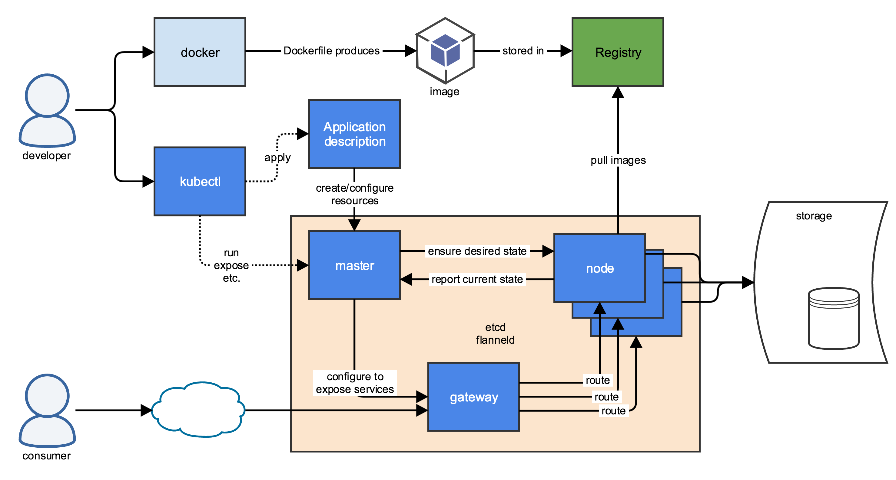

```
{
    "url": "k8s-summary",
    "time": "2020/11/11 08:45",
    "tag": "Kubernetes,容器化",
    "toc": "yes"
}
```

# 一、概述

## 1.1 背景

接触运维以后，发现系统整体资源利用率不高，由于各种环境、软件依赖的问题，大部分机器也只部署一种服务， 所以机器资源浪费比较严重，平均`CPU`使用率大概只有10%。所以要想提升机器利用率，第一步得解决软件依赖的问题。而容器也许是比较好的方案，进而需要了解容器的编排工具`kubernetes`。

## 1.2 容器化改造

对旧系统的改造设计一整套运维流程的变更，镜像打包、发布流程、容器管理、容器监控、日志的收集处理。


# 二、Docker + Kubernetes



## 2.1 关于Docker

`Docker`是一个开源的应用容器引擎， 可以让开发者打包他们的应用以及依赖包到一个轻量级、可移植的容器中，然后发布到任何流行的`Linux`机器上，也可以实现虚拟化。

## 2.2 容器解决了什么问题

虚拟机上一个机器运行多个项目需要考虑软件的环境，系统资源的抢占，而容器之间是完全隔离的，它的运行环境不受其他容器的影响，容器的资源可以做独立控制。这样下来，一台虚拟机就变成了多台容器，管理的粒度更细，资源的利用率会更好些。


## 2.3 关于Kubernetes

`Kubernetes`是`Google`在2014年开源的一个容器集群管理系统，简称`k8s`。

## 2.4 k8s解决了什么问题？

主要解决了容器的编排问题，让容器化在生产环境落地。`k8s`把虚拟机当做一个整体的资源池，自己实现资源的管理，用户只需要向`k8s`申请需要什么样的资源，要部署什么样的应用，`k8s`会从这个资源池中自己寻找资源，创建对应的资源对象。

# 三、Kubernetes特性

## 3.1 健康监测

通过`Pod`的`readiness`可以判断容器是否准备好了，而通过`liveness`可以判断容器是否还存活，类似阿里云SLB的端口监听，如果有异常会且走流量，而`k8s`如果检测到`Pod`异常则会自动修复，确保服务的可靠性。

## 3.2 自我修复

比如`supervisor`突然挂了，进程突然退出了，健康检测失败后则会重启`Pod`尝试恢复服务。


## 3.3 滚动更新与回滚

以往的更新可能会需要自己来控制不同节点的更新，服务的发布重启可能有短暂的服务不可用。而k8s的`Deploy`机制可以让`Pod`一个一个被替换掉，从而实现不间断更新，从系统层面实现不同类型应用的更新。

## 3.4 服务发现

传统配置上需要配置后端IP实现负载均衡，如果IP变化则需要手动调整。而`Service`可以自动发现`Pod`，当新增、重建、或者删除`Pod`后，`Service`都可以自动维护后端PodIP列表，不再需要手动管理后端`PodIP`。

## 3.5 负载均衡

`k8s`对外暴露服务的方式有`NodePort`、`LoadBalancer`、`Ingress`。`Service`实现的是4层的负载均衡，`Ingress`实现的是7层的负载均衡，通过`ingress-controlle`r将请求转向到后端的`Service`。`Service`则可以通过`iptables`、`ipvs`将请求转向后端`Pod`实现负载均衡。

## 3.6 弹性收缩

可以通过对系统资源的监控，实现对`Pod`的自动扩容与缩容，让资源利用上更合理，也让服务变得更高可用。

## 3.7 资源调度

大部分情况都是运维根据项目要求来选择对应的机器，资源的控制由运维控制，k8s将这种控制进行抽象，根据调度策略将`Pod`调度到最优的`Node`节点上，从而充分利用系统资源。当然机器资源的不同，应用要求不同，也可以人为控制节点亲和性。

# 四、k8s如何使用？

## 4.1 基础镜像

比如Python的镜像或者PHP的镜像，基础镜像应该满足不了项目使用，那我们自己就需要在这些基础镜像上做一些扩展或者第三方包的安装，这里应该有两种方式：

- `Dockerfile`继承官方基础镜像。
- `Dockerfile`继承自定义的基础镜像。

自定义相当于在上面在封装一层，安装一些日常需要使用的扩展，大部分应用的`Dockerfile`可能就不需要参与到具体环境的编译来了。

## 4.2 源代码镜像如何打？

**4.1.1 以运行环境镜像为基础打镜像**

比如`Python`项目的源代码，基础镜像为已打好的镜像，直接将代码文件拷贝到镜像中，镜像文件有项目运行的环境。如果对运行环境有什么特殊要求，也可以在`Dockerfile`里直接处理了。

**4.1.2 以通用镜像为基础打镜像**

比如以`Alpine`或者`busybox`为基础镜像，只需要将源代码拷贝到镜像中即可，镜像不具备项目运行的环境。隔离了源代码和环境，应用需要的独立环境只能运维处理，Yaml文件的容器部分需要将源代码镜像和运行环境镜像连接起来。

## 4.3 配置文件如何管理？

应用层级与依赖的数据库配置、日志级别等配置，服务层级有`Nginx`配置文件、`PHP`配置文件等。直接打进镜像后面任意修改就都得更新镜像了。而`Kubernetes`提供了`ConfigMap`、`Secret`、`PV`这些存储方式，类似这种配置文件使用`ConfigMap`、`Secret`这种应该就可以满足了。

然后在`initC`容器里可以将配置文件拷贝到容器里，或者容器直接挂载到特定目录去。

## 4.4 源代码文件如何共享？

比如`Python`的项目需要配个`Nginx`的话，`Nginx`只需要配置反向代理的`IP`即可，而`PHP`必须借助`Nginx`，他们俩都需要可以访问到源代码，就涉及到同一个`Pod`中多容器或者不同`Pod`中数据共享的问题。比如`PHP+Nginx`：

如果处在不同的`Pod`中，`Nginx`的配置文件`fastcgi_pass`可以通过`php-svc`进行关联，如果处理同一个`Pod`里，直接通过9000端口关联即可。数据存储上就必须借助`Volumes`了，比如挂载同一个`nfs`，或者挂载同一个空目录，然后在`initC`容器里将数据写入到这个目录里。


@todo


# 五、相关资料

## 6.1 官方仓库

| 项目          | 官网          | Github                                      | 说明           |
| ------------- | ------------- | ------------------------------------------- | -------------- |
| Kubernetes    | kubernetes.io | https://github.com/kubernetes/kubernetes    | Kubernetes项目 |
| Etcd          | etcd.io       | https://github.com/etcd-io/etcd             | 配置管理       |
| Coredns       | coredns.io    | https://github.com/coredns/coredns          | DNS服务        |
| Flannel       |               | https://github.com/coreos/flannel           | 网络插件       |
| kubeadm       |               | https://github.com/kubernetes/kubeadm       | k8s安装        |
| minikube      |               | https://github.com/kubernetes/minikube      | k8s安装        |
| ingress-nginx |               | https://github.com/kubernetes/ingress-nginx | ingress        |
| traefik       | traefik.io    | https://github.com/traefik/traefik          | ingress        |
| Dashboard     |               | https://github.com/kubernetes/dashboard     |                |
| Helm          | helm.sh       | https://github.com/helm/helm                | 包管理         |
| Prometheus    | prometheus.io | https://github.com/prometheus/prometheus    | 监控报警       |
| Grafana       | grafana.com   | https://github.com/grafana/grafana          | 图表展示       |
| Istio         | istio.io      | https://github.com/istio/istio              |                |

## 6.2 个人整理

| 地址                                                        | 说明                                                    |
| ----------------------------------------------------------- | ------------------------------------------------------- |
| [Docker ( 1 ) - 小试Docker容器环境](docker-start.html)      | Docker基本介绍                                          |
| [Docker ( 2 ) - Dockerfile](dockerfile.html)                | 尝试通过Dockerfile来构建镜像                            |
| [Docker ( 3 ) - Docker Compose](docker-compose.html)        | 通过Docker Compose来组合容器                            |
| [Docker ( 4 ) - Docker Api](docker-api.html)                | Docker的API接口与基本架构介绍                           |
| [Docker ( 5 ) - Docker小结](docker-summary.html)            | Docker小结                                              |
| [Kubernetes基础 ( 1 ) - 环境搭建及概念说明](k8s-start.html) | k8s基础概念介绍，能通过minukube或者docker搭建一套环境。 |
| [Kubernetes基础 ( 2 ) - 资源清单](k8s-yaml.html)            | 通过2、3、4三个章节对基础的Pod和资源清单、存储做介绍。  |
| [Kubernetes基础 ( 3 ) - Pod](k8s-pod.html)                  | Pod的写法及生命周期介绍                                 |
| [Kubernetes基础 ( 4 ) - 存储](k8s-storage.html)             | Pod依赖的存储介绍                                       |
| [Kubernetes基础 ( 5 ) - 控制器](k8s-controller.html)        | 各种控制器的初步介绍，通过控制器来管理Pod               |
| [Kubernetes基础 ( 6 ) - Service](k8s-service.html)          | 通过Service暴露Pod                                      |
| [Kubernetes基础 ( 7 ) - Ingress](k8s-ingress.html)          | 通过7层负载暴露服务                                     |
| [Kubernetes基础 ( 8 ) - 调度器](k8s-scheduler.html)         | 介绍k8s调度器的逻辑                                     |
| [Kubernetes基础 ( 9 ) - 示例](k8s-example.html)             | 通过示例来演示基本的用法                                |
| [Kubernetes基础 ( 10 ) - 小结](k8s-summary.html)            | Kubernetes小结                                          |


## 6.3 容器化经验

- [1] [历时3年，美图全面容器化踩过的坑](https://mp.weixin.qq.com/s/w3tTr29qYelkBeXn1ks4vg)
- [2] [有赞容器化实践](https://segmentfault.com/a/1190000016551255)
- [3] [独角兽完美日记电商系统容器化改造实践](https://yqh.aliyun.com/detail/15962?utm_content=g_1000154186)
- [4] [腾讯万台规模的 Docker 应用实践](https://www.infoq.cn/article/tencent-millions-scale-docker-application-practice/)
- [5] [京东 618：15 万个 Docker 实例，所有业务全部容器化](https://www.infoq.cn/article/2016/06/jd-618-docker-cloud-practice/)
- [6] [运维的辛酸泪：陌陌K8s容器化改造之路](https://www.sohu.com/a/207545870_185201)
- [7] [拉勾网基于 UK8S 平台的容器化改造实践](https://zhuanlan.zhihu.com/p/86570312)

## 6.4 学习资料

- [1] [kubernetes中文社区](https://www.kubernetes.org.cn/)
- [2] [Linux系统运维之路](https://www.cnblogs.com/linuxk/category/1248289.html)
- [3] [BenjaminYangIn](https://www.cnblogs.com/benjamin77/category/1323077.html)


