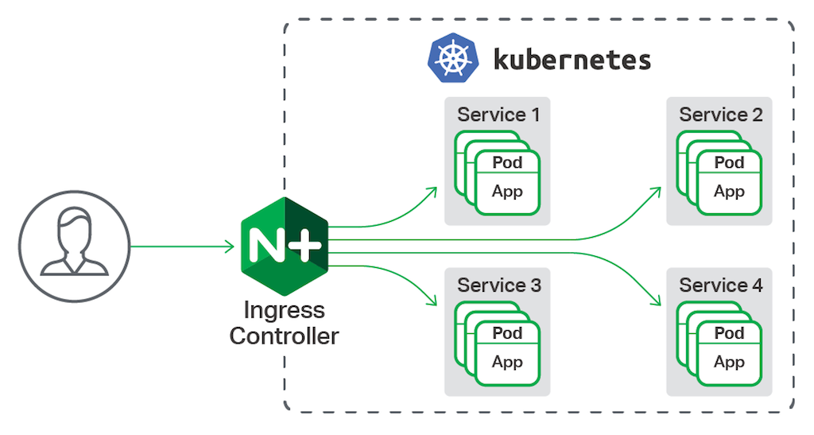
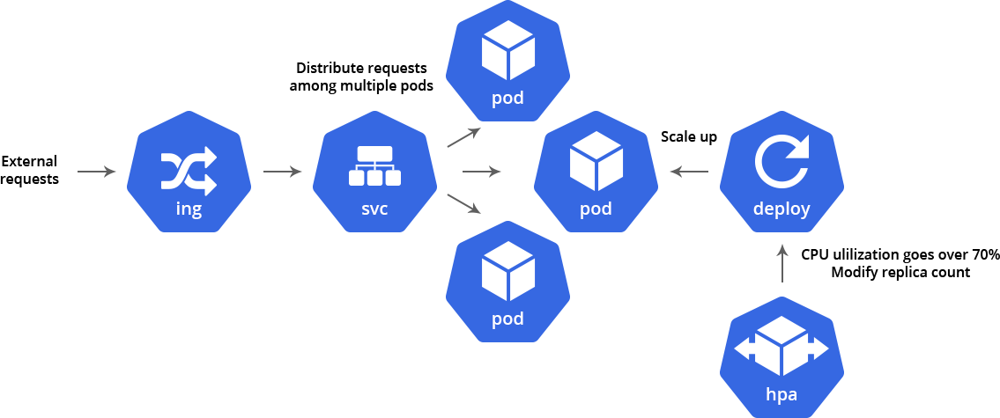

```
{
    "url": "k8s-ingress",
    "time": "2020/10/24 21:21",
    "tag": "Kubernetes,容器化",
    "toc": "yes"
}
```


# 一、概述

## 1.1 关于ingress

在前一章中，我们可以通过`Service`中的`NodePort`、`LoadBalancer`的方式来暴露服务的端口，但这也意味着我们需要管理`NodePort`的端口映射关系。

`Ingress`可以根据`hostname`和`path`将流量转发到不同的`Service`上。使用`Ingress`后的流程图如下，相当于在`Service`上又重新封装了一层，可以根据访问规则，将流量转到不同的`Service`上。



## 1.2 Ingress与Ingress-controller

Ingress对象：k8s中的资源对象，可以通过yaml配置，作用是定义到service的转发规则。

Ingress-controller：实现反向代理及负载均衡的控制器，解析Ingress规则，根据规则进行转发。

常见的`ingress-controller`有：`ingress-nginx`、`traefik`，这里使用`ingres-nginx`

# 二、ingress-nginx

## 2.1 安装ingress-nginx

通过官方仓库说明文档 [<sup>[1]</sup>](#refer)，我的环境是`Docker for Mac`，应该是执行下面语句。

```
$ kubectl apply -f https://raw.githubusercontent.com/kubernetes/ingress-nginx/controller-v0.35.0/deploy/static/provider/cloud/deploy.yaml
```

但需要注意的是文件中这个镜像要翻墙，否则拉取镜像会失败。

```
image: k8s.gcr.io/ingress-nginx/controller:v0.35.0@sha256:fc4979d8b8443a831c9789b5155cded454cb7de737a8b727bc2ba0106d2eae8b
```

我这里的处理方法是借助阿里云的仓库，通过构建`Github`上的`Dockerfile`。然后直接用阿里云的仓库替换掉后再`apply`。

## 2.2 ingress-nginx示例

```
apiVersion: apps/v1
kind: Deployment
metadata:
  name: k8s-go-demo-deploy
  labels:
    project: k8s-go-demo-deploy
spec:
  replicas: 2
  selector:
    matchLabels:
      app: k8s-go-demo
  template:
    metadata:
      labels:
        app: k8s-go-demo
    spec:
      containers:
      - name: k8s-go-demo
        image: pengbotao/k8s-go-demo:v1
        imagePullPolicy: IfNotPresent
        ports:
        - containerPort: 38001

---

apiVersion: v1
kind: Service
metadata:
  name: k8s-go-demo-svc
  labels:
    project: k8s-go-demo-svc
spec:
  selector:
    app: k8s-go-demo
  ports:
  - port: 38000
    targetPort: 38001
    protocol: TCP

--- 

apiVersion: extensions/v1beta1
kind: Ingress
metadata:
  name: k8s-go-demo-ingress
spec:
  rules:
  - host: demo.k8s.com
    http:
      paths:
      - path: /
        backend:
          serviceName: k8s-go-demo-svc
          servicePort: 38000
```

前面的`Deployment`和`Service`用的比较多了，主要看`ingress`，这里根据`serviceName`和`servicePort`进行关联。应用之后可以看到：

```
$ kubectl get ingress
NAME                  HOSTS          ADDRESS     PORTS   AGE
k8s-go-demo-ingress   demo.k8s.com   localhost   80      47m
```

配置`Hosts`后本地浏览器访问`http://demo.k8s.com/`可以看到如下效果。

```
{
    "ClientIP": "192.168.65.3",
    "Host": "k8s-go-demo-deploy-f5fb59494-tgcq4",
    "ServerIP": "10.1.2.115",
    "Time": "2020-09-21 10:00:41",
    "Version": "v1"
}
```

> 默认使用的80端口，如果本地有其他程序占用80端口可能无法访问。

可以进`ingress-nginx`容器看到，相当于通过`Nginx`把请求转给后端`Service`。

```
$ kubectl get pod -n ingress-nginx
NAME                                       READY   STATUS    RESTARTS   AGE
ingress-nginx-controller-5449bc97c-k5g87   1/1     Running   0          8m16s
ingress-nginx-controller-5449bc97c-lgj5c   1/1     Running   0          4h2m
ingress-nginx-controller-5449bc97c-wjxm7   1/1     Running   0          8m16s

$ kubectl exec -it ingress-nginx-controller-5449bc97c-k5g87 -n ingress-nginx /bin/bash

$ cat nginx.conf

server {
    server_name demo.k8s.com ;

    listen 80  ;
    listen 443  ssl http2 ;

    set $proxy_upstream_name "-";

    ssl_certificate_by_lua_block {
            certificate.call()
    }

    location / {

        set $namespace      "default";
        set $ingress_name   "k8s-go-demo-ingress";
        set $service_name   "k8s-go-demo-svc";
        set $service_port   "38000";
        set $location_path  "/";

```

# 三、小结

到这里，访问流程大致如下：



---

<div id="refer"></div>

- [1] [Installation Guide](https://github.com/kubernetes/ingress-nginx/blob/master/docs/deploy/index.md)
- [2] [k8s ingress原理及ingress-nginx部署测试](https://segmentfault.com/a/1190000019908991)
- [3] [kubernetes学习笔记之七： Ingress-nginx 部署使用](https://www.cnblogs.com/panwenbin-logs/p/9915927.html)