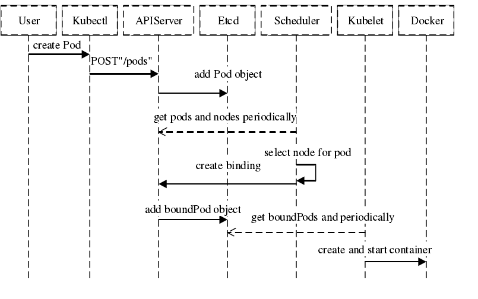

```
{
    "url": "k8s-scheduler",
    "time": "2020/10/30 17:46",
    "tag": "Kubernetes,容器化",
    "toc": "yes"
}
```

# 一、概述

k8s集群后面的资源是一个由许多Node节点组成的大的资源池，每个Node的硬件配置可能不完全相同，比如有些Node内存大，有些CPU多，有些是SSD等等。而Pod则会运行在这样一个资源池里，但每个Pod对资源的要求是不一样的，怎么样合理的分配资源池的资源则是一个很重要的问题。调度器解决的正是Pod该运行在哪一个Node里的问题。

> In Kubernetes, scheduling refers to making sure that Pods are matched to Nodes so that Kubelet can run them.

## 1.1 流程说明



这个网上找的一个创建Pod的基本流程，调度器会为Pod选择合适的Node然后告诉给APIServer，如果找不到则处于Pending状态，直到遇到合适的资源。

## 1.2 调度目标

- 公平性：在调度Pod时需要公平的决策，每个节点都有被分配的机会，调度器需要针对不同节点作出平衡决策。
- 资源高效：最大化提升所有可调度资源的利用率，使有限的CPU、内存等资源服务尽可能更多的Pod。
- 性能：能快速的完成对大规模Pod的调度工作，在集群规模扩增的情况下，依然能确保调度的性能。
- 灵活性：在实际生产中，用户希望Pod的调度策略是可扩展的，从而可以定制化调度算法以处理复杂的实际问题。因此平台要允许多种调度器并行工作，并支持自定义调度器。

## 1.3 调度步骤

为了给Pod找到合适的Node对象，可以分为2个步骤：

- 预选（Filtering）：预选就是从所有的节点里先排除掉硬性条件都不满足的节点，比如Cpu、内存有硬性要求，如果一个都没找到则Pod不会被调度。
- 优选（Scoring）：留下的Node都是可用的，但还会有一些相对合适点，调度器会根据一系列维度进行评分，然后将Pod分配给分数排名最高的节点，如果还有多个则随机选一个。

有点找对象的意思，房子、车子是硬性要求，还得善良、大方、长得漂亮。为了实现满足这些，k8s实现了一系列的具体调度策略。

# 二、调度策略

## 2.1 预选策略


## 2.2 优选策略

# 三、node调度

上面是理论层面的一些信息，在实际运行中可以通过配置的方式来实现对调度策略的干预。比如Reids部署到内存型的机器上，有IP限制的服务部署到指定的服务节点上，有以下三种方式实现对pod调度到node的干预，解决的是pod与node之间的关系。

## 3.1 nodeName

```
$ kubectl get node
NAME             STATUS   ROLES    AGE   VERSION
docker-desktop   Ready    master   11d   v1.19.3
```

这里可以看到node的名称， 可以直接根据指定名称来确定pod可以运行在哪个节点上，如果找不到指定的节点pod将处于pengding状态。

```
apiVersion: apps/v1
kind: Deployment
metadata:
  name: k8s-go-demo
spec:
  replicas: 2
  selector:
    matchLabels:
      app: k8s-go-demo
  template:
    metadata:
      labels:
        app: k8s-go-demo
    spec:
      nodeName: docker-desktop
      containers:
      - name: k8s-go-demo
        image: pengbotao/k8s-go-demo
        imagePullPolicy: IfNotPresent
        ports:
        - containerPort: 38001
```

## 3.2 nodeSelector

比nodeName灵活一点，pod调度时可以根据label进行筛选，相当于有了分组的概念，前提需要先给node打上对应的label，打标签方式如下(pod与node相同)：

```
Examples:
  # Update pod 'foo' with the label 'unhealthy' and the value 'true'.
  kubectl label pods foo unhealthy=true

  # Update pod 'foo' with the label 'status' and the value 'unhealthy', overwriting any existing value.
  kubectl label --overwrite pods foo status=unhealthy

  # Update all pods in the namespace
  kubectl label pods --all status=unhealthy

  # Update a pod identified by the type and name in "pod.json"
  kubectl label -f pod.json status=unhealthy

  # Update pod 'foo' only if the resource is unchanged from version 1.
  kubectl label pods foo status=unhealthy --resource-version=1

  # Update pod 'foo' by removing a label named 'bar' if it exists.
  # Does not require the --overwrite flag.
  kubectl label pods foo bar-
```

然后就可以通过指定pod.spec.nodeSelector来指定pod想运行在的节点，比如本地这里就会报不匹配：

> Warning  FailedScheduling  9s    default-scheduler  0/1 nodes are available: 1 node(s) didn't match node selector.

```
apiVersion: apps/v1
kind: Deployment
metadata:
  name: k8s-go-demo
spec:
  replicas: 2
  selector:
    matchLabels:
      app: k8s-go-demo
  template:
    metadata:
      labels:
        app: k8s-go-demo
    spec:
      nodeSelector:
        env: sandbox
      containers:
      - name: k8s-go-demo
        image: pengbotao/k8s-go-demo
        imagePullPolicy: IfNotPresent
        ports:
        - containerPort: 38001
```

## 3.1 nodeAffinity

nodeSelector是白名单操作方式，但往往还有一些组合方式不足以支撑，这个时候就可以使用nodeAffinity来实现。从策略上可以分为硬策略（required）必须满足否则pending和软策略（preferred）优先满足但不保证。

| 策略                                            | 类型      | 说明                                                         |
| ----------------------------------------------- | --------- | ------------------------------------------------------------ |
| requiredDuringSchedulingIgnoredDuringExecution  | required  | 必须满足，否则pending，IgnoredDuringExecution表示运行中状态标签若变化可忽略，让pod仍然继续运行 |
| preferredDuringSchedulingIgnoredDuringExecution | preferred | 优先但不保证                                                 |

还有两种但貌似还没实现，文档里查不到，和前面的区别就是当标签变化不在满足条件时则重新选择符合的节点：

- requiredDuringSchedulingRequiredDuringExecution
- preferredDuringSchedulingRequiredDuringExecution

示例：

```
apiVersion: apps/v1
kind: Deployment
metadata:
  name: k8s-go-demo
spec:
  replicas: 2
  selector:
    matchLabels:
      app: k8s-go-demo
  template:
    metadata:
      labels:
        app: k8s-go-demo
    spec:
      affinity:
        nodeAffinity:
          requiredDuringSchedulingIgnoredDuringExecution:
            nodeSelectorTerms:
            - matchExpressions:
              - key: env
                operator: In
                values: 
                - sandbox
                - test
      containers:
      - name: k8s-go-demo
        image: pengbotao/k8s-go-demo
        imagePullPolicy: IfNotPresent
        ports:
        - containerPort: 38001
```

表示必须是打了env标签为sandbox或者test的节点，本地默认还没打，程序处于pengding，打上标签后运行成功。

```
$ kubectl label node docker-desktop env=sandbox
```

其中operator有：In、NotIn、Exists、DoesNotExists、Gt、Lt ，比如要指定打了env=sandbox标签或者没有打过标签的：

```
    spec:
      affinity:
        nodeAffinity:
          requiredDuringSchedulingIgnoredDuringExecution:
            nodeSelectorTerms:
            - matchExpressions:
              - key: env
                operator: In
                values: 
                - sandbox
            - matchExpressions:
              - key: env
                operator: DoesNotExists
```

nodeSelectorTerms下的多个条件满足一个就行，matchExpressions下的需要满足所有条件才行。如果是指定preferredDuringSchedulingRequiredDuringExecution则可以这么使用：

```
    spec:
      affinity:
        nodeAffinity:
          preferredDuringSchedulingIgnoredDuringExecution:
          - weight: 1 #权重，取值范围为 1-100
            preference:
              matchExpressions:
              - key: env
                operator: In
                values: 
                - prod
```

# 四、pod调度

node亲和性是根据node的标签给pod找node，而pod亲和性则更细一些，考虑的是pod与其他pod之间的亲和性。

- podAffinity：匹配pod标签，觉得pod可以和哪些pod运行在一起
- podAntiAffinity：pod反亲和性，表示不可以运行和哪些pod运行在一起

我们可以对Node打标签，系统也会预设一些标签：

| 标签                                     | 示例                      |
| ---------------------------------------- | ------------------------- |
| failure-domain.beta.kubernetes.io/region | cn-hangzhou               |
| failure-domain.beta.kubernetes.io/zone   | cn-hangzhou-h             |
| kubernetes.io/arch                       | amd64                     |
| kubernetes.io/hostname                   | cn-hangzhou.192.168.0.100 |
| kubernetes.io/os                         | linux                     |
| beta.kubernetes.io/instance-type         | ecs.c6.4xlarge            |

云厂商也会打一些标签，比如：

| 标签                                          | 示例          |
| --------------------------------------------- | ------------- |
| alibabacloud.com/nodepool-id                  |               |
| topology.diskplugin.csi.alibabacloud.com/zone | cn-hangzhou-h |
| topology.kubernetes.io/region                 | cn-hangzhou   |
| topology.kubernetes.io/zone                   | cn-hangzhou-h |

运行在一起的意思时可以根据指定某些标签比如都是linux系统，都在某一区域等，可以通过topologyKey来指定。

用法同node类似，通过label选择时支持的操作符有：In、NotIn、Exists、DoesNotExists

## 4.1 pod亲和性

```
apiVersion: apps/v1
kind: Deployment
metadata:
  name: k8s-go-demo
spec:
  replicas: 2
  selector:
    matchLabels:
      app: k8s-go-demo
  template:
    metadata:
      labels:
        app: k8s-go-demo
    spec:
      affinity:
        podAffinity:
          preferredDuringSchedulingIgnoredDuringExecution:
          - weight: 50
            podAffinityTerm:
              topologyKey: kubernetes.io/hostname
              labelSelector:
                matchExpressions:
                - key: service
                  operator: In
                  values: 
                  - order
      containers:
      - name: k8s-go-demo
        image: pengbotao/k8s-go-demo
        imagePullPolicy: IfNotPresent
        ports:
        - containerPort: 38001
```

也可以使用requiredDuringSchedulingIgnoredDuringExecution

```
    spec:
      affinity:
        podAffinity:
          requiredDuringSchedulingIgnoredDuringExecution:
          - labelSelector:
              matchExpressions:
              - key: service
                operator: In
                values: 
                - order
            topologyKey: kubernetes.io/hostname
```

通过topologyKey定义位置划分方式，上面表示想要或者必须和运行了service=order的pod运行在一起，通过hostname标签来区分，不过往往hostname都是唯一的，也就是得运行在同一个节点。

> pod的亲和性属于比较细的场景了，topologyKey设置自定义的标签留待以后碰到了在测试。

## 4.2 pod反亲和性

定义在字段pod.spec.affinity.podAntiAffinity，使用方式和上面是一样，只是逻辑是反的。

# 五、污点与容忍

- 污点(taints)
- 容忍(tolerations)


---

- [1] [k8s调度器kube-scheduler](https://www.cnblogs.com/kcxg/p/11119679.html)

