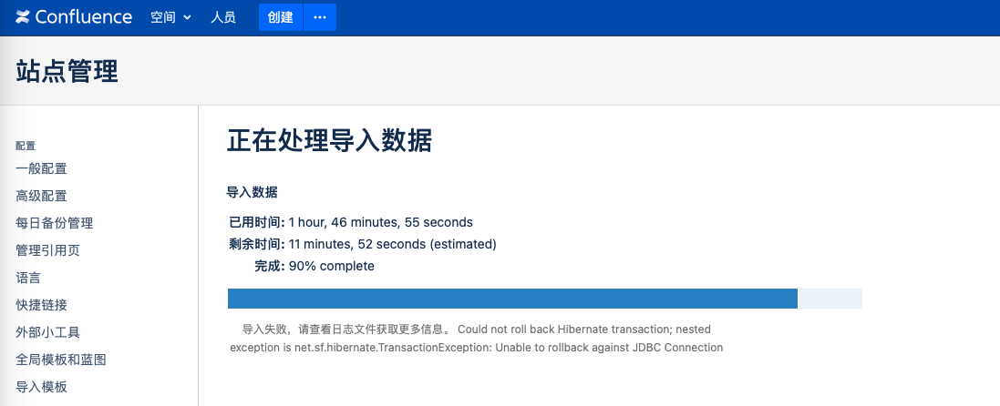

```
{
    "url": "confluence-in-k8s",
    "time": "2021/05/02 04:46",
    "tag": "Kubernetes,容器化"
}
```

先尝试在Docker中启动Confluence，

```
$ docker pull atlassian/confluence-server:6.8.5
$ docker run -d --name confluence -p 8090:8090 atlassian/confluence-server:6.8.5
c4b28fd48840af6726b2337a4d6d825cf0c43c1ac01b6f06357ea7580aa742ad
```

安装好之后的项目路径：

>  默认程序：/opt/atlassian/confluence
>
>  默认数据：/var/atlassian/application-data/confluence

本地访问8090即可进入在线安装过程，安装过程中穿插一个破解流程：

1、下载破解工具：

```
https://files.cnblogs.com/files/Javame/confluence%E7%A0%B4%E8%A7%A3%E5%B7%A5%E5%85%B7.zip
```

2、拷贝`atlassian-extras-decoder-v2-3.3.0.jar`文件到本地，并重命名为atlassian-extras-2.4.jar。

```
docker cp 871b663c9fae:/opt/atlassian/confluence/confluence/WEB-INF/lib/atlassian-extras-decoder-v2-3.3.0.jar .
```

3、运行破解工具选择文件进行破解，破解之后将文件名改回来然后拷贝进容器。

4、重启容器，拷贝安装过程中的KEY到破解工具生成秘钥即可完成破解。

**可能碰到的问题：**

1、数据库编码不对

> Incorrect character set
>
> Your database must be configured to use utf8 as the default character set. Learn more

```
mysql> create database confluence default character set utf8 collate utf8_bin;
mysql> grant all on confluence.* to 'confluence'@'%' identified by '123456'; 
mysql> flush privileges;
```

2、事务隔离等级需要为READ-COMMITED

> Incorrect isolation level
> [Confluence] Your database must use 'READ-COMMITED' as default isolation level.

```
mysql> show variables like '%tx_isolation%';
+---------------+-----------------+
| Variable_name | Value           |
+---------------+-----------------+
| tx_isolation  | READ-COMMITTED |
+---------------+-----------------+
1 row in set (0.00 sec)
mysql> SET GLOBAL TRANSACTION ISOLATION LEVEL READ COMMITTED;
```

3、不支持Mysql数据库

Mysql数据库需要按提示安装jar包，上面版本提示会调整到`https://dev.mysql.com/downloads/connector/j/5.1.html`。镜像中为Ubuntu系统，在容器内下载执行。

```
$ dpkg -L mysql-connector-java_8.0.25-1ubuntu20.04_all.deb
drwxr-xr-x root/root         0 2021-04-27 10:46 ./
drwxr-xr-x root/root         0 2021-04-27 10:46 ./usr/
drwxr-xr-x root/root         0 2021-04-27 10:46 ./usr/share/
drwxr-xr-x root/root         0 2021-04-27 10:46 ./usr/share/doc/
drwxr-xr-x root/root         0 2021-04-27 10:46 ./usr/share/doc/mysql-connector-java/
-rw-r--r-- root/root     89924 2021-04-27 10:46 ./usr/share/doc/mysql-connector-java/CHANGES.gz
-rw-r--r-- root/root       174 2021-04-27 10:46 ./usr/share/doc/mysql-connector-java/INFO_BIN
-rw-r--r-- root/root       136 2021-04-27 10:46 ./usr/share/doc/mysql-connector-java/INFO_SRC
-rw-r--r-- root/root     29020 2021-04-27 10:46 ./usr/share/doc/mysql-connector-java/LICENSE.gz
-rw-r--r-- root/root      1245 2021-04-27 10:46 ./usr/share/doc/mysql-connector-java/README
-rw-r--r-- root/root       213 2021-04-27 10:46 ./usr/share/doc/mysql-connector-java/changelog.Debian.gz
-rw-r--r-- root/root       356 2021-04-27 10:46 ./usr/share/doc/mysql-connector-java/copyright
drwxr-xr-x root/root         0 2021-04-27 10:46 ./usr/share/java/
-rw-r--r-- root/root   2428297 2021-04-27 10:46 ./usr/share/java/mysql-connector-java-8.0.25.jar

$ dpkg -i mysql-connector-java_8.0.25-1ubuntu20.04_all.deb
$ cp /usr/share/java/mysql-connector-java-8.0.25.jar /opt/atlassian/confluence/confluence/WEB-INF/lib
```

到这正常情况应该就可以顺利安装了。完成Docker里的测试之后可以打个自己的镜像，将需要的2个文件直接拷贝到容器中，简化下安装步骤：

```
$ cat Docerfile
FROM atlassian/confluence-server:6.8.5

ENV TZ=Asia/Shanghai
RUN ln -snf /usr/share/zoneinfo/$TZ /etc/localtime && echo $TZ > /etc/timezone

COPY atlassian-extras-decoder-v2-3.3.0.jar /opt/atlassian/confluence/confluence/WEB-INF/lib/
COPY mysql-connector-java-8.0.25.jar /opt/atlassian/confluence/confluence/WEB-INF/lib/

$ docker build -t pengbotao/confluence-server:6.8.5 .
```

容器里面配置就比较简单了，只需要挂在一下数据目录`/var/atlassian/application-data/confluence`即可。

> 注：示例未挂载，重启即失效。需要创建下pv完成挂载。

```
apiVersion: v1
kind: Service
metadata:
  name: confluence
spec:
  selector:
    project: confluence
  ports:
  - name: http
    port: 80
    targetPort: 8090
    protocol: TCP
  clusterIP: None

---

apiVersion: apps/v1
kind: StatefulSet
metadata:
  name: confluence
  namespace: default
  labels:
    project: confluence
spec:
  serviceName: confluence
  replicas: 1
  selector:
    matchLabels:
      project: confluence
  template:
    metadata:
      labels:
        project: confluence
    spec:
      restartPolicy: Always
      containers:
      - name: confluence
        image: pengbotao/confluence:6.8.5
        imagePullPolicy: Always
        ports:
        - containerPort: 8090
        env:
        - name: JVM_MINIMUM_MEMORY
          value: 1024m
        - name: JVM_MAXIMUM_MEMORY
          value: 2048m
        volumeMounts:
        - name: confluence-pv
          mountPath: /var/atlassian/application-data/confluence
      volumes:
      - name: confluence-pv
        persistentVolumeClaim:
          claimName: confluence-pvc
---

apiVersion: extensions/v1beta1
kind: Ingress
metadata:
  name: confluence
  namespace: default
  annotations:
    nginx.ingress.kubernetes.io/proxy-read-timeout: "600"
    nginx.ingress.kubernetes.io/proxy-send-timeout: "600"
    nginx.ingress.kubernetes.io/proxy_connect_timeout: "600"
    nginx.ingress.kubernetes.io/proxy-body-size: 100m
spec:
  rules:
  - host: www.example.com
    http:
      paths:
      - path: /
        backend:
          serviceName: confluence
          servicePort: 80
```

**数据迁移**

1、在`备份与还原`界面可以进行数据恢复，但可能出现恢复出错的情况：



重启后的效果是有部分空间是好的，有一些空间不展示，这时可以通过管理页面`备份与还原`下一个菜单`内容索引`，尝试重建索引完成数据迁移。

2、无访问权限。

进入之后如果管理员有权限，其他用户没有权限可以访问`/admin/permissions/pagepermsadmin.action`重构页面权限。