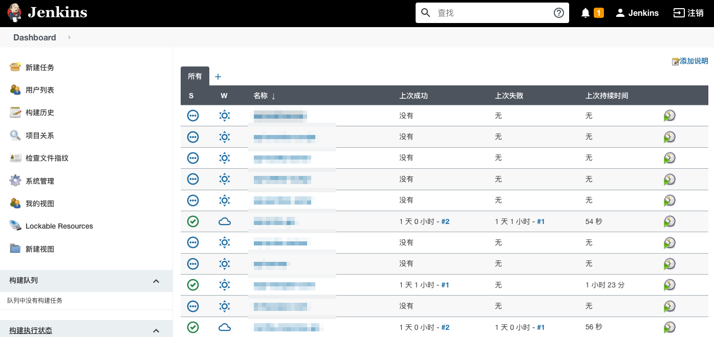

```
{
    "url": "jenkins-in-k8s",
    "time": "2021/08/15 22:22",
    "tag": "Jenkins,Kubernetes,容器化"
}
```

Jenkins有官方镜像，配置起来也就是常规的配置。


```
apiVersion: apps/v1
kind: StatefulSet
metadata:
  name: jenkins
  labels:
    app: jenkins
spec:
  serviceName: jenkins
  replicas: 1
  selector:
    matchLabels:
      app: jenkins
  template:
    metadata:
      labels:
        app: jenkins
    spec:
      restartPolicy: Always
      containers:
      - name: jenkins
        image: jenkins/jenkins:2.289.2
        imagePullPolicy: IfNotPresent
        ports:
        - name: http
          containerPort: 8080
        - name: jnlp
          containerPort: 50000
        volumeMounts:
        - name: jenkins-pv
          mountPath: /var/jenkins_home
        - name: sync-host-time
          mountPath: /etc/localtime
          readOnly: true
      volumes:
      - name: jenkins-pv
        persistentVolumeClaim:
          claimName: jenkins-pvc
      - name: sync-host-time
        hostPath:
          path: /etc/localtime
```

> 注：需要将jenkins_home目录持久化。

配置Service和Ingress

```
apiVersion: v1
kind: Service
metadata:
  name: jenkins
spec:
  selector:
    app: jenkins
  ports:
  - name: jenkins
    port: 8080
    targetPort: 8080
    protocol: TCP
  - name: jnlp
    port: 50000
    targetPort: 50000
    protocol: TCP
  clusterIP: None

---

apiVersion: extensions/v1beta1
kind: Ingress
metadata:
  name: jenkins
spec:
  rules:
  - host: jenkins.demo.com
    http:
      paths:
      - path: /
        backend:
          serviceName: jenkins
          servicePort: 8080
```

安装过程有个插件选择，有些装不上，可以先跳过后面再根据实际情况在插件管理里安装，安装之后的效果：

