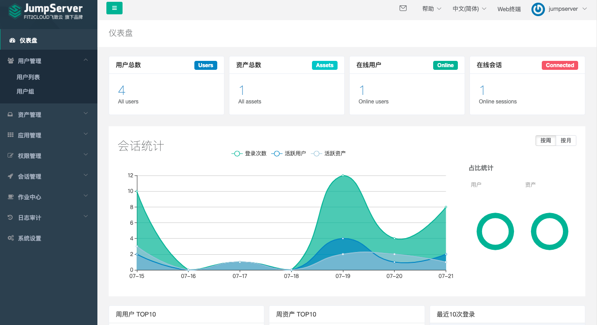

```
{
    "url": "jumpserver-in-k8s",
    "time": "2021/07/10 23:14",
    "tag": "JumpServer,Kubernetes,容器化"
}
```

和sshd的功能类似，这里只是将ssh代理访问和ssh登录进行了分离，JumpServer的作用则是在本地可以实现对远程服务的访问，同时可以方便的进行授权管理、操作回放、审计等。JumpServer需要Mysql和Redis支持，关于Mysql和Redis的容器化安装可查看前面的文章。官网目前给的环境要求：

- Mysql >= 5.7
- Reids >= 6.0

Deployment文件如下，有使用到外部存储用来存储操作回放文件，pv的存储前面配置的较多，可直接使用阿里云的Nas或者磁盘。

```
apiVersion: apps/v1
kind: Deployment
metadata:
  name: jumpserver
  labels:
    app: jumpserver
spec:
  replicas: 1
  selector:
    matchLabels:
      app: jumpserver
  template:
    metadata:
      labels:
        app: jumpserver
    spec:
      containers:
      - name: jumpserver
        image: jumpserver/jms_all:v2.11.4
        imagePullPolicy: IfNotPresent
        ports:
        - containerPort: 80
          name: jumpserver
        - containerPort: 2222
          name: ssh
        env:
        - name: SECRET_KEY
          # cat /dev/urandom | tr -dc A-Za-z0-9 | head -c 50
          value: iJ2YaSaNLCALNOVSqsw7sgwk3cX5gK6nCcey57UZiujF20I32n
        - name: BOOTSTRAP_TOKEN
          # cat /dev/urandom | tr -dc A-Za-z0-9 | head -c 16
          value: S7sLMAH9J0mTaqSZ
        - name: DB_HOST
          value: mysql-js.default.svc.cluster.local
        - name: DB_PORT
          value: "3306"
        - name: DB_USER
          value: jumpserver
        - name: DB_PASSWORD
          value: "password"
        - name: DB_NAME
          value: jumpserver
        - name: REDIS_HOST
          value: redis-js.default.svc.cluster.local
        - name: REDIS_PORT
          value: "6379"
        - name: REDIS_PASSWORD
          value: ""
        volumeMounts:
        - name: jumpserver-pv
          mountPath: /opt/jumpserver/data/media
      volumes:
      - name: jumpserver-pv
        persistentVolumeClaim:
          claimName: jumpserver-pvc
```

暴露可以通过Service+Ingress的方式，只需要将站点配置好即可在网页上连接机器。

```
apiVersion: v1
kind: Service
metadata:
  name: jumpserver
spec:
  selector:
    app: jumpserver
  ports:
  - port: 80
    targetPort: 80
    protocol: TCP
```

整个过程不需要开放22端口，可理解成配置好站点即可。最后的效果图如下：

