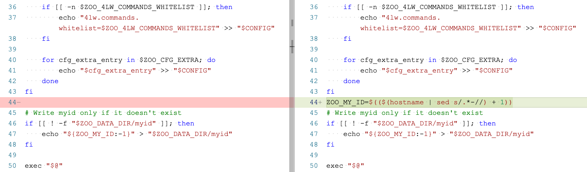

```
{
    "url": "zookeeper-in-k8s",
    "time": "2021/07/05 21:50",
    "tag": "zookeeper,Kubernetes,容器化"
}
```

Kubernetes官方有一个[ZooKeeper教程](https://kubernetes.io/zh/docs/tutorials/stateful-application/zookeeper/)，镜像被墙，也没找到更新后的版本。这里使用的是Docker[官方镜像](https://hub.docker.com/_/zookeeper)，主要是两个环境变量的设置：`ZOO_MY_ID`和`ZOO_SERVERS`。`ZOO_MY_ID`用来指定myid文件中的编号，`ZOO_SERVERS`用来指定集群列表。Docker官方示例，

```
version: '3.1'

services:
  zoo1:
    image: zookeeper
    restart: always
    hostname: zoo1
    ports:
      - 2181:2181
    environment:
      ZOO_MY_ID: 1
      ZOO_SERVERS: server.1=zoo1:2888:3888;2181 server.2=zoo2:2888:3888;2181 server.3=zoo3:2888:3888;2181

  zoo2:
    image: zookeeper
    restart: always
    hostname: zoo2
    ports:
      - 2182:2181
    environment:
      ZOO_MY_ID: 2
      ZOO_SERVERS: server.1=zoo1:2888:3888;2181 server.2=zoo2:2888:3888;2181 server.3=zoo3:2888:3888;2181

  zoo3:
    image: zookeeper
    restart: always
    hostname: zoo3
    ports:
      - 2183:2181
    environment:
      ZOO_MY_ID: 3
      ZOO_SERVERS: server.1=zoo1:2888:3888;2181 server.2=zoo2:2888:3888;2181 server.3=zoo3:2888:3888;2181
```

首先打算在Kubernetes中通过StatefulSet来部署，但`ZOO_MY_ID`环境变量无法通过Yaml文件注入到容器，找了一圈也没找到好的办法，但好在官方在Github上提供了[Dockerfile](https://github.com/31z4/zookeeper-docker)，需要在`docker-entrypoint.sh`中实现通过主机名获取编号。



调整之后重新打成自己的镜像即可解决`ZOO_MY_ID`的获取问题。

> 网上也有通过Deployment的方式来部署，部署3个Deployment，每个单独指定ZOO_MY_ID，这样子不需要调整镜像Dockerfile。但这样也把一个服务拆成了3个服务，Pod的反亲和性、滚动更新上不太好做。

接下来部署就比较简单了，这里以一个3个节点的ZooKeeper集群为例：

**第一步**，创建PV，这里是使用的阿里云的NAS存储，可以根据需要选择云盘、NFS等其他存储。

```
apiVersion: v1
kind: PersistentVolume
metadata:
  name: zookeeper-pv1
  labels:
    project: zookeeper-pv
spec:
  capacity:
    storage: 5Gi
  accessModes:
    - ReadWriteOnce
  persistentVolumeReclaimPolicy: Retain
  csi:
    driver: nasplugin.csi.alibabacloud.com
    volumeHandle: zookeeper-pv1
    volumeAttributes:
      server: "nasid.cn-hangzhou.nas.aliyuncs.com"
      path: "/zookeeper/data1"
  mountOptions:
  - nolock,tcp,noresvport
  - vers=3

--- 

apiVersion: v1
kind: PersistentVolume
metadata:
  name: zookeeper-pv2
  labels:
    project: zookeeper-pv
spec:
  capacity:
    storage: 5Gi
  accessModes:
    - ReadWriteOnce
  persistentVolumeReclaimPolicy: Retain
  csi:
    driver: nasplugin.csi.alibabacloud.com
    volumeHandle: zookeeper-pv2
    volumeAttributes:
      server: "nasid.cn-hangzhou.nas.aliyuncs.com"
      path: "/zookeeper/data2"
  mountOptions:
  - nolock,tcp,noresvport
  - vers=3

--- 

apiVersion: v1
kind: PersistentVolume
metadata:
  name: zookeeper-pv3
  labels:
    project: zookeeper-pv
spec:
  capacity:
    storage: 5Gi
  accessModes:
    - ReadWriteOnce
  persistentVolumeReclaimPolicy: Retain
  csi:
    driver: nasplugin.csi.alibabacloud.com
    volumeHandle: zookeeper-pv3
    volumeAttributes:
      server: "nasid.cn-hangzhou.nas.aliyuncs.com"
      path: "/zookeeper/data3"
  mountOptions:
  - nolock,tcp,noresvport
  - vers=3
```

**第二步**，创建Service

```
apiVersion: v1
kind: Service
metadata:
  name: zookeeper
  namespace: default
  labels:
    project: zookeeper
spec:
  selector:
    project: zookeeper
  ports:
  - name: client
    port: 2181
    targetPort: 2181
    protocol: TCP
  - name: follower
    port: 2888
    targetPort: 2888
    protocol: TCP
  - name: election
    port: 3888
    targetPort: 3888
    protocol: TCP
  clusterIP: None
```

**第三步**，创建StatefulSet，通过`podAntiAffinity`来避免`Pod`都运行在同一个节点上，通过Service提供的服务地址来访问，从而忽略PodIP，如：`zookeeper-0.zookeeper.default.svc.cluster.local`

```
apiVersion: apps/v1
kind: StatefulSet
metadata:
  name: zookeeper
  namespace: default
  labels:
    project: zookeeper
spec:
  serviceName: zookeeper
  replicas: 3
  selector:
    matchLabels:
      project: zookeeper
  template:
    metadata:
      labels:
        project: zookeeper
    spec:
      restartPolicy: Always
      affinity:
        podAntiAffinity:
          preferredDuringSchedulingIgnoredDuringExecution:
          - weight: 80
            podAffinityTerm:
              topologyKey: kubernetes.io/hostname
              labelSelector:
                matchExpressions:
                - key: project
                  operator: In
                  values: 
                  - zookeeper
      containers:
      - name: zookeeper
        image: zookeeper:3.6.3
        imagePullPolicy: IfNotPresent
        ports:
        - containerPort: 2181
          name: client
        - containerPort: 2888
          name: follower
        - containerPort: 3888
          name: election
        readinessProbe:
          tcpSocket:
            port: 2181
          initialDelaySeconds: 30
          timeoutSeconds: 15
          periodSeconds: 5
        livenessProbe:
          tcpSocket: 
            port: 2181
          initialDelaySeconds: 30
          timeoutSeconds: 15
          periodSeconds: 15
        env:
        - name: ZOO_TICK_TIME
          value: "3000"
        - name: ZOO_INIT_LIMIT
          value: "10"
        - name: ZOO_SYNC_LIMIT
          value: "5"
        - name: ZOO_STANDALONE_ENABLED
          value: "false"
        - name: ZOO_SERVERS
          value: "server.1=zookeeper-0.zookeeper.default.svc.cluster.local:2888:3888;2181 server.2=zookeeper-1.zookeeper.default.svc.cluster.local:2888:3888;2181 server.3=zookeeper-2.zookeeper.default.svc.cluster.local:2888:3888;2181"
        volumeMounts:
        - name: zookeeper-pvc
          mountPath: /data
  volumeClaimTemplates:
  - metadata:
      name: zookeeper-pvc
    spec:
        accessModes:
          - ReadWriteOnce
        resources:
          requests:
            storage: 5Gi
        selector:
          matchLabels:
            project: zookeeper-pv

```

> 注：上面的镜像地址为官方地址，Yaml文件未指定ZOO_MY_ID无法运行，需要调整为自定义地址。

---

- [1] [Kubernetes 搭建zookeeper集群](https://www.cnblogs.com/cyleon/p/14675875.html)
- [2] [Adds a mechanism for Kubernetes StatefulSet, guess id from hostname](https://github.com/solsson/zookeeper-docker/commit/df9474f858ad548be8a365cb000a4dd2d2e3a217)
- [3] [Are there plans to make the ordinal index for a statefulset available dynamically within a config file? #40651](https://github.com/kubernetes/kubernetes/issues/40651)