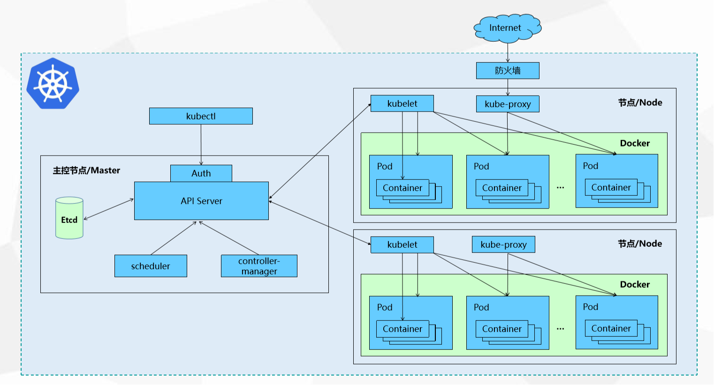
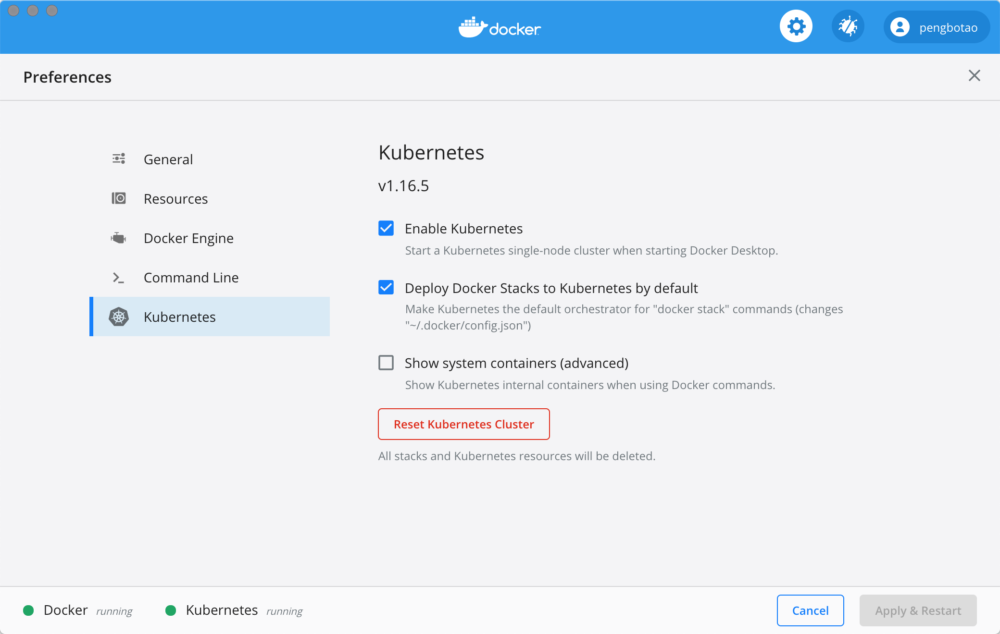
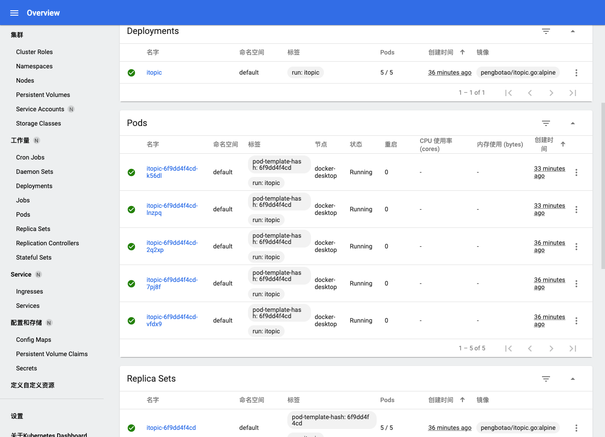

```
{
    "url": "k8s-mac-install",
    "time": "2020/08/28 19:06",
    "tag": "Kubernetes"
}
```

# 一、概述

## 1.1 Kubernetes是什么？

`Kubernetes`的名字来自希腊语，意思是“舵手” 或 “领航员”。`K8s`是将8个字母`ubernete`替换为`8`的缩写，也就是仅保留了头尾2个字母（k和s），中间的8个字母都去掉了，用`8`代替。

`Kubernetes`是容器集群管理系统，是一个开源的平台，可以实现容器集群的自动化部署、自动扩缩容、维护等功能。

通过`Kubernetes`你可以：

- 快速部署应用
- 快速扩展应用
- 无缝对接新的应用功能
- 节省资源，优化硬件资源的使用

**Kubernetes 特点**：

- **可移植**: 支持公有云，私有云，混合云，多重云（multi-cloud）
- **可扩展**: 模块化, 插件化, 可挂载, 可组合
- **自动化**: 自动部署，自动重启，自动复制，自动伸缩/扩展

`Kubernetes`是`Google`2014年创建管理的，是`Google`10多年大规模容器管理技术`Borg`的开源版本。

## 1.2 Kubernetes设计架构

`Kubernetes`集群包含有节点代理`kubelet`和`Master`组件(APIs, scheduler, etc)，一切都基于分布式的存储系统。下面这张图是`Kubernetes`的架构图 [<sup>[1]</sup>](#refer)。



在这张系统架构图中，我们把服务分为运行在工作节点上的服务和组成集群级别控制板的服务。`Kubernetes`节点有运行应用容器必备的服务，而这些都是受`Master`的控制。每个节点上当然都要运行`Docker`。`Docker`来负责所有具体的映像下载和容器运行。

`Kubernetes`主要由以下几个核心组件组成：

  - `etcd`：保存了整个集群的状态；
  - `apiserver`：提供了资源操作的唯一入口，并提供认证、授权、访问控制、API注册和发现等机制；
  - `controller manager`：负责维护集群的状态，比如故障检测、自动扩展、滚动更新等；
  - `scheduler`：负责资源的调度，按照预定的调度策略将`Pod`调度到相应的机器上；
  - `kubelet`：负责维护容器的生命周期，同时也负责`Volume（CVI）`和网络（`CNI`）的管理；
  - `Container runtime`：负责镜像管理以及Pod和容器的真正运行（`CRI`）；
  - `kube-proxy`：负责为`Service`提供`cluster`内部的服务发现和负载均衡；

除了核心组件，还有一些推荐的`Add-ons`：

  - `kube-dns`：负责为整个集群提供DNS服务
  - `Ingress Controller`：为服务提供外网入口
  - `Heapster`：提供资源监控
  - `Dashboard`：提供GUI
  - `Federation`：提供跨可用区的集群
  - `Fluentd-elasticsearch`：提供集群日志采集、存储与查询

了解到这里后可能就开始懵圈了，好多文章里还会看到`Deployment`、`Service`、`ReplicaSets/Replication Controller`等，一堆概念容易混淆。所以接下来我们先忽略概念，看怎么在Mac电脑上部署个k8s环境，操作一遍之后再来梳理概念和交互。

# 二、安装K8s

通过`Docker`方式部署比较简单，打开已搭建好的`Docker Dashboard`界面，设置里有个`Kubernetes`，默认是没有勾选的，但这里直接勾选应用后卡死了，大概是因为墙的原因，有些镜像无法下载，所以在点击之前需要先手动下载镜像。

## 2.1 下载依赖镜像

参考 `gotok8s` [<sup>[2]</sup>](#refer) 的安装方法：

```
$ git clone git@github.com:gotok8s/k8s-docker-desktop-for-mac.git
$ ./load_images.sh
```

脚本比较简单，用后面的镜像替换前面的镜像，替换完成之后重新打TAG还原。

```
$ cat image_list
k8s.gcr.io/kube-proxy:v1.16.5=gotok8s/kube-proxy:v1.16.5
k8s.gcr.io/kube-controller-manager:v1.16.5=gotok8s/kube-controller-manager:v1.16.5
k8s.gcr.io/kube-scheduler:v1.16.5=gotok8s/kube-scheduler:v1.16.5
k8s.gcr.io/kube-apiserver:v1.16.5=gotok8s/kube-apiserver:v1.16.5
k8s.gcr.io/coredns:1.6.2=gotok8s/coredns:1.6.2
k8s.gcr.io/pause:3.1=gotok8s/pause:3.1
k8s.gcr.io/etcd:3.3.15-0=gotok8s/etcd:3.3.15-0
k8s.gcr.io/kubernetes-dashboard-amd64=gotok8s/kubernetes-dashboard-amd64:v1.10.1
```

## 2.2 启用Kuberenetes

打开Docker，启用`Kubernetes`，应用后若正常则可以看到左下角有2个`running`状态。



命令行敲`kubectl`就可以输出信息了。

## 2.3 安装Dashboard

`Dashboard`是可选组件，部署 Kubernetes Dashboard：

```
$ kubectl apply -f https://raw.githubusercontent.com/kubernetes/dashboard/master/aio/deploy/recommended.yaml

# 开启本机访问代理
$ kubectl proxy
```

创建Dashboard管理员用户并用token登陆

```
# 创建 ServiceAccount kubernetes-dashboard-admin 并绑定集群管理员权限
$ kubectl apply -f https://raw.githubusercontent.com/gotok8s/gotok8s/master/dashboard-admin.yaml

# 获取登陆 token
$ kubectl -n kubernetes-dashboard describe secret $(kubectl -n kubernetes-dashboard get secret | grep kubernetes-dashboard-admin | awk '{print $1}')
```

通过下面的连接访问`Dashboard`: `http://localhost:8001/api/v1/namespaces/kubernetes-dashboard/services/https:kubernetes-dashboard:/proxy/`

输入上一步获取的`token`, 验证并登陆。到这里环境就装好了。

# 三、尝试部署镜像

一般可以通过`YAML`进行创建，这里先尝试走通流程，类似`docker run`的用法让容器先跑起来。整个过程只需要执行2条命令即可。

## 3.1 创建deployment

首先，执行第一条命令：

```
$ kubectl run itopic --image=pengbotao/itopic.go:alpine --replicas=3 --port=8001
```

说明：使用的是我们前面用`docker`构建的镜像，容器使用的是8001端口，启动3个副本。操作`run`之后就创建好了`deployment`、`pod`，可以查看相关信息：

**查看Node**：只有一个主节点

```
$ kubectl get node
NAME             STATUS   ROLES    AGE     VERSION
docker-desktop   Ready    master   2d21h   v1.16.6-beta.0
```

**查看deployment、rs和pod**

```
$ kubectl get deployment
NAME     READY   UP-TO-DATE   AVAILABLE   AGE
itopic   3/3     3            3           16s

$ kubectl get rs
NAME                DESIRED   CURRENT   READY   AGE
itopic-6f9dd4f4cd   3         3         3       21s

$ kubectl get pod
NAME                      READY   STATUS    RESTARTS   AGE
itopic-6f9dd4f4cd-2q2xp   1/1     Running   0          23s
itopic-6f9dd4f4cd-7pj8f   1/1     Running   0          23s
itopic-6f9dd4f4cd-vfdx9   1/1     Running   0          23s
```

**查看pod详情**

```
$ kubectl describe pod itopic-6f9dd4f4cd-2q2xp
Name:         itopic-6f9dd4f4cd-2q2xp
Namespace:    default
Priority:     0
Node:         docker-desktop/192.168.65.3
Start Time:   Thu, 27 Aug 2020 13:57:42 +0800
Labels:       pod-template-hash=6f9dd4f4cd
              run=itopic
Annotations:  <none>
Status:       Running
IP:           10.1.0.16
IPs:
  IP:           10.1.0.16
Controlled By:  ReplicaSet/itopic-6f9dd4f4cd
Containers:
  itopic:
    Container ID:   docker://3896614a1b1f3f2d11f709cfad56a2579769c51fb212eb2402e0dea668d95584
    Image:          pengbotao/itopic.go:alpine
    Image ID:       docker-pullable://pengbotao/itopic.go@sha256:1a1a98ffe435e34da61956be22eb61382eb5732120c4e216922f90ace0ad504b
    Port:           8001/TCP
    Host Port:      0/TCP
    State:          Running
      Started:      Thu, 27 Aug 2020 13:57:43 +0800
    Ready:          True
    Restart Count:  0
    Environment:    <none>
    Mounts:
      /var/run/secrets/kubernetes.io/serviceaccount from default-token-lmjrh (ro)
Conditions:
  Type              Status
  Initialized       True
  Ready             True
  ContainersReady   True
  PodScheduled      True
Volumes:
  default-token-lmjrh:
    Type:        Secret (a volume populated by a Secret)
    SecretName:  default-token-lmjrh
    Optional:    false
QoS Class:       BestEffort
Node-Selectors:  <none>
Tolerations:     node.kubernetes.io/not-ready:NoExecute for 300s
                 node.kubernetes.io/unreachable:NoExecute for 300s
Events:          <none>
```

**也可以进入容器**

```
$ kubectl exec -it itopic-6f9dd4f4cd-2q2xp /bin/sh
/www/itopic.go #
```

## 3.2 创建service

到这里容器已经建好了，但是还无法从外部访问。接下来，执行第二条命令：

```
$ kubectl expose deployment itopic --type=LoadBalancer --port=38001 --target-port=8001 
```

**查看service**

```
$ kubectl get service
NAME         TYPE           CLUSTER-IP       EXTERNAL-IP   PORT(S)           AGE
itopic       LoadBalancer   10.100.230.169   localhost     38001:31234/TCP   26s
kubernetes   ClusterIP      10.96.0.1        <none>        443/TCP           2d20h


$ kubectl describe service itopic
Name:                     itopic
Namespace:                default
Labels:                   run=itopic
Annotations:              <none>
Selector:                 run=itopic
Type:                     LoadBalancer
IP:                       10.100.230.169
LoadBalancer Ingress:     localhost
Port:                     <unset>  38001/TCP
TargetPort:               8001/TCP
NodePort:                 <unset>  31234/TCP
Endpoints:                10.1.0.15:8001,10.1.0.16:8001,10.1.0.17:8001
Session Affinity:         None
External Traffic Policy:  Cluster
Events:                   <none>
```

这个时候就可以通过`http://localhost:38001`访问了。


## 3.3 扩容 / 缩容

通过调整副本数量可以进行扩容与缩容。

```
$ kubectl scale --replicas=3 deploy/itopic

$ kubectl get pods
NAME                      READY   STATUS    RESTARTS   AGE
itopic-6f9dd4f4cd-2q2xp   1/1     Running   0          38m
itopic-6f9dd4f4cd-7pj8f   1/1     Running   0          38m
itopic-6f9dd4f4cd-k56dl   1/1     Running   0          35m
itopic-6f9dd4f4cd-lnzpq   1/1     Running   0          35m
itopic-6f9dd4f4cd-vfdx9   1/1     Running   0          38m
```

如果要删除`deployment`和`service`:

```
kubectl delete deployment,service itopic
```

到这里一个简单的镜像通过2条K8s命令就部署好了，来看看`Dashboard`的展示情况：



# 四、节点说明

## 4.1 Master

集群的控制节点，负责整个集群的管理和控制，`kubernetes`的所有的命令基本都是发给`Master`，由它来负责具体的执行过程。

**Master**的组件：

- `kube-apiserver`：资源增删改查的入口
- `kube-controller-manager`：资源对象的大总管
- `kube-scheduler`：负责资源调度（Pod调度）
- `etcd Server`：`kubernetes`的所有的资源对象的数据保存在`etcd`中。

## 4.2 Node

`Node`是集群的工作负载节点，默认情况`kubelet`会向`Master`注册自己，一旦`Node`被纳入集群管理范围，`kubelet`会定时向`Master`汇报自身的情报，包括操作系统，`Docker`版本，机器资源情况等。

如果`Node`超过指定时间不上报信息，会被`Master`判断为“失联”，标记为`Not Ready`，随后`Master`会触发`Pod`转移。

**Node**的组件：

- `kubelet`：Pod的管家，与Master通信
- `kube-proxy`：实现kubernetes Service的通信与负载均衡机制的重要组件
- `Docker`：容器的创建和管理

## 4.3 Pod

`Pod`是`Kubernetes`中操作的基本单元。每个`Pod`中有个根容器(`Pause容器`)，`Pause`容器的状态代表整个容器组的状态，其他业务容器共享`Pause`的IP，即Pod IP，共享Pause挂载的Volume，这样简化了同个Pod中不同容器之间的网络问题和文件共享问题。


1. `Kubernetes`集群中，同宿主机的或不同宿主机的Pod之间要求能够TCP/IP直接通信，因此采用虚拟二层网络技术来实现，例如`Flannel`，`Openvswitch(OVS)`等，这样在同个集群中，不同的宿主机的Pod IP为不同IP段的IP，集群中的所有Pod IP都是唯一的，**不同Pod之间可以直接通信**。
2. Pod有两种类型：普通Pod和静态Pod。静态Pod即不通过K8S调度和创建，直接在某个具体的Node机器上通过具体的文件来启动。普通Pod则是由K8S创建、调度，同时数据存放在ETCD中。
3. Pod IP和具体的容器端口（ContainnerPort）组成一个具体的通信地址，即Endpoint。一个Pod中可以存在多个容器，可以有多个端口，Pod IP一样，即有多个Endpoint。
4. Pod Volume是定义在Pod之上，被各个容器挂载到自己的文件系统中，可以用分布式文件系统实现后端存储功能。
5. Pod中的Event事件可以用来排查问题，可以通过`kubectl describe pod xxx`来查看对应的事件。
6. 每个Pod可以对其能使用的服务器上的计算资源设置限额，一般为CPU和Memory。K8S中一般将千分之一个的CPU配置作为最小单位，用m表示，是一个绝对值，即100m对于一个Core的机器还是48个Core的机器都是一样的大小。Memory配额也是个绝对值，单位为内存字节数。
7. 资源配额的两个参数
   - `Requests`：该资源的最小申请量，系统必须满足要求。
   - `Limits`：该资源最大允许使用量，当超过该量，K8S会kill并重启Pod。

# 五、概念说明 - Master

@todo


# 六、概念说明 - Node

@todo


# 七、概念说明 - Pod

@todo


---
<div id="refer"></div>

- [1] [Kubernetes设计架构](https://www.kubernetes.org.cn/kubernetes%E8%AE%BE%E8%AE%A1%E6%9E%B6%E6%9E%84)
- [2] [Docker Desktop for Mac 开启并使用 Kubernetes](https://github.com/gotok8s/k8s-docker-desktop-for-mac)
- [3] [Kubernetes基本概念（二）之k8s常用对象说明](https://blog.csdn.net/huwh_/article/details/77017281)
- [4] [在k8s中的controller简介](https://tinychen.com/190722-k8s-controller/)