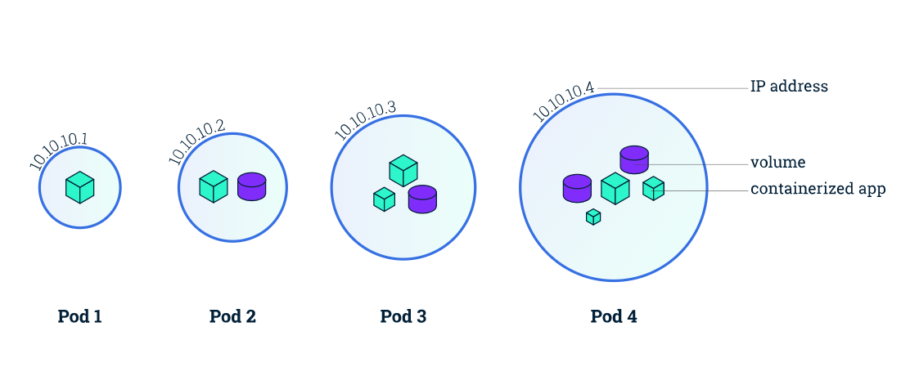
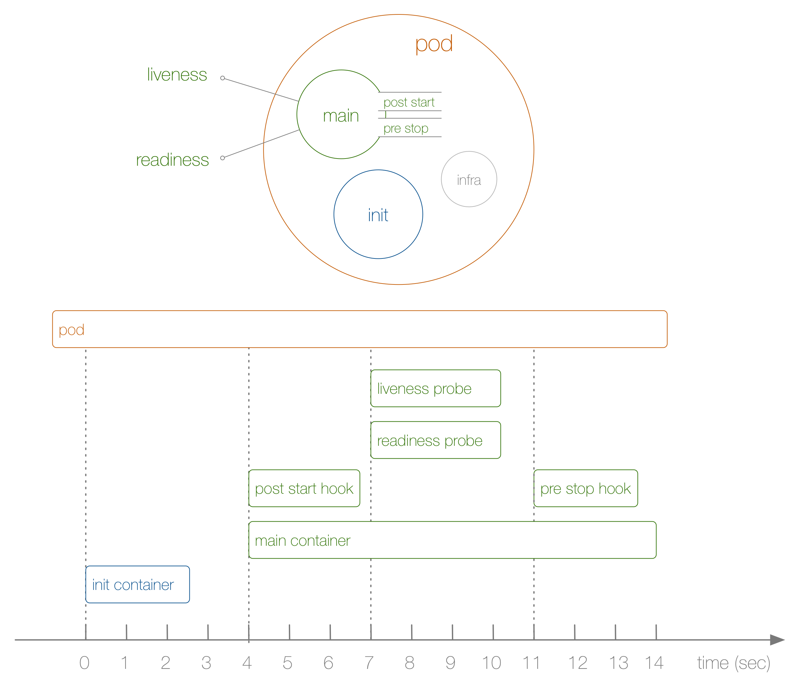

```
{
    "url": "k8s-pod",
    "time": "2020/09/12 23:18",
    "tag": "Kubernetes,容器化"
}
```

# 一、概述

## 1.1 Pod简介

`k8s`管理的最小粒度资源是`Pod`，它是`k8s`基础资源。一个`Pod`里可运行多个容器，而一个`Node`里又可以运行多个`Pod`，每个`Node`节点上都安装有`kubelet`，当`Pod`有任何问题，`kubelet`会和主节点通信，从而完成重启或者剔除节点等操作。`Pod`里的容器共享存储、网络。

- **网络**：每个`Pod`被分配一个独立的`IP`地址，`Pod`中的每个容器共享网络命名空间，包括`IP`地址和网络端口。`Pod`内的容器可以使用`localhost`相互通信。当`Pod`中的容器与`Pod`外部通信时，他们必须协调如何使用共享网络资源（如端口）。

- **存储**：`Pod`可以指定一组共享存储`volumes`。`Pod`中的所有容器都可以访问共享`volumes`，允许这些容器共享数据。`volumes`还用于`Pod中`的数据持久化，以防其中一个容器需要重新启动而丢失数据。



## 1.2 Pod分类

`Pod`可以分为两类：

- 自主式`Pod`：直接创建的`Pod`，没有管理者，退出后不会有重新拉起操作。
- 控制器`Pod`：可以根据控制器的不同规则对`Pod`做不同的行为控制。

控制器`Pod`我们会在下一章节介绍控制器时来讲，本章主要介绍自主式`Pod`。先来看一个示例，了解下`Pod`的基本用法。

```
apiVersion: v1
kind: Pod
metadata:
  name: mypod
  labels:
    name: mypod
spec:
  restartPolicy: Always
  containers:
  - name: c1
    image: busybox
    command:
      - "/bin/sh"
      - "-c"
      - "top"
    resources:
      limits:
        memory: "128Mi"
        cpu: "500m"
  - name: c2
    image: busybox
    command:
      - "/bin/sh"
      - "-c"
      - "while true ; sleep 1; do date ; done"
    resources:
      limits:
        memory: "128Mi"
        cpu: "500m"
  - name: c3
    image: busybox
    command:
      - "/bin/sh"
      - "-c"
      - "date"
    resources:
      limits:
        memory: "128Mi"
        cpu: "500m"
```

说明：

- 定义了一个`Pod`，`Pod`的名字是`mypod`，打了一个标签也是`mypod`
- `Pod`里定义了3个容器，容器都从`busybox`拉取镜像，但没有指定`busybox`的版本，默认`latest`版本
- 第一个容器执行`Top`命令，第二个容器每`1s`打印时间，第三个容器只打印了当前时间

来看看执行情况：

```
# 查看Pod
$ kubectl get pod
NAME                           READY   STATUS    RESTARTS   AGE
mypod                          2/3     Running   3          74s

# 查看c2容器日志，-f参数类似 tail -f。
$ kubectl logs mypod c2 -f
Fri Sep  4 03:46:11 UTC 2020
Fri Sep  4 03:46:12 UTC 2020
Fri Sep  4 03:46:13 UTC 2020
Fri Sep  4 03:46:14 UTC 2020
Fri Sep  4 03:46:15 UTC 2020
Fri Sep  4 03:46:16 UTC 2020
Fri Sep  4 03:46:17 UTC 2020
Fri Sep  4 03:46:18 UTC 2020
Fri Sep  4 03:46:19 UTC 2020
```

容器要求程序在前台执行，执行完了容器就退出了。因为前两个容器都会一直执行，第三个容器执行完就退出了。通过`describe`也可以看到。

```
$ kubectl describe pod mypod
Events:
  Type    Reason     Age        From                     Message
  ----    ------     ----       ----                     -------
  Normal  Scheduled  <unknown>  default-scheduler        Successfully assigned default/mypod to docker-desktop
  Normal  Pulling    7s         kubelet, docker-desktop  Pulling image "busybox"
  Normal  Pulled     6s         kubelet, docker-desktop  Successfully pulled image "busybox"
  Normal  Created    6s         kubelet, docker-desktop  Created container c1
  Normal  Started    6s         kubelet, docker-desktop  Started container c1
  Normal  Pulling    6s         kubelet, docker-desktop  Pulling image "busybox"
  Normal  Pulled     3s         kubelet, docker-desktop  Successfully pulled image "busybox"
  Normal  Created    3s         kubelet, docker-desktop  Created container c2
  Normal  Started    3s         kubelet, docker-desktop  Started container c2
  Normal  Pulling    3s         kubelet, docker-desktop  Pulling image "busybox"
  Normal  Pulled     1s         kubelet, docker-desktop  Successfully pulled image "busybox"
  Normal  Created    1s         kubelet, docker-desktop  Created container c3
  Normal  Started    1s         kubelet, docker-desktop  Started container c3
  Warning  BackOff    15s (x4 over 48s)  kubelet, docker-desktop  Back-off restarting failed container
  Normal   Pulling    3m3s (x4 over 3m57s)   kubelet, docker-desktop  Pulling image "busybox
  Warning  BackOff    83s (x23 over 6m19s)   kubelet, docker-desktop  Back-off restarting failed container

$ kubectl get pod mypod -o wide
NAME    READY   STATUS             RESTARTS   AGE   IP          NODE             NOMINATED NODE   READINESS GATES
mypod   2/3     CrashLoopBackOff   7          14m   10.1.2.46   docker-desktop   <none>           <none>
```

- 由于是`latest`版本，默认每次创建容器都会有`Pulling image "busybox"`操作，线上应避免直接拉`latest`镜像，如果要用可以重新打个`tag`。
- `c3`容器执行后就退出了，所以`Pod`会尝试重启容器，但会一直退出，并不是执行失败了，而是执行完退出了。
- 重新查看容器状态为`CrashLoopBackOff`，`READY`状态为`2/3`，`RESTARTS`重启次数为7，重启的粒度是容器层级，从日志上看`c1`、 `c2`容器的重启次数没有增多。

# 二、Pod资源清单

`apiVersion`和`kind`通过`kubectl explain`可以看到

```
$ kubectl explain pod
KIND:     Pod
VERSION:  v1
```

所以，主要介绍下`metadata`和`spec`下的字段说明。

## 2.1 metadata

| 参数名               | 字段类型          | 说明                                                         |
| -------------------- | ----------------- | ------------------------------------------------------------ |
| metadata.name        | string            | 资源名称，名称在名称空间内需唯一，名称不能包含`_`，可使用`-`和`.` |
| metadata.namespace   | string            | 名称空间，默认`default`名称空间                              |
| metadata.labels      | map[string]string | 标签                                                         |
| metadata.annotations | map[string]string |                                                              |

## 2.2 spec

| 参数名                | 字段类型 | 说明                |
| --------------------- | -------- | ------------------- |
| spec.restartPolicy    | string   | 重启策略            |
| spec.containers[]     | []Object | 定义Pod里包含的容器 |
| spec.volumes[]        | []Object | 存储卷              |
| spec.initContainers[] | []Object | 初始化容器          |
| spec.hostname         | string   | 指定主机名          |

## 2.3 spec.restartPolicy

前面示例容器会不断重启，除了容器执行完成后，主要还是跟重启参数设置有关，默认为总是重启。看描述：

```
$ kubectl explain pod.spec.restartPolicy
KIND:     Pod
VERSION:  v1

FIELD:    restartPolicy <string>

DESCRIPTION:
     Restart policy for all containers within the pod. One of Always, OnFailure, Never. Default to Always.
```

- 重启策略针对`Pod`里的所有容器
- 值按字面意思理解就行
  - `Always`：容器退出时总是重启容器，默认策略。
  - `OnFailure`：容器异常退出时重启（状态码非0），如果增加`spec.restartPolicy = OnFailure`，则c3容器执行后不会在重启。
  - `Never`：容器退出时不重启容器

## 2.4 spec.containers

`Pod`中包含的容器列表，单个`Pod`可以配置多个容器。需要注意的是因为他们共享网络所以容器里不能都启动同一个端口，否则就端口冲突了，不同`Pod`则没有限制。一般一个容器负责处理一件事情，比如要配置`PHP+Nginx`，则可以`PHP`起一个容器，`Nginx`起一个容器，他们在同一个`Pod`中，通过`volume`的方式共享磁盘。所以`Pod`的概念就类似一台虚拟机，里面可以起多个容器相互协作。

在看`Docker`的时候有一个疑问是把容器理解成虚拟机包含整套服务（比如`CentOS`镜像里安装了各种环境），还是只是一个进程。在`k8s`里看，更倾向于相互独立。

### 2.4.1 image

| 参数名                            | 字段类型           | 说明                                                         |
| --------------------------------- | ------------------ | ------------------------------------------------------------ |
| spec.containers[]                 | []Object[required] | 定义容器列表                                                 |
| spec.containers[].name            | string[required]   | 定义容器名称，名称在Pod内部需唯一，名称不能被更新            |
| spec.containers[].image           | string             | 定义镜像来源                                                 |
| spec.containers[].imagePullPolicy | string             | 定义镜像拉取策略，有Always、Never、IfNotPresent三个值。默认Always。<br />- Always: 每次都尝试重新拉取镜像<br />- Never：仅使用本地镜像<br />- IfNotPresent：本地有就使用，没有就拉取 |
| spec.containers[].workingDir      | string             | 指定容器工作目录                                             |
| spec.containers[].command         | []string           |                                                              |
| spec.containers[].args            | []string           |                                                              |

### 2.4.2 ports

| 参数名                                  | 字段类型          | 说明                                          |
| --------------------------------------- | ----------------- | --------------------------------------------- |
| spec.containers[].ports                 | []Object          | 指定容器需要用到的端口列表                    |
| spec.containers[].ports[].name          | string            |                                               |
| spec.containers[].ports[].containerPort | integer[required] |                                               |
| spec.containers[].ports[].hostIP        | string            |                                               |
| spec.containers[].ports[].hostPort      | integer           |                                               |
| spec.containers[].ports[].protocol      | string            | Must be UDP, TCP, or SCTP. Defaults to "TCP". |

### 2.4.3 volumeMounts

| 参数名                                     | 字段类型         | 说明                   |
| ------------------------------------------ | ---------------- | ---------------------- |
| spec.containers[].volumeMounts             | []Object         | 指定容器内部存储券配置 |
| spec.containers[].volumeMounts[].name      | string[required] | 需要匹配存储卷的名称   |
| spec.containers[].volumeMounts[].mountPath | string[required] | 对应所在容器内的路径   |
| spec.containers[].volumeMounts[].readOnly  |                  | 是否只读，默认false    |

### 2.4.4 env

| 参数名                        | 字段类型         | 说明                                 |
| ----------------------------- | ---------------- | ------------------------------------ |
| spec.containers[].env         | []Object         | 指定容器运行前需要设置的环境变量列表 |
| spec.containers[].env[].name  | string[required] |                                      |
| spec.containers[].env[].value |                  |                                      |

### 2.4.5 resources

| 参数名                                      | 字段类型          | 说明                           |
| ------------------------------------------- | ----------------- | ------------------------------ |
| spec.containers[].resources                 | Object            | 指定资源限制和资源请求的值     |
| spec.containers[].resources.limits          | map[string]string | 指定容器运行的资源上限         |
| spec.containers[].resources.limits.cpu      |                   |                                |
| spec.containers[].resources.limits.memory   |                   |                                |
| spec.containers[].resources.requests        | map[string]string | 指定容器启动和调度时的限制设置 |
| spec.containers[].resources.requests.cpu    |                   |                                |
| spec.containers[].resources.requests.memory |                   |                                |

### 2.4.6 readinessProbe

检测容器是否就绪，如果准备好了则可以接收服务的流量。

| 参数名                                                 | 字段类型 | 说明                                                         |
| ------------------------------------------------------ | -------- | ------------------------------------------------------------ |
| spec.containers[].readinessProbe                       | Object   | 就绪检测                                                     |
| spec.containers[].readinessProbe.initialDelaySeconds   | integer  | 容器启动后首次执行间隔时间。                                 |
| spec.containers[].readinessProbe.periodSeconds         | integer  | 检测周期，默认是10s。最小值可设置为1s。                      |
| spec.containers[].readinessProbe.timeoutSeconds        | integer  | 检测超时时间，默认为1s。最小值可设置为1s。                   |
| spec.containers[].readinessProbe.successThreshold      | integer  | 探测失败后，最少连续探测成功多少次才被认定为成功。默认是``1``。对于``liveness``必须是``1``。最小值是``1``。 |
| spec.containers[].readinessProbe.failureThreshold      | integer  | 探测成功后，最少连续探测失败多少次才被认定为失败。默认是``3``。最小值是``1``。 |
| spec.containers[].readinessProbe.httpGet               | Object   | 检测方式一：通过HTTP请求检测                                 |
| spec.containers[].readinessProbe.httpGet.host          | string   | 连接的主机名                                                 |
| spec.containers[].readinessProbe.httpGet.path          | string   | 路径                                                         |
| spec.containers[].readinessProbe.httpGet.port          | string   | 端口名字或端口号                                             |
| spec.containers[].readinessProbe.httpGet.scheme        | string   | 检测协议，默认是HTTP                                         |
| spec.containers[].readinessProbe.httpGet.httpHeaders[] | []Object | 自定义请求头                                                 |
| spec.containers[].readinessProbe.exec                  | Object   | 检测方式二：通过运行命令检测                                 |
| spec.containers[].readinessProbe.tcpSocket             | Object   | 检测方式三：TCP方式                                          |

### 2.4.7 livenessProbe

检测容器是否存活。配置方式与`readinessProbe`一致。将在第三章`Pod`生命周期中做演示。

## 2.5 spec.volumes

| 参数名                            | 字段类型         | 说明                                                        |
| --------------------------------- | ---------------- | ----------------------------------------------------------- |
| spec.volumes[]                    | []Object         | 存储卷                                                      |
| spec.volumes[].name               | string           | 存储卷的名称，Pod内需要唯一。                               |
| spec.volumes[].emptyDir           | Object           | 生命周期同Pod，Pod创建时创建，Pod移除时删除，无需指定目录。 |
| spec.volumes[].emptyDir.medium    | string           |                                                             |
| spec.volumes[].emptyDir.sizeLimit | string           |                                                             |
| spec.volumes[].hostPath           | Object           | 宿主机方式                                                  |
| spec.volumes[].hostPath.path      | string[required] |                                                             |
| spec.volumes[].hostPath.type      | string           |                                                             |
| spec.volumes[].nfs                | Object           | nfs方式                                                     |
| spec.volumes[].nfs.path           | string           |                                                             |
| spec.volumes[].nfs.readOnly       | Boolean          |                                                             |
| spec.volumes[].nfs.server         | string[required] |                                                             |

存储卷相当于`Pod`中多个容器的共享目录，共享的方式有很多种，通过示例来看看常见的几种。

### 2.5.1 emptyDir

我们来在一个`Pod`里创建2个容器，分别是`Nginx`和`PHP`，然后交互挂一个空目录。

```
apiVersion: v1
kind: Pod
metadata:
  name: php-nginx
  labels:
    name: php-nginx
spec:
  restartPolicy: Always
  containers:
  - name: php
    image: pengbotao/php:7.4.8-fpm-alpine
    volumeMounts:
    - mountPath: /var/www/html
      name: wwwroot
  - name: nginx
    image: nginx:1.19.2-alpine
    volumeMounts:
    - mountPath: /usr/share/nginx/html
      name: wwwroot
  volumes:
  - name: wwwroot
    emptyDir: {}
```

执行之后可以看到创建的`Pod`，没有配置`service`，外部无法访问。我们先进入到`Nginx`的容器进行验证

```
$ kubectl exec -it php-nginx -c nginx /bin/sh
```

在`/usr/share/nginx/html`下创建`index.html`和`info.php`并写入内容，调整`/etc/nginx/conf.d/default.conf`

```
    location ~ \.php$ {
    #    root           html;
        fastcgi_pass   127.0.0.1:9000;
        fastcgi_index  index.php;
        fastcgi_param  SCRIPT_FILENAME  /var/www/html$fastcgi_script_name;
        include        fastcgi_params;
    }
```

他们处在同一个`Pod`里，可以直接用`127.0.0.1:9000`访问`PHP`，设置后重启`Nginx`后（`/usr/sbin/nginx -s reload`）就可以通过`curl 127.0.0.1`来访问了。

需要注意的是`Pod`删除后目录就清掉了，所以`emptyDir`适用一些临时空间的场景。

### 2.5.2 hostPath

还是以PHP+Nginx交互，我们来看看用hostPath如何配置。

```
apiVersion: v1
kind: Pod
metadata:
  name: php-nginx
  labels:
    name: php-nginx
spec:
  restartPolicy: Always
  containers:
  - name: php
    image: pengbotao/php:7.4.8-fpm-alpine
    volumeMounts:
    - mountPath: /var/www/html
      name: wwwroot
  - name: nginx
    image: nginx:1.19.2-alpine
    volumeMounts:
    - mountPath: /usr/share/nginx/html
      name: wwwroot
  volumes:
  - name: wwwroot
    hostPath: 
      path: /Users/peng/k8s
```

只需要修改`volumes`的配置方式，`Nginx`的修改方式同上面，本机的目录里创建文件后，在容器里就可以访问了。因为挂载在本机，所以删除容器不会影响，可以用于一些需要持久化的场景。

### 2.5.3 nfs

也可以通过nfs共享的方式来存储。

```
volumes:
- name: wwwroot
  nfs:
    server: 192.168.0.100
    path: /wwwroot
```


## 2.6 spec.initContainers

`Init Container`就是用来做初始化工作的容器，可以是一个或者多个，如果有多个的话，这些容器会按定义的顺序依次执行，只有所有的`Init Container`执行完后，主容器才会被启动。我们知道一个`Pod`里面的所有容器是共享数据卷和网络命名空间的，所以`Init Container`里面产生的数据可以被主容器使用到的。

他也是一个容器，所以资源清单配置上和容器的配置是一样的。即前面提到的字段它都可以用到，来看个示例：

创建一个`Nginx`容器，同时设置了2个`initContainers`，每个`Container`都会执行一条命令，命令执行完成后容器退出，进入下一个初始化容器，所有容器执行完毕后，`Nginx`容器才会启动。

```
apiVersion: v1
kind: Pod
metadata:
  name: nginx
  labels:
    name: nginx
spec:
  containers:
  - name: nginx
    image: nginx:1.19.2-alpine
  initContainers:
  - name: init-redis
    image: busybox:1.32.0
    command: ['sh', '-c', 'until nslookup redis-server; do echo waiting for redis; sleep 2; done;']
  - name: init-mysql
    image: busybox:1.32.0
    command: ['sh', '-c', 'until nslookup mysql-server; do echo waiting for mysql; sleep 2; done;']
```

创建`Pod`之后可以看到状态，`kubectl describe`也可以看到`pod`的信息，在等`init-redis`容器执行完毕。

```
$ kubectl get pod
NAME        READY   STATUS     RESTARTS   AGE
nginx       0/1     Init:0/2   0          11s

$ kubectl describe pod nginx

Events:
  Type    Reason     Age        From                     Message
  ----    ------     ----       ----                     -------
  Normal  Scheduled  <unknown>  default-scheduler        Successfully assigned default/nginx to docker-desktop
  Normal  Pulled     9m11s      kubelet, docker-desktop  Container image "busybox:1.32.0" already present on machine
  Normal  Created    9m11s      kubelet, docker-desktop  Created container init-redis
  Normal  Started    9m11s      kubelet, docker-desktop  Started container init-redis
```

分别启动`redis-server`和`mysql-server`的服务后，可以看到，主容器就启动了。

```
$ kubectl describe pod nginx

Events:
  Type    Reason     Age        From                     Message
  ----    ------     ----       ----                     -------
  Normal  Scheduled  <unknown>  default-scheduler        Successfully assigned default/nginx to docker-desktop
  Normal  Pulled     9m11s      kubelet, docker-desktop  Container image "busybox:1.32.0" already present on machine
  Normal  Created    9m11s      kubelet, docker-desktop  Created container init-redis
  Normal  Started    9m11s      kubelet, docker-desktop  Started container init-redis
  Normal  Pulled     2m5s       kubelet, docker-desktop  Container image "busybox:1.32.0" already present on machine
  Normal  Created    2m5s       kubelet, docker-desktop  Created container init-mysql
  Normal  Started    2m5s       kubelet, docker-desktop  Started container init-mysql
  Normal  Pulled     14s        kubelet, docker-desktop  Container image "nginx:1.19.2-alpine" already present on machine
  Normal  Created    14s        kubelet, docker-desktop  Created container nginx
  Normal  Started    14s        kubelet, docker-desktop  Started container nginx
```

也就是可以在`initContainers`里做一些主容器启动前的初始化工作，比如检测依赖的服务是否启动。

# 三、 Pod生命周期



## 3.1 pause

`Pause容器`，全称infrastucture container（又叫infra）基础容器。每个`Pod`里运行着一个特殊的被称之为`Pause`的容器，其他容器则为业务容器，这些业务容器共享`Pause`容器的网络栈和`Volume`挂载卷，因此他们之间通信和数据交换更为高效。在设计时可以充分利用这一特性，将一组密切相关的服务进程放入同一个`Pod`中；同一个`Pod`里的容器之间仅需通过`localhost`就能互相通信。

## 3.2 init container

在主容器（`Main Container`）启动之前执行的容器，串行执行，只有前一个`InitContainer`正常退出，下一个才会继续。如果`InitContainer`失败，则会根据策略重启`Pod`。相当于在主容器启动之前，可以通过`Init Conntainer`容器做一些准备工作。

## 3.3 hook

`Kubernetes `为容器提供了两种生命周期钩子：

- `post start hook`：于容器创建完成之后立即运行的钩子程序。
- `pre stop hook`：容器终止之前立即运行的程序，是以同步方式的进行，因此其完成之前会阻塞 删除容器的调用

备注：钩子程序的执行方式有`Exec`和`HTTP`两种。

## 3.4 readiness

就绪检测：用于判定容器是否准备就绪，就绪之后就可以接受`Service`过来的请求。

```
apiVersion: v1
kind: Pod
metadata:
  name: readiness-pod
  labels:
    name: readiness-pod
spec:
  containers:
  - name: readiness
    image: nginx:1.19.2-alpine
    readinessProbe:
      httpGet:
        path: /index.html
        port: 80
      initialDelaySeconds: 60
      periodSeconds: 10

---

apiVersion: v1
kind: Service
metadata:
  name: readiness-svc
spec:
  type: LoadBalancer
  ports:
  - port: 38000
    targetPort: 80
  selector:
    name: readiness-pod
```

通过httpGet方式检测Nginx80端口是不是好的，如果获取到的状态码是2xx和3xx则认为是正常的，否则失败。设置了初次间隔是60s。所以在60s之内从外部访问不了容器，svc的Endpoints没有值。待第一次检测通过之后svc的Endpoints才有值。

```
$ kubectl describe svc readiness-svc
Name:                     readiness-svc
Namespace:                default
Labels:                   <none>
Annotations:              kubectl.kubernetes.io/last-applied-configuration:
                            {"apiVersion":"v1","kind":"Service","metadata":{"annotations":{},"name":"readiness-svc","namespace":"default"},"spec":{"ports":[{"port":38...
Selector:                 name=readiness-pod
Type:                     LoadBalancer
IP:                       10.104.144.208
LoadBalancer Ingress:     localhost
Port:                     <unset>  38000/TCP
TargetPort:               80/TCP
NodePort:                 <unset>  30381/TCP
Endpoints:
Session Affinity:         None
External Traffic Policy:  Cluster
Events:                   <none>
```

当我们进容器之后将`index.html`改个名，检测之后发现`svc`的`Endpoints`又没值了，相当于认为容器异常了，将流量不发给后端容器了。所以`readiness`检测影响请求是否转发给容器。

## 3.5 liveness

存活检测：用于判定主容器是否处于存活状态。看示例：

```
apiVersion: v1
kind: Pod
metadata:
  name: liveness-pod
spec:
  containers:
  - name: liveness
    image: busybox:1.32.0
    command:
    - /bin/sh
    - -c
    - touch /tmp/healthy; sleep 30; rm -rf /tmp/healthy; sleep 600
    livenessProbe:
      exec:
        command:
        - cat
        - /tmp/healthy
```

启动了一个`busybox`容器，容器启动后创建了一个文件，然后`30s`后将这个文件删掉了。增加了一个存活检测，默认是每`10s`检测一次判断该文件。如果文件不存在`cat`返回值不为0则认为容器有异常。从日志可以看到检测失败后容器重启了。

```
$ kubectl describe pod liveness-pod
Events:
  Type     Reason     Age                From                     Message
  ----     ------     ----               ----                     -------
  Normal   Scheduled  <unknown>          default-scheduler        Successfully assigned default/liveness-pod to docker-desktop
  Normal   Pulled     78s                kubelet, docker-desktop  Container image "busybox:1.32.0" already present on machine
  Normal   Created    78s                kubelet, docker-desktop  Created container liveness
  Normal   Started    78s                kubelet, docker-desktop  Started container liveness
  Warning  Unhealthy  21s (x3 over 41s)  kubelet, docker-desktop  Liveness probe failed: cat: can't open '/tmp/healthy': No such file or directory
  Normal   Killing    21s                kubelet, docker-desktop  Container liveness failed liveness probe, will be restarted
  Normal   Pulled     23s (x2 over 110s)  kubelet, docker-desktop  Container image "busybox:1.32.0" already present on machine
  Normal   Created    23s (x2 over 110s)  kubelet, docker-desktop  Created container liveness
  Normal   Started    23s (x2 over 110s)  kubelet, docker-desktop  Started container liveness
  
$ kubectl get pod
NAME           READY   STATUS    RESTARTS   AGE
liveness-pod   1/1     Running   1          2m54s
```

所以，`liveness`检测如果失败了会重启容器。

# 四、小结

`Pod`是`k8s`的基础资源，着重介绍了`Pod`的资源清单配置方式以及对`Pod`的生命周期，并通过一些简单的示例来进行说明。下一篇接着看看跟Pod相关的一些存储用法。

---

- [1] [k8s 使用 Init Container 确保依赖的服务已经启动](https://www.cnblogs.com/weihanli/p/12018469.html)
- [2] [Kubernetes Pod 生命周期和重启策略](https://www.dazhuanlan.com/2019/11/04/5dbf2f7da84c5/)
- [3] [Kubernetes K8S之Pod 生命周期与init container初始化容器详解](https://www.cnblogs.com/zhanglianghhh/p/13493337.html)
- [4] [k8s的存储Volume](https://www.cnblogs.com/benjamin77/p/9940266.html)
