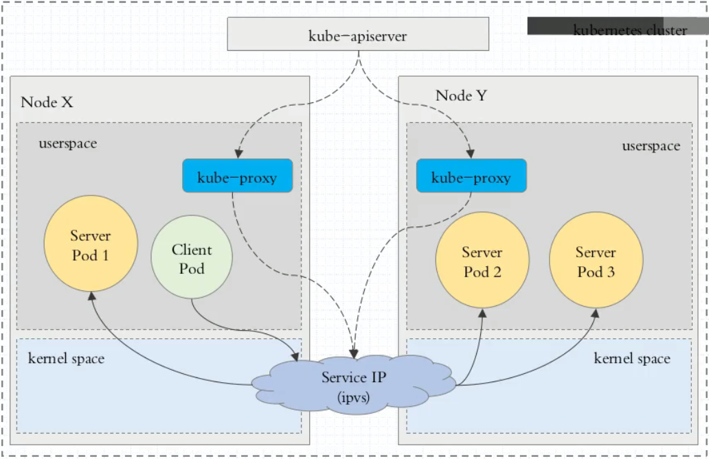
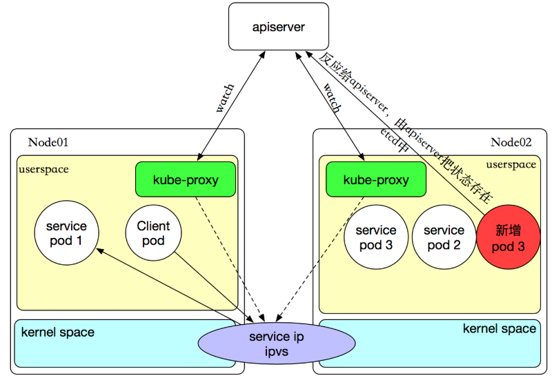

```
{
    "url": "k8s-service",
    "time": "2020/10/01 06:24",
    "tag": "Kubernetes,容器化",
    "public": "no"
}
```

# 一、概述

## 1.1 关于Service

通过前面文章的学习应该已经对`K8s`有个基础的了解，我们可以通过`Deployment`来创建`Pod`、扩容与缩容，每个`Pod`都会分配一个独立的`IP`，但这个`IP`只在容器内部使用，外部无法直接访问；另外`Pod`动态伸缩后可能会产生新的`IP`，这个`IP`如何被发现并提供服务？所以2个问题：

- 如何发现新的`Pod`？
- 如果对一组`Pod`提供统一的对外访问？新增、删除`Pod`调用方都不需要调整节点地址。

在`Docker`中我们可以通过端口映射暴露宿主机器端口，从而实现外部访问。在`k8s`中，可以通过`Service`来解决这个问题，先来看看`Service`的使用。

## 1.2 示例

我们已经尝试用`Service`开放端口，前一章`4.2`的示例就是一个基础的`Service`示例，网络方式是`LoadBalencer`，当时能访问就没有细究。`Service`示例如下：

```
apiVersion: v1
kind: Service
metadata:
  name: nginx-svc
  labels:
    project: nginx
spec:
  type: LoadBalancer
  ports:
  - port: 38000
    targetPort: 80
    protocol: TCP
  selector:
    app: nginx-pod
```


# 二、工作方式

在 Kubernetes 集群中[<sup>[1]</sup>](#refer)，每个 Node 运行一个 `kube-proxy` 进程。`kube-proxy` 负责为 `Service` 实现了一种 `VIP`（虚拟 IP）的形式，而不是 `ExternalName` 的形式。 在 Kubernetes v1.0 版本，代理完全在 userspace。在 Kubernetes v1.1 版本，新增了 iptables 代理，但并不是默认的运行模式。 从 Kubernetes v1.2 起，默认就是 iptables 代理。在Kubernetes v1.8.0-beta.0中，添加了ipvs代理。在 Kubernetes v1.0 版本，`Service` 是 “4层”（TCP/UDP over IP）概念。 在 Kubernetes v1.1 版本，新增了 `Ingress` API（beta 版），用来表示 “7层”（HTTP）服务。

`kube-proxy`这个组件始终监视着apiserver中有关service的变动信息，获取任何一个与service资源相关的变动状态，通过watch监视，一旦有service资源相关的变动和创建，kube-proxy都要转换为当前节点上的能够实现资源调度规则（例如：iptables、ipvs）

## 2.1 userspace

这种模式，当客户端Pod请求内核空间的service iptables后，把请求转到给用户空间监听的kube-proxy 的端口，由kube-proxy来处理后，再由kube-proxy将请求转给内核空间的 service ip，再由service iptalbes根据请求转给各节点中的的service pod。

由此可见这个模式有很大的问题，由客户端请求先进入内核空间的，又进去用户空间访问kube-proxy，由kube-proxy封装完成后再进去内核空间的iptables，再根据iptables的规则分发给各节点的用户空间的pod。这样流量从用户空间进出内核带来的性能损耗是不可接受的。在Kubernetes 1.1版本之前，userspace是默认的代理模型。


## 2.2 iptables

客户端IP请求时，直接请求本地内核service ip，根据iptables的规则直接将请求转发到到各pod上，因为使用iptable NAT来完成转发，也存在不可忽视的性能损耗。另外，如果集群中存在上万的Service/Endpoint，那么Node上的iptables rules将会非常庞大，性能还会再打折扣。iptables代理模式由Kubernetes 1.1版本引入，自1.2版本开始成为默认类型。


## 2.3 ipvs

Kubernetes自1.9-alpha版本引入了ipvs代理模式，自1.11版本开始成为默认设置。客户端IP请求时到达内核空间时，根据ipvs的规则直接分发到各pod上。kube-proxy会监视Kubernetes `Service`对象和`Endpoints`，调用`netlink`接口以相应地创建ipvs规则并定期与Kubernetes `Service`对象和`Endpoints`对象同步ipvs规则，以确保ipvs状态与期望一致。访问服务时，流量将被重定向到其中一个后端Pod。

与iptables类似，ipvs基于netfilter 的 hook 功能，但使用哈希表作为底层数据结构并在内核空间中工作。这意味着ipvs可以更快地重定向流量，并且在同步代理规则时具有更好的性能。此外，ipvs为负载均衡算法提供了更多选项，例如：

- `rr`：轮询调度
- `lc`：最小连接数
- `dh`：目标哈希
- `sh`：源哈希
- `sed`：最短期望延迟
- `nq`：不排队调度

**注意： ipvs模式假定在运行kube-proxy之前在节点上都已经安装了IPVS内核模块。当kube-proxy以ipvs代理模式启动时，kube-proxy将验证节点上是否安装了IPVS模块，如果未安装，则kube-proxy将回退到iptables代理模式。**



如果某个服务后端pod发生变化，标签选择器适应的pod有多一个，适应的信息会立即反映到apiserver上,而kube-proxy一定可以watch到etc中的信息变化，而将它立即转为ipvs或者iptables中的规则，这一切都是动态和实时的，删除一个pod也是同样的原理。如图：



# 三、 服务类型

类型决定`Service`以什么方式暴露应用程序，默认是`ClusterIP`，`type`可以分成4种模式：[<sup>[2]</sup>](#refer)

- `ClusterIP`： 默认方式。根据是否生成`ClusterIP`又可分为`普通Service`和`Headless Service`两类：
  - `普通Service`：通过为`Kubernetes`的Service分配一个集群内部可访问的`固定虚拟IP`（`Cluster IP`），实现集群内的访问。为最常见的方式。
  - `Headless Service`：该服务不会分配`Cluster IP`，也不通过`kube-proxy`做反向代理和负载均衡。而是通过`DNS`提供稳定的络ID来访问，DNS会将headless service的后端直接解析为podIP列表。主要供`StatefulSet`使用。
- `NodePort`：除了使用`Cluster IP`之外，还通过将service的port映射到集群内每个节点的相同一个端口，实现通过`nodeIP:nodePort`从集群外访问服务。
- `LoadBalancer`：和nodePort类似，不过除了使用一个`Cluster IP`和`nodePort`之外，还会向所使用的公有云申请一个负载均衡器(负载均衡器后端映射到各节点的`nodePort`)，实现从集群外通过LB访问服务。
- `ExternalName`：是` Service`的特例。此模式主要面向运行在集群外部的服务，通过它可以将外部服务映射进k8s集群，且具备k8s内服务的一些特征（如具备namespace等属性），来为集群内部提供服务。此模式要求kube-dns的版本为1.7或以上。这种模式和前三种模式（除headless service）最大的不同是重定向依赖的是dns层次，而不是通过`kube-proxy`。
  比如，在service定义中指定`externalName`的值`my.database.example.com`：此时k8s集群内的DNS服务会给集群内的服务名 `..svc.cluster.local`创建一个`CNAME`记录，其值为指定的`my.database.example.com`。
  当查询k8s集群内的服务`my-service.prod.svc.cluster.local`时，集群的`DNS`服务将返回映射的`CNAME`记录`foo.bar.example.com`。

> 备注：前3种模式，定义服务的时候通过selector指定服务对应的pods，根据pods的地址创建出endpoints作为服务后端；Endpoints Controller会watch Service以及pod的变化，维护对应的Endpoint信息。kube-proxy根据Service和Endpoint来维护本地的路由规则。当Endpoint发生变化，即Service以及关联的pod发生变化，kube-proxy都会在每个节点上更新iptables，实现一层负载均衡。而ExternalName模式则不指定selector，相应的也就没有port和endpoints。ExternalName和ClusterIP中的Headles Service同属于Headless Service的两种情况。Headless Service主要是指不分配Service IP，且不通过kube-proxy做反向代理和负载均衡的服务。

## 3.1 ClusterIP


## 3.2 NodePort


## 3.3 LoadBalancer


## 3.4 ExternalName


---

<div id="refer"></div>

- [1] [Kubernetes学习之路（十四）之服务发现Service](https://www.cnblogs.com/linuxk/p/9605901.html)
- [2] [k8s~k8s里的服务Service](https://www.cnblogs.com/lori/p/12052552.html)
- [3] [k8s ingress原理及ingress-nginx部署测试](https://segmentfault.com/a/1190000019908991)

