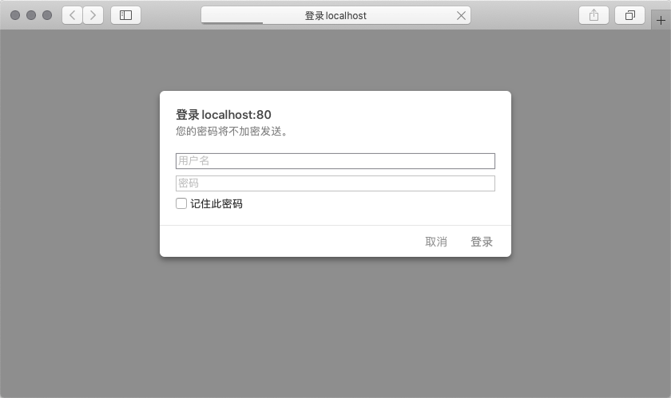

```
{
    "url": "nginx-module",
    "time": "2018/06/06 17:54",
    "tag": "Nginx,Linux",
    "toc": "no"
}
```


# 一、增加HTTP验证

1、 配置`auth_basic`和`auth_basic_user_file`，文件可以先指定，下一步会用`htpasswd`生成。

```
server {
    listen       80;
    server_name  localhost;

    auth_basic "Welcome to Localhost";
    auth_basic_user_file /usr/local/server/nginx1.10.3/conf/vhost/auth_user_list;

    #charset koi8-r;

    #access_log  logs/host.access.log  main;

    location / {
        root   html;
        index  index.html index.htm;
    }
```

2、 配置密码文件，多个账号换行分隔。

```
pengbotao:conf peng$ sudo htpasswd -c /usr/local/server/nginx1.10.3/conf/vhost/auth_user_list peng
New password:
Re-type new password:
Adding password for user peng

pengbotao:conf peng$ more /usr/local/server/nginx1.10.3/conf/vhost/auth_user_list
peng:$apr1$ySsxdCSf$W5YxzVzSQ2rbNiipwYpT5/
```

3、 重启Nginx即可看到效果。



# 二、限流

- limit_req_zone 用来限制单位时间内的请求数，即速率限制,采用的漏桶算法 "leaky bucket"。
    - 如：limit_conn_zone $clientRealIp zone=perip:10m;
- limit_conn_zone 用来限制同一时间连接数，即并发限制。
    - 如：limit_req_zone $clientRealIp zone=one:10m rate=8r/s;

server模块配置示例：

```
server {
    limit_conn perip 20;
    limit_req zone=one burst=25;
```

还是以localhost为例，配置后刷新就会出现503了。

```
    limit_conn_zone $binary_remote_addr zone=perip:10m;
    limit_req_zone $binary_remote_addr zone=one:10m rate=1r/s;

    server {
        listen       80;
        server_name  localhost;

        limit_conn perip 1;
        limit_req zone=one;
```

参考：https://www.cnblogs.com/biglittleant/p/8979915.html

# 三、GeoIP2进行地域转发

参考：https://www.cnblogs.com/itusye/p/11926980.html
