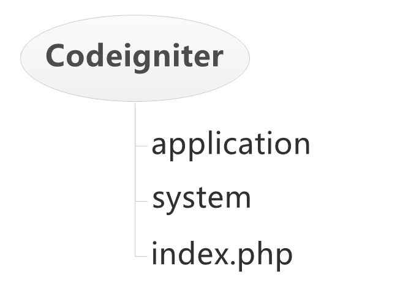
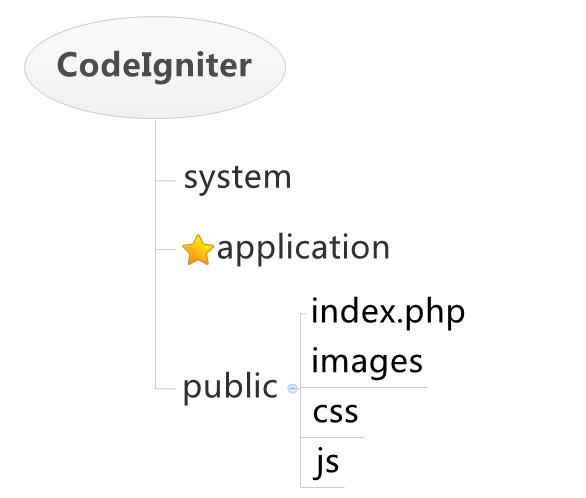
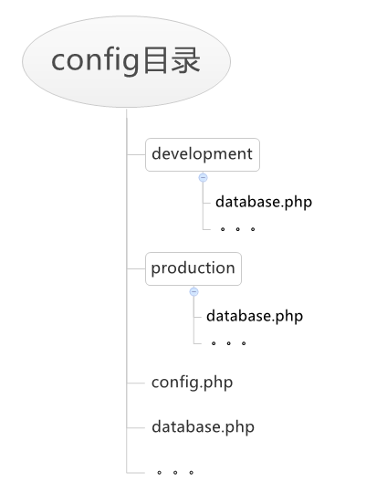

```
{
    "url": "codeigniter-initialization",
    "time": "2013/10/27 12:42",
    "tag": "PHP,CodeIgniter"
}
```

# 一、目录结构
CodeIgniter框架已帮我们配置好了项目目录结构，来看看`Codeigniter`的目录结构：



- **index.php**： CodeIgniter单一入口文件。
- **system**： 框架目录，Codeigniter核心文件和自带的类库、函数等。
- **application**： 应用目录，包括控制器、模型、配置、类库等等，所有的PHP代码都写在该目录中。

CI提供的默认结构可能是最方便、快速的，但不一定是最好的。可以看到入口文件和application、system目录处于同一级别，这意味着web目录也可以访问到`application`、`system`中的内容。虽然CI对每个目录做了.htaccess限制，但依然存在潜在的危险。可能由于服务器配置不支持或不完善导致某些目录可以被访问到。并且随着开发的不断进行，我们可能会在每一个目录中放一些文件，即便根目录，当这些不该被访问到的文件成为可能时，潜在的危险就产生了。

**该如何调整？**

其实很简单，可以把静态资源和入口文件放在一起，`application`和`system`放置在`web`目录之外，参考下图：



调整之后所有需要外部可访问的图片、样式、脚本等就都放在`public`目录下即可。那`Codeigniter`为什么还这么放呢？目录的调整需要有相关的权限才行，如果服务器没调整的权限，就不行了。CI本身也提倡把应用和框架放在根目录之外。

**所以，不该让用户访问到的文件坚决不让用户存在访问的可能性。**

最后回头看看自己的项目，日志文件是否乱放而且在可访问的目录下，不该访问到的缓存、模版文件是否都可以访问到，一些备份的文件是否也直接在根目录下？

# 二、环境配置、SVN配置
先来看一个实际的例子，项目中存在这样一个配置文件：
```

$STATUS = 'normal'; //测试为test,正式为normal
$KEY_INFO = array(
    'a_test' => array(
        'key' => 'a_test_key',
        'value' => 'a_test_value'
    ),
    'a_normal' => array(
        'key' => 'a_normal_key',
        'value' => 'a_normal_value'
    ),
    'b_test' => array(
        'key' => 'b_test_key',
        'value' => 'b_test_value'
    ),
    'b_normal' => array(
        'key' => 'b_normal_key',
        'value' => 'b_normal_value'
    ),
);
```
生产环境和测试环境的开关通过`$STATUS`变量来控制，而`$STATUS`定义和配置文件在同一个文件中，这意味着每次发布的时候都需要把这个值改成`normal`，测试的时候再调整回来，这样就无缘无故增加了发布的难度和错误产生的几率，每次提交的时候都得小心翼翼。产生该问题的主要原因就是把环境和配置没有分离开，环境和配置耦合在一个文件里了。很多时候我们写一个类的时候也会有类似的做法，将类需要配置的信息直接写死在属性中，不方便调整。

所以多环境的配置是十分有必要的，而`Codeigniter`框架是支持多环境配置的，环境的配置在`index.php入`口文件的第21行
```
/*
 *---------------------------------------------------------------
 * APPLICATION ENVIRONMENT
 *---------------------------------------------------------------
 *
 * You can load different configurations depending on your
 * current environment. Setting the environment also influences
 * things like logging and error reporting.
 *
 * This can be set to anything, but default usage is:
 *
 *     development
 *     testing
 *     production
 *
 * NOTE: If you change these, also change the error_reporting() code below
 *
 */
    define('ENVIRONMENT', 'development');
```
即CI开篇就定义了环境配置，那不同的环境配置会影响到哪些方面？

- 1、 报错机制。不同的环境设置的报错级别不同，如开发环境（development）会显示所有错误信息，而生产环境（production）则会屏蔽所有错误信息。
- 2、 加载的配置文件不同，从而实现多套环境配置。

在开发过程中会将数据库配置设置为测试服或本机，而生成环境下会修改为正式服。那这么多环境该如何设置？

先看看application目录下的config目录，该目录主要为系统的配置目录，如数据库配置、路由配置等。以数据库配置为例，当连接DB时，会读取config/database.php的配置文件，但这种情况是在没有自定义配置时。当我们定义ENVIRONMENT为development是，并创建config/development/database.php时，系统会从此环境来读取数据库配置，而非config/database.php

所以针对开发环境我们可以创建development目录，并将开发的配置文件放置于此目录下，创建production目录，用于发布时生产环境的配置，如下图所示：



**注意:**

对于个人定义的配置文件，若通过`$this->load->config`的方式加载，也适用多套环境，若是通过include加载则不行。

环境配置完之后还需要配合SVN的管理，方便日常的工作。**那针对多种环境SVN要如何配置?**

创建项目的时候，在config下创建`development`目录和`production`目录，并将两个目录提交到SVN,然后忽略两个目录里面的所有文件。那么其他人down下来的时候，会存在这两个目录，但目录是空的，若个人有特殊配置，拷贝相应的配置文件到`ENVIRONMENT`目录下即可，既可自定义，又无需担心提交到SVN。

至于怎么忽略文件夹里面的内容，可参考如下方式：

在development目录下随意创建个 a.txt 和 a 目录，选择两个文件，右键SVN选项中按扩展名忽略，并提交到SVN即可。

**SVN应尽可能的保持干净，以免因疏忽而导致提交异常代码到SVN，从而影响到其他人的开发效率和生产环境的正常功能。**

# 三、权限、调试、项目发布
碰到过这样子的情况，测试环境部署某个项目，配置好了站点以及修改权限等配置后可以访问，但登录提交却直接刷新本页面，没有正常跳转到其他地址，后来查找原因是某个目录没有写权限。我们在开发的时候自己常常比较清楚该怎么配置，但后面他人接手时就不会这么清楚了。所以开发的时候我们应当尽可能的减少一些不必要的异常，这里完全可以把该目录移到cache目录下。

接下来看看CI初始化时还需要做的一些事情：

## 3.1. 目录权限
application目录的cache目录和logs目录分别用来存放缓存和日志文件，需要设置为递归可写。

**cache：**

- 1、 一般用来存放输出缓存，模版缓存，一些数据的文件缓存，通常情况下这里的各种缓存是可删除的，删除后不会对系统有什么影响。所以若是不可删除的数据，则需要考虑下是否放置该目录，避免因其他操作删除而影响系统运行。
- 2、 该目录可以作为缓存的唯一目录。过多的缓存目录将会使发布变得困难，或者因为文件权限文件而产生问题。
尽可能少的目录权限调整让系统变得更简单。

**log：** 主要用来记录运行日志，开启系统日志后会在该目录下生成log-{date}.php的日志文件。

## 3.2 开启调试
CI中允许你开启或禁用评测器，评测器将在页的底部显示测试基准点或调试、优化需要的其他数据。在控制器任何位置插入下面语句即可。
```
$this->output->enable_profiler(TRUE);
```
其他开发环境相关调整：

- 1、 环境设置为development，框架默认为development
- 2、 设置config.php中的日志记录等级（log_threshold），一般设置为1即可，方便查看系统运行中的错误日志记录。
- 3、 设置database.php中的调试开关（db_debug），开启调试，有SQL出错将直接在页面上打印，方便查看。

# 3.3 项目发布

1、发布PHP代码和创建相应数据库，并更改服务器配置增加新的站点并指向到public目录。

2、是否需要需要配置重定向，重定向某些URL以及去掉地址栏的index.php

**Apache中.htaccess去掉index.php**
```
<IfModule mod_rewrite.c>
RewriteEngine on
  
# if a directory or a file exists, use it directly
RewriteCond %{REQUEST_FILENAME} !-f
RewriteCond %{REQUEST_FILENAME} !-d
  
# otherwise forward it to index.php
RewriteRule . index.php
</IfModule>
```
**Nginx配置**
```
server {
    listen       80;
    server_name  s.local;
    index index.php;
    root  /var/www/scaffold;
  
    if (!-e $request_filename) {
        rewrite ^.*$ /index.php last;
    }
    location ~ .*\.(php|php5)?$ {
        fastcgi_pass unix:/tmp/php-cgi.sock;
        fastcgi_index index.php;
        fastcgi_param SCRIPT_FILENAME $document_root$fastcgi_script_name;
        include fastcgi_params;
        fastcgi_param PATH_INFO $fastcgi_script_name;
    }
    location ~ .*\.(gif|jpg|jpeg|png|bmp|swf)$ {
            expires      30d;
    }
    location ~ .*\.(js|css)?$ {
            expires      1h;
    }
    access_log off;
}
```
3、修改index.php中development为production，config下若无production目录则创建production目录，拷贝database.php 以及其他正式配置文件到production目录下，并关闭DB的调试模式以及要调整的地方。

4、 修改目录权限，application目录下cache和log目录必须可写。

5、访问站点测试功能是否正常。