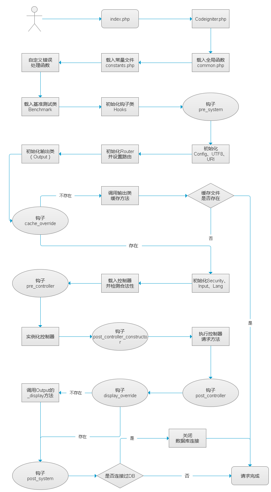
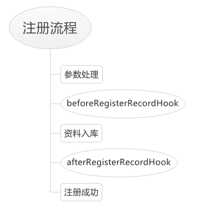

```
{
    "url": "codeigniter-core",
    "time": "2013/11/28 19:22",
    "tag": "PHP,CodeIgniter",
    "toc": "yes"
}
```

# 一、执行流程
CI手册介绍一栏有关于应用程序流程图的介绍，从更宏观的层面来解读CI的执行流程。CI的整体流程都集中在核心目录中的CodeIgniter.php文件中，这里整理了一张CodeIgniter中的执行流程，其中突出了钩子，为后面整理钩子用。
说明：

1、只有在实例化控制器之后的操作才可以调用 get_instance 获取实例，因为未实例化之前没有CI_Controller对象。所有发现有写程序中用的global的方式获取，有些是通过CI实例来获取的。



# 二、钩子
CodeIgniter执行流程图中有7个椭圆的框，这表示在执行的过程中埋了7个钩子。那先来看看什么是钩子？
网上找到的两段文字：

> 钩子的完整实现应该叫事件驱动。事件驱动分为两个阶段，第一个阶段是注册事件，目的是给未来可能发生的“事件”起一个名字，简单的实现方法是用单例模式产生一个持久的对象或者注册一个全局变量，然后将事件名称，以及该事件对应的类与方法插入全局变量即可。也就是挂载一个钩子。
> 第二个阶段是触发事件，本质上就是在事件的全局变量中查询要触发的事件名称，然后找到注册好的类与方法，实例化并运行。这样子就可以摆脱传统方式中程序必须按顺序的规则，进一步实现解除耦合的目的。


> 钩子函数可以截获并处理其他应用程序的消息。每当特定的消息发出，在没有到达目的窗口前，钩子程序就先捕获该消息，亦即钩子函数先得到控制权。这时钩子函数即可以加工处理（改变）该消息，也可以不作处理而继续传递该消息，还可以强制结束消息的传递。

可以看到：
- 1、钩子函数是预设并在特定的条件下触发的。
- 2、钩子函数接管程序后可以影响到程序的走向。

**CI预设钩子**

CI中设定了7个钩子，钩子与钩子之间相对独立。前3个钩子是在实例化之前设定的，意味着无法使用get_instance实例，要使用已实例化的类需要global。7个钩子的作用手册上说的比较清楚了，可以重写缓存输出、可以对输出进行处理等。

**如何触发CI钩子？**

CI在配置文件中设置了钩子开关，要使用钩子首先得打开该开关，然后配置config/hook.php中的hook数组，比如设置post_controller_constructor钩子：
```
$hook['post_controller_constructor'] = array(
    'class'    => 'Hook',
    'function' => 'post_controller_constructor',
    'filename' => 'Hook.php',
    'filepath' => 'hooks',
    'params'   => array('beer', 'wine', 'snacks')
);
```
当控制器实例化之后，调用action之前就会触发去执行hooks目录下的Hook.php中的post_controller_constructor方法。我们可以在该方法中做一些处理。

**钩子的应用**

到目前为止还未体会到CI钩子的绝妙之处，查看网上有一些应用CI钩子来实现权限控制的程序，即在post_controller_constructor做权限判断，由于这个钩子就好比一个构造函数，在构造函数里判断接下来要执行的方法是否有权限，确实可行。但这个功能也完全可以放在MY_Controller中去实现，甚至会更好。因为CI的钩子是全局的，不管是前台还是后台都会启动该钩子，虽然说这个钩子程序可以做判断，但这里判断不一定是最好的。前面提到过MY_Controller中不同模块公用控制器分开，前台后台继承不同的控制器，如果我只需要对后台进行权限控制，完全可以直接在后台公用控制器中来实现，不影响到前台，只对需要的部分做控制。

这里有个非CI中的例子，思维是一样的。合作渠道的用户登录注册功能，有很多的合作方，不同的合作方需要注册的基本资料相同，但每个合作方可能会有一些特殊的字段或者不同的校验方式。

很多时候碰到问题我们都可以放到日常生活中来看。以注册处理逻辑为例，可以看看其中有个流程是不变的。接受参数->注册资料之前处理->注册->注册资料之后处理。变化的是什么？每一步都可能变化，但流程不变化。所以可以对前、后、处理等相关地方设置钩子，把处理的逻辑分发到特定的情况下去，下面有个参考图，具体的如何设置钩子还需要根据项目来：



事实也证明这种方式是可行的，合作方虽然很多，但是也可以分组，上百个注册页面很容易就实现了。所以利用钩子处理这种流程不变，而中间的某个步骤变化多端的需求是很方便的。

**简单点说， 钩子就是特定条件下执行一段程序;再简单点，钩子就是实现解除if判断的一种方式。**

过多的if判断会导致程序难以阅读和维护，而通过钩子的处理可以让程序更灵活。钩子有一定的触发条件，条件可以是配置、从数据库读取，或者通过一些技术来实现，比如反射等，使用钩子可以达到解耦的目的。

# 三、多语言支持
CI应用目录下有一个language语言包目录，用来配置多种不同的语言。语言的配置位于config文件中，配置格式如下：
```
$config['language'] = 'english';
```
**定义语言文件**

language下有个空的english目录，即上面定义的系统默认语言目录，系统会从该目录加载语言包文件。如果要定义不同的语言包，如zh_cn，则创建zh_cn目录并配置相应语言包文件即可。需要注意的是，语言文件的后缀必须为_lang.php，语言翻译通过数组的键值对来实现，为防止出现重复的键名，可以为键名增加统一的前缀。配置的方式可参考下面：
```
$lang['menu_system_title'] = '系统设置';
$lang['menu_system_user_admin'] = '用户管理';
$lang['menu_system_user_list'] = '用户列表';
$lang['menu_system_user_detail'] = '用户详情';
$lang['menu_system_setting'] = '配置管理';
  
/* End of file user_menu_lang.php */
/* Location: ./system/language/zh_tw/user_menu_lang.php */
```
**语言包的使用**

使用语言包之前需要先加载语言包，加载和使用方式如下：
```
//加载方式一，加载时不需要传入_lang
$this->load->language(array('user_menu', 'user_message'));
  
//加载方式二
$this->lang->load('user_menu');
  
//使用方式一
echo $this->lang->line('language_key');
  
//使用方式二（需先加载language帮助函数）
$this->load->helper('language');
echo lang('menu_system_title');
```
可以说语言包的使用相当简单，前不久也做了个台湾版的系统，顺便说下CI中的语言包的使用及需要注意的问题。

**1、$config['language'] 直接配置成 zh_cn 会怎么样？**

系统中有一些默认的语言包位于system/language/english目录下，当使用系统中提供的一些类报错时会加载对应的语言包。此时系统会先到language/zh_cn目录下去查找，然后去system/language/zh_cn目录下查找，都找不到就提示找不到语言包的错误。所以若更改了language配置，最好拷贝system/language/english下的文件到对应的语言目录下。
这里看起来有点奇怪，为什么不是这种思维：先到language/zh_cn目录下去找，找不到就到system/language/english目录下去找。叫english可能不合适，应该称呼为系统默认的语言包。

**2、是否需要使用语言包？**

在某个系统中发现这样子的情况， 有些错误提示用的语言包，有些直接用的中文，可能因为多人开发的原因，键的命名也不太规范，经常需要去对比对应的语言文件，导致程序阅读起来相对麻烦，而中文的则没该问题，个人在系统中使用语言包也觉得有点麻烦。所以，不需要考虑多语言的程序尽量还是不要使用语言包的好。

**3、如何自动检测语言包？**

通常情况下可以根据浏览器的语言类型来判断，PHP中的$_SERVER['HTTP_ACCEPT_LANGUAGE']可以获取到该值，然后根据字符串分隔或者正则匹配等方式即可获取到客户端浏览器默认语言类型。获取到之后通过$this->config->set_item('language', 'zh_cn');设置即可。

关于是否确实使用了语言包，可以重写lang函数，带^_^即为使用了语言包，参考如下：
```
function lang($line, $param = array())
{
    $CI =& get_instance();
    $line = $CI->lang->line($line);
    if(is_array($param) && count($param) > 0) {
        array_unshift($param, $line);
        $line = call_user_func_array('sprintf', $param);
    }
    return '^_^'.$line;
}
```
很多情况下多语言的实现都是通过数组的形式来实现，还有一些是.mo的格式,l18n多语言的实现方式，php中需要php_gettext扩展支持，详情可查阅相关资料。

# 四、扩展核心类
CI中对核心类、辅助类和函数的扩展是相当方便的，配置文件中指定了subclass_prefix扩展前缀，默认为MY_，扩展时需要以该配置为前缀，下面整理下扩展方式。

## 1、扩展核心类

核心类位于system/core下，其中大部分类会在初始化的时候自动加载。扩展核心类的方式有两种：替换核心类和继承核心类。

**替换核心类**

当application/core目录下存在与system/core同名的文件时会自动替换掉核心类。以Loader.php为例，当创建application/core/Loader.php后会自动加载该类，由于该类为系统核心类，所以，如果Loader.php未实现CI_Loader类中的方法则会报错，如：
```
class CI_Loader
{
    ...
}
```
替换核心类需要重写其中的所有方法，以免影响核心功能。但大部分时候并不需要重写整个核心，基本上只是增加某些方法，这个时候可以采取继承的方式。

**继承核心类**

继承核心类需要以subclass_prefix为前缀，如扩展Input类，需创建application/core/MY_Input.php，并且MY_Input需要继承CI_Input类，如：
```
<?php  if ( ! defined('BASEPATH')) exit('No direct script access allowed');
  
class MY_Input extends CI_Input
{
    function _clean_input_keys($str)
    {
        $config = &get_config('config');  
        if ( ! preg_match("/^[".$config['permitted_uri_chars']."]+$/i", rawurlencode($str))) {
            exit('Disallowed Key Characters.');  
        }
        // Clean UTF-8 if supported
        if (UTF8_ENABLED === TRUE) {
            $str = $this->uni->clean_string($str);
        }
        return $str;
    }
}
  
/* End of file MY_Input.php */
/* Location: ./application/core/MY_Input.php */
```
## 2、扩展CI类库
system/libraries下实现了一些辅助类，当有需要扩展这些类时，和核心类的处理方式是一样的，只不过目录变成了application/libraries

##3、扩展辅助函数
辅助函数存放于application/helpers目录下，辅助函数的“继承”方式与上面相同。因为CI的辅助函数都有使用function_exists来判断是否存在，所以也可以达到“重写”的目的。如在array中新增一个数组排序方法：
```
<?php  if ( ! defined('BASEPATH')) exit('No direct script access allowed');
/**
 * 对二维数组进行排序
 *
 * @param array $data 需要排序的字段
 * @param array $sort_field 按哪个键进行排序，如果不是所有键中都含有该字段则返回原数组
 * @param array $sort_type 排序方式 SORT_ASC 升序 SORT_DESC 降序
 * @return array
 */
function array_field_sort($data, $sort_field, $sort_type = SORT_ASC)
{
    if(! is_array($data)) {
        return false;
    }
    $sort_arr = array();
    foreach($data as $key => $val) {
        if(isset($val[$sort_field])) {
            $sort_arr[$key] = $val[$sort_field];
        }
    }
    if(count($sort_arr) == count($data)) {
        array_multisort($sort_arr, $sort_type, $data);
    }
    return $data;
}
/* End of file MY_array_helper.php */
/* Location: ./application/helpers/MY_array_helper.php */
```
总的来说，可以对CI框架system目录下的大部分内容进行重写，灵活度很高，扩展也很方便。但有时候也需要注意一下，并不是扩展的越多就越好，确保CI实现不了的功能再去扩展。最后既然CI提供了扩展的功能，就不要直接去修改system下的内容了。