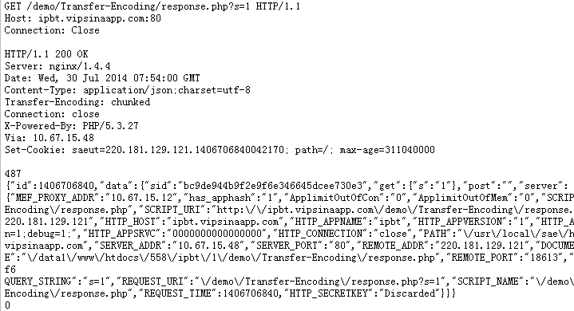

```
{
    "url": "chunked-encode",
    "time": "2014/07/30 12:50",
    "tag": "PHP,HTTP"
}
```

前不久同事调接口时发现了一个奇怪的问题，直接使用CURL请求接口，返回没有问题；而通过Socket请求时返回的信息多了两行。查看HTTP响应头发现，有时候会指定Content-Length，有时则是Transfer-Encoding: chunked。当chunked编码时，通过socket请求就出错。而如果此时服务端指定返回的长度则没问题。

问题就出在此！通常情况下会通过Content-Length来指定返回内容的长度，而有些时候无法确定长度时，可采用chunked编码动态返回。

**CHUNKED描述**

> 一般HTTP通信时，会使用Content-Length头信息性来通知用户代理（通常意义上是浏览器）服务器发送的文档内容长度，该头信息定义于HTTP1.0协议RFC 1945 10.4章节中。浏览器接收到此头信息后，接受完Content-Length中定义的长度字节后开始解析页面，但如果服务端有部分数据延迟发送吗，则会出现浏览器白屏，造成比较糟糕的用户体验。

> 解决方案是在HTTP1.1协议中，RFC 2616中14.41章节中定义的Transfer-Encoding: chunked的头信息，chunked编码定义在3.6.1中，所有HTTP1.1 应用都支持此使用trunked编码动态的提供body内容的长度的方式。进行Chunked编码传输的HTTP数据要在消息头部设置：Transfer-Encoding: chunked表示Content Body将用chunked编码传输内容。根据定义，浏览器不需要等到内容字节全部下载完成,只要接收到一个chunked块就可解析页面.并且可以下载html中定义的页面内容,包括js,css,image等。

**格式**

http://zh.wikipedia.org/wiki/%E5%88%86%E5%9D%97%E4%BC%A0%E8%BE%93%E7%BC%96%E7%A0%81

如果一个HTTP消息（请求消息或应答消息）的`Transfer-Encoding`消息头的值为`chunked`，那么，消息体由数量未定的块组成，并以最后一个大小为0的块为结束。

每一个非空的块都以该块包含数据的字节数（字节数以十六进制表示）开始，跟随一个`CRLF` （回车及换行），然后是数据本身，最后块CRLF结束。在一些实现中，块大小和CRLF之间填充有白空格（0x20）。最后一块是单行，由块大小（0），一些可选的填充白空格，以及CRLF。最后一块不再包含任何数据，但是可以发送可选的尾部，包括消息头字段。消息最后以CRLF结尾。

**模拟socket请求**

模拟请求后请求数据和返回数据如下图：



Transfer-Encoding指定chunked编码，并且分成两段，分别对应长度和内容，以0结束。可以对照上面的格式查看。

**编码解析**

通常这种问题发生在使用自己封装的socket方法时，并且HTTP版本使用1.1时会有该问题，所以可以使用1.0避免chunked编码解析的问题，或者使用CURL或者其他封装好的方法。
如果想解析chunked编码，也可参考手册上的方法: http://cn2.php.net/manual/en/function.fsockopen.php 

```
function unchunkHttpResponse($str=null)
{ 
    if (!is_string($str) or strlen($str) < 1) { return false; } 
    $eol = "\r\n"; 
    $add = strlen($eol); 
    $tmp = $str; 
    $str = ''; 
    do { 
        $tmp = ltrim($tmp); 
        $pos = strpos($tmp, $eol); 
        if ($pos === false) { return false; } 
        $len = hexdec(substr($tmp,0,$pos)); 
        if (!is_numeric($len) or $len < 0) { return false; } 
        $str .= substr($tmp, ($pos + $add), $len); 
        $tmp  = substr($tmp, ($len + $pos + $add)); 
        $check = trim($tmp); 
    } while(!empty($check)); 
    unset($tmp); 
    return $str; 
}
```