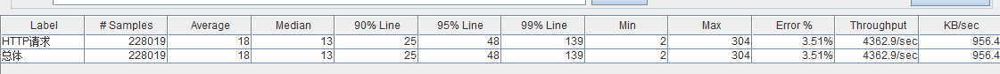
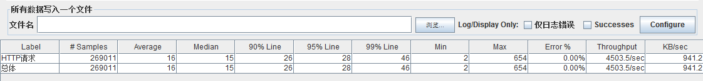
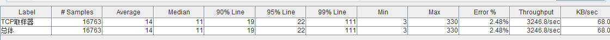

```
{
    "url": "swoole",
    "time": "2016/09/12 14:24",
    "tag": "PHP,Swoole"
}
```

# 一、概述
## 1.1 Swoole简介
Swoole是一个PHP的异步、并行、高性能网络通信引擎，使用纯C语言编写，提供了PHP语言的异步多线程服务器，异步TCP/UDP网络客户端，异步MySQL，异步Redis，数据库连接池，AsyncTask，消息队列，毫秒定时器，异步文件读写，异步DNS查询。 Swoole内置了Http/WebSocket服务器端/客户端、Http2.0服务器端。
Swoole可以广泛应用于互联网、移动通信、企业软件、云计算、网络游戏、物联网（IOT）、车联网、智能家居等领域。 使用PHP+Swoole作为网络通信框架，可以使企业IT研发团队的效率大大提升，更加专注于开发创新产品。

## 1.2 Swoole优势
- 纯C编写性能极强
- 简单易用开发效率高
- 事件驱动异步非阻塞
- 并发百万TCP连接
- TCP/UDP/UnixSock
- 服务器端/客户端
- 全异步/半异步半同步
- 支持多进程/多线程
- CPU亲和性/守护进程
- 支持IPv4/IPv6网络

## 1.3 使用场景
Swoole为了弥补PHP在网络编程、异步IO等方面的不足而产生的。它用C语言实现网络通信及其中的异步等逻辑，PHPer同样可以用PHP写出高性能的服务端程序。
使用Swoole可以提供基于tcp的即时通信、异步任务调度、Websocket服务、异步IO等功能。

## 1.4 开发模式
Swoole给PHPer提供了一种全新的开发模式，其编程思路不同于传统的PHPWeb编程，更类似Python、Nodejs，在命令行通过PHP执行一个脚本即启动服务，中间该脚本有更新需要重新启动服务。Swoole实现了HTTP，所以可以不依赖Nginx等Web服务器。

## 1.5 研究目标
查看是否可以使用Swoole实现异步任务调度，如发送短信、推送、缓存更新等，其中的效率怎样？

# 二、Swoole功能介绍
## 2.1 Swoole安装

- 官网：http://www.swoole.com
- 下载地址：https://github.com/swoole/swoole-src/releases

这里安装1.8.8-stable，PHP为PHP7.0.5，安装扩展同普通扩展一样。

```
# /usr/local/webserver/php7.0.5/bin/phpize
# ./configure --with-php-config=/usr/local/webserver/php7.0.5/bin/php-config
# make
# make install
```
然后修改php.ini添加到扩展里即可。

## 2.2 Swoole HttpServer
### 2.2.1 Web Server实现
Swoole实现了HTTP，一个简单HTTP示例如下：

```
<?php
$http = new swoole_http_server("0.0.0.0", 9501);
 
$http->on('request', function ($request, $response) use($http) {
    $response->end("Hello World");
});
 
$http->start();
```

在命令行启动该脚本即可监听9501端口，实现基本的Web服务功能。实现后第一个想到的问题是他的性能和PHP+Nginx的性能怎样？

### 2.2.2 压力测试
这里以Hello World作为参考，100个线程不断执行，下图是Swoole的压测结果：



可以看到，Hello World的吞吐量为4363，其中一直飙到5000，但这个时候开始出现错误了，稳定性上面打折扣，平均值18ms，90%在25ms以内，速度上还可以。接下来看看Nginx+PHP组合的Hello World



可以看到Nginx未出现Error的情况，效率也不比Swoole差。Swoole有一点优势就是支持异步去处理一下业务逻辑。比如：

```
<?php
$http = new swoole_http_server("0.0.0.0", 9501);
$http->set(array(
    'daemonize' => 0,  //以守护进程执行
    'max_conn' => 10240,
    'max_request' => 1024,
    'task_max_request' => 0,
    'dispatch_mode' => 2,
    'worker_num' => 4,       //一般设置为服务器CPU数的1-4倍
    'task_worker_num' => 8,  //task进程的数量
    "task_ipc_mode " => 3 ,  //使用消息队列通信，并设置为争抢模式
));
$http->on('request', function ($request, $response) use($http) {
    $http->task("param");
    $response->end("Hello World");
});
$http->on('Task', function(swoole_server $http, $task_id, $from_id, $data) {
    //do task
    return true;
});
$http->on('Finish', function(swoole_server $http, $task_id, $data) {
    echo "Task {$task_id} finish\n";
});
$http->start();
```

当然，PHP也可以直接起一个进程去执行脚本。根据压测的结果Http Server的稳定成都还不算满意。接下来进行一下TCP方式的测试。

## 2.3 Swoole TCP Server
### 2.3.1 TCP Server实现
设想一个这样子的场景，由PHP发送一个请求给TCP Server，Server可以同步返回也可以异步返回。
异步返回比如，将一些缓存的更新、短信的发送、推送等事件发送给TCP Server即可，Server收到请求后即返回；
同步的返回比如，获取用户数据，如果有缓存就直接从缓存取，没有缓存就读取数据后设置缓存并同步返回，这样子Server类似于MVC中的Model层，PHP做表现层。

最简单的Server写法写入：

```
$serv = new swoole_server("127.0.0.1", 9501);
$serv->set(array(
    'worker_num' => 8,   //工作进程数量
    'daemonize' => true, //是否作为守护进程
));
$serv->on('connect', function ($serv, $fd){
    echo "Client:Connect.\n";
});
$serv->on('receive', function ($serv, $fd, $from_id, $data) {
    $serv->send($fd, 'Swoole: '.$data);
    $serv->close($fd);
});
$serv->on('close', function ($serv, $fd) {
    echo "Client: Close.\n";
});
$serv->start();
```

可以通过telnet连接测试，我们这里将Server与Task组合起来实现同步和异步。

**小知识，TCP的封包过程一般有两种格式，Swoole也都支持。**

- EOF指定结束符，将Server接收到该结束符时表示该数据包发送完毕，否则等待客户端发送。需要注意的时发送的数据内容中不能有EOF标识符，否则可能导致数据包不完整，影响业务；
- 自定义封包协议，比如数据包中前四个字节代表数据长度，先接收到数据长度，然后根据数据长度再读取指定长度的数据。

这里为了压测方便，采用EOF的方式（分隔符为chr(35)），具体实现上还是采用自定义封包协议，示例如下：

```
$swoole_server = new swoole_server("0.0.0.0", 9501);
$swoole_server->set(array(
    'daemonize' => 0,  //以守护进程执行
    'max_conn' => 10240,
    'max_request' => 1024,
    'task_max_request' => 0,
    'dispatch_mode' => 2,
    'worker_num' => 4,   //一般设置为服务器CPU数的1-4倍
    'task_worker_num' => 8,  //task进程的数量
    "task_ipc_mode " => 3 ,  //使用消息队列通信，并设置为争抢模式
    "log_file" => "./taskqueueu.log" ,//日志
    "open_length_check" => true,
    "package_max_length" => 8192,
    /*
    "package_length_type" => "N",
    "package_length_offset" => 0,*/
    "package_body_offset" => 11,
     
    'open_eof_check'=> true,
    'package_eof' => chr(35),
));
$swoole_server->on('Start', function($server) {
    echo "start:".convert(memory_get_usage(true));
});
// 请求：4字节长度 + 2字节命令 +  4字节请求ID + 1字节同步异步(1同步，0异步) + JSON内容
// 返回：4字节长度 + 2字节状态码 + 4字节请求ID + JSON内容
$swoole_server->on('Receive', function(swoole_server $server, $fd, $from_id, $data) {
    if(strlen($data) < $server->setting["package_body_offset"]) {
        return ;
    }
    $param = unpack("Nlen/ncmd/Nid/Csync" , substr($data, 0, $server->setting["package_body_offset"]));
    //print_r($param);
    $body = substr($data, $server->setting["package_body_offset"] , $param['len']);
    if($param["sync"] == 0) {
        $server->task( $body );
        $server->send($fd, set_task_output(0, $param["id"]));
    } else {
        $rtn = handle($body);
        $server->send($fd, set_task_output(0, $param["id"], array("body" => $rtn)));
    }
});
$swoole_server->on('Task', function(swoole_server $server, $task_id, $from_id, $data) {
    return handle($data);
});
$swoole_server->on('Finish', function(swoole_server $server,$task_id, $data) {
    echo "Task {$task_id} finish, Memory ".convert(memory_get_usage(true))."\n";
});
$swoole_server->on('Close', function($server, $fd) {
    //echo "Client Close{$fd}, Memory ".convert(memory_get_usage(true))."\n";
});
$swoole_server->start();
function set_task_output($code = 0, $id = 0, $data = array())
{
    $len = 10;
    if(! empty($data)) {
        $data = json_encode($data);
    } else {
        $data = "";
    }
    $len += strlen($data);
    $data = pack("N", $len) . pack("nN", $code, $id) . $data.chr(35);
    return $data;
}
function handle($data)
{
    //echo "Data = {$data}\n";
    //sleep(3);
    return $data . str_repeat(".", rand(1, 1000));
}
function convert($size){
    $unit=array('b','kb','mb','gb','tb','pb');
    return @round($size/pow(1024,($i=floor(log($size,1024)))),2).' '.$unit[$i];
}
```

因为swoole仅能在Linux下使用，为方便开发这里不使用扩展自带的swoole client请求，直接使用fsockopen函数

```
$fp = fsockopen("192.168.1.168", 9501, $errno, $errstr, 30);
if (! $fp) {
    //exit;
}
$ramd = rand(1, 1000);
$data = json_encode(array(
    "cmd" => "get_user_info".$ramd,
    "param" => str_repeat("*", $ramd)
));
$sync = 0;
$msg = pack("N" , strlen($data)). pack("n", rand(0, 65535)) . pack("N", rand()). pack("C", $sync).  $data . chr(35);
//file_put_contents("pack.txt", bin2hex($msg.chr(35)));
fwrite($fp, $msg);
$length = 4;
$read = 0;
$ret = '';
while ($read < $length && ($buf = fread($fp, $length - $read))) {
        $read += strlen($buf);
        $ret .= $buf;
}
$ret = unpack('N', $ret);
$length = $ret[1] - 4;
$read = 0;
$ret = '';
while ($read < $length && ($buf = fread($fp, $length - $read))) {
    $read += strlen($buf);
    $ret .= $buf;
}
$param = unpack("ncode/Nid", substr($ret, 0, 6));
print_r($param);
$data = substr($ret, 6);
if($data) {
    print_r(json_decode($data, true));
}
fclose($fp);
```

这样子封包过程和解包过程就实现了。下面也看看压测的结果。

### 2.3.2 压力测试


效率上也没有太大问题，但跟Http Server一样，同样存在不稳定，当压测到一定成都之后Task就挂掉了，无法接收新的任务，需要重启服务。官方对task的使用说明：

> task操作的次数必须小于onTask处理速度，如果投递容量超过处理能力，task会塞满缓存区，导致worker进程发生阻塞。worker进程将无法接收新的请求

目前的访问量来看不会出现这么大量，但不能确保系统不会做一些批量操作之类的，这样导致服务挂掉的情况。而稳定性在生产环境上却是首要考虑的问题。

## 2.4 其他功能

Swoole还提供了很多功能，比如WebScoket、AsyncIO、内存操作、进程操作，Mysql、Reds连接池等等，但和上面某类似的感觉，会存在一些不靠谱的情况。比如异步IO中的异步写文件：
```
swoole_async_write("a.txt", "Hello World", -1);
```
当不指定第四个参数回调函数时，执行报段错误，若是传入一个NULL则不会。但文档上标注的是一个可写参数。

# 三、总结
整体来说，Swoole给PHPer提供了一种新的开发思路，是件不错的事情。测试脚本中没有什么业务的前提下看到内存的控制是不错的，直到挂掉也还是占用2M的内存。Swoole也提供了一些参数来控制进程执行请求数的数量，当达到这个数量后进程后重启。但文档的欠缺，稳定性上的不足是需要考虑的，社区的活跃程度也不高。我觉得官方需要做的不是提供一个又一个的功能，而是从程序的健壮性和完善文档方面来考虑，让PHP在服务端网络编程方面也能占一席之地。

最后，虽然官网声称有很多公司在用，在通过自测的情况来看，Swoole在生产环境中的使用还需要观望。