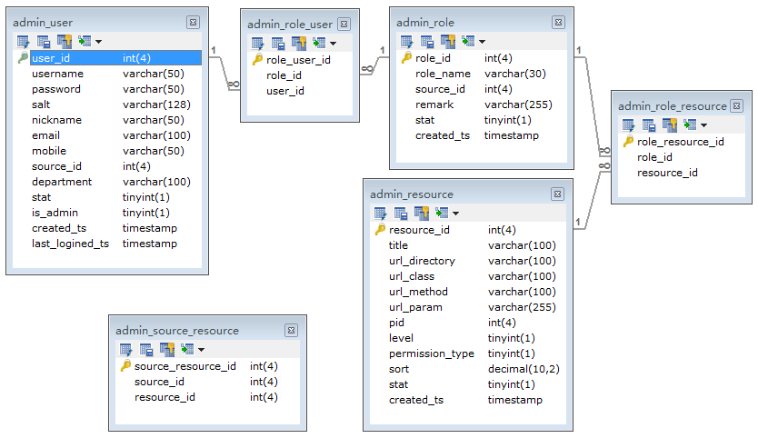

```
{
    "url": "rbac-design",
    "time": "2014/04/12 11:25",
    "tag": "PHP"
}
```

最近开发了一个新的管理系统，整理下其中的权限设计，尤其是开发过程中慢慢发现的问题提出来，方便下次改进。

**需求：**

开发一个管理系统，该系统可以支持多渠道商查看，并且每个渠道商只能查看自己的相应数据。

**分析：**

- 1、渠道商属于合作公司，所以他们应当有创建用户，分配权限的功能，并且分配的这些权限不能超过渠道超级管理员所拥有的最大权限。
- 2、基于前面这一点，渠道之间应该是互不影响的权限分配，并且尽可能简单为好。
- 3、数据权限该怎么控制？数据权限的控制会使操作变得复杂。需要给各渠道分配数据权限，各渠道之间再分配权限也可能涉及到数据权限的控制。本着让自己简单点，也让使用者简单点的原则，数据上只根据渠道做了控制，控制的方式则写在了对应的程序里，渠道通过控制资源的访问来限制权限，期待大神指点。

**设计：**

设计的思想还是围绕这RBAC的方式来进行，基本的5个表是需要的：管理员、角色、资源、管理员与角色关系表、角色与资源对应关系表。

**用户表：**记录下用户的基本信息，该用户属于哪个渠道，该管理员是普通管理员还是超级管理员。所以增加了渠道字段source_id，以及管理员字段is_admin。管理员分为三种，普通管理员、超级管理员、系统管理员。系统管理员可以理解为开发者，用来创建超级管理员并给超级管理员分配权限，超级管理员则是对应渠道的最大权限管理员。

**角色表：**用户通过角色与资源相关联。这里需要增加渠道字段，每个渠道创建的角色归本渠道所有。

**用户角色关系表：**维护用户与角色的关系，用户与角色之间是多对多的关系。可能设计的时候会考虑有没有必要？是否可以在用户表中增加一个字段来维护和角色的关系。如果确定一个用户只可拥有一个角色，放在这里也是可行。但如果以后要扩展多个角色就不方便扩展了，得增加字段或者说用逗号分隔的方式来记录：1,2,3。而逗号分隔的维护性不好，查询、分配可能问题不大，但如果删除角色时去更新拥有这些角色的用户就比较麻烦了。

**资源表：**这里的理解就是一个个的系统菜单。

**角色资源关系表：**维护角色与资源的关系。

在这个基础上要实现渠道分配权限的功能还需要有一个渠道和资源的关系，这里定义为渠道最大权限表。渠道超管的权限直接通过该表获取，不用再给渠道超管分配角色，渠道管理员给普通管理员分配权限也受限于这里所拥有的权限。表的维护由系统管理员来管理。

最后E-R图：



**开发过程中的思考**

1、角色增加了渠道字段，资源需不需要增加渠道字段？

增加渠道后知道这个资源属于那个渠道拥有，这里面也就有一个对应关系了。 这个对应关系就是这里说的渠道最大权限表。

2、渠道和用户组的概念？

这里渠道可以看成一个用户组，组与用户的关系，组与权限的关系，最开始思维局限在渠道这块了。

3、系统中菜单访问没有权限可以推荐到同级别的菜单访问。

权限的设计可以弄的很麻烦，这里本着尽可能简单的方式，有一些非菜单访问的页面就直接忽略掉控制（permission_type），只是在入口页面控制权限分配，减少管理员的操作。当然敏感的操作还是要控制。