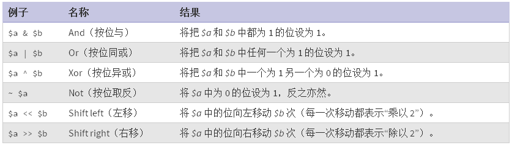

```
{
    "url": "liucunlv-shixian",
    "time": "2014/03/06 11:10",
    "tag": "PHP"
}
```

统计留存率之前先弄清一下留存率的概念，百度百科中是这么说的：

用户在某段时间内开始使用应用，经过一段时间后，仍然继续使用应用的被认作是留存；这部分用户占当时新增用户的比例即是留存率，会按照每隔1单位时间（例日、周、月）来进行统计。顾名思义，留存指的就是“有多少用户留下来了”。留存用户和留存率体现了应用的质量和保留用户的能力。

简单点说，第一天新增加了100个用户，第二天这100个人有50个还有登录，第三天这100个人还有30个有登录。。。依次类推
那次日留存率为50%，三日留存为30% 。

在统计系统中经常需要统计用户留存率，这里整理下用户留存率统计的几种实现方式。

# 1、通过最后登录时间实现

有一张唯一表来记录新增用户，这张表至少包含这三个字段: uid, reg_time, last_visited_time。用户每次访问后更新最后访问时间（last_visited_time），假设3.6号新注册100个用户，需要统计次日留存，则在3.8号凌晨统计reg_time为3.6并且last_visited_time为3.7号即可，参考SQL：

```
SELECT COUNT(*) FROM TBL_NAME WHERE DATE(reg_time) = '2014-03-06' AND DATE(last_visited_time) = '2014-03-07'
```

实现起来很简单，但问题也很明显，如果恰好这些用户0点有访问，且先一步更新了访问时间，留存率则记录不到了，这个对整个的结果偏差不会太大，先忽略。有一个更明显的问题就是无法重复统计，如果脚本出错或者需要重新统计则无法实现。当然好处也有，就是统计方便，同时也方便新增N日留存。

# 2、通过建立独立的字段实现

独立的字段可以这么设计，uid,reg_time,day_2,day_3,day_4...等等，当用户第二天有访问时更新day_2的字段为1，第三日访问更新day_3为1，该系列字段默认为0。同样的统计次日留存，则SQL应该是这样子：

```
SELECT COUNT(*) FROM TBL_NAME WHERE DATE(reg_time) = '2014-03-06' AND day_2 = 1
```

该方法可以重复统计了，但又不方便扩展了，如果当前没有考虑到15天流程，则需要修改表结构，新增day_15才行。

# 3、通过位运算实现

上面的数据表中记录的值就是很多的0和1，可以用这些二进制的0和1来表示当天是否有访问过，1表示有访问过，0表示未访问过。设计表中有这几个字段，uid,reg_time,retension,假设留存用retention记录，则

第一天访问 0 0 0 0 0 0 0 0 0 0 0 0 0 0 0 1 对应十进制的1，retention记录为1

第二天访问 0 0 0 0 0 0 0 0 0 0 0 0 0 0 1 1 第二天有访问后retention更新为3

第四天访问 0 0 0 0 0 0 0 0 0 0 0 0 1 0 1 1 第三天没有访问，第四天访问后rentention更新为11

依次类推，接下来就是计算该天的留存，以次日留存为例。将次日的数据与第2位为1其他位为0的值做按位与操作

```
0 0 0 0 0 0 0 0 0 0 0 0 0 0 1 1 
&
0 0 0 0 0 0 0 0 0 0 0 0 0 0 1 0
=
0 0 0 0 0 0 0 0 0 0 0 0 0 0 1 0
```

按位与是将都为1的设置为1，如果用整数来表示，求次日留存是 3 & 2 ，如果结果为2则表示次日有访问过，如果不为2结果为0则说明没有访问过。所以求第N天的sql应该是（N表示第N天留存，如第3天用第3位来表示就是2的2次方）：

```
SELECT COUNT(*) FROM TBL_NAME WHERE DATE(reg_time) = 'XXXX-XX-XX' AND retention & 2^(N-1)
```

当然这里的第几天实际表示第几日留存可以自己定，如果第10位表示30日留存，则将retention与2^9求按位与即可求得30日留存。

这里解决了读的问题，还有写的问题，首次注册时值为0 0 0 0 0 0 0 0 0 0 0 0 0 0 0 1 ,第二天有访问则将前一天的值与第二位为1其他位为0的做按位或操作即可，按位或是将其中任何一个为 1 的位设为 1

```
0 0 0 0 0 0 0 0 0 0 0 0 0 0 0 1
|
0 0 0 0 0 0 0 0 0 0 0 0 0 0 1 0
=
0 0 0 0 0 0 0 0 0 0 0 0 0 0 1 1
```

第三天没有访问，第四天访问则是

```
0 0 0 0 0 0 0 0 0 0 0 0 0 0 1 1
|
0 0 0 0 0 0 0 0 0 0 0 0 1 0 0 0
=
0 0 0 0 0 0 0 0 0 0 0 0 1 0 1 1
```

用SQL来表示就是(N表示第N天访问)

```
UPDATE TBL_NAME SET retention = retention | 2^(N-1) WHERE uid = 'XX'
```

而且该更新操作在当天是可以重复操作的，因为按位或只需要有一个为1即可，第2天第一次更新1 | 2 = 3，第二次更新3 | 2 = 3。可见值是相同的。
听到这种方案后也怀疑效率问题，在1000w数据中统计速度与reg_time中索引时间差不多，所以问题不大；一个整形4个字节32位，可以表示32个不同的留存，整形不够也可以用长整型8个字节的。总体看来该方法可扩展，可重新统计，所以可行。

位运算之前只在权限中见过，这里用法也是一种不错的方式，期待更多的思考，下面是位运算的基本操作：

