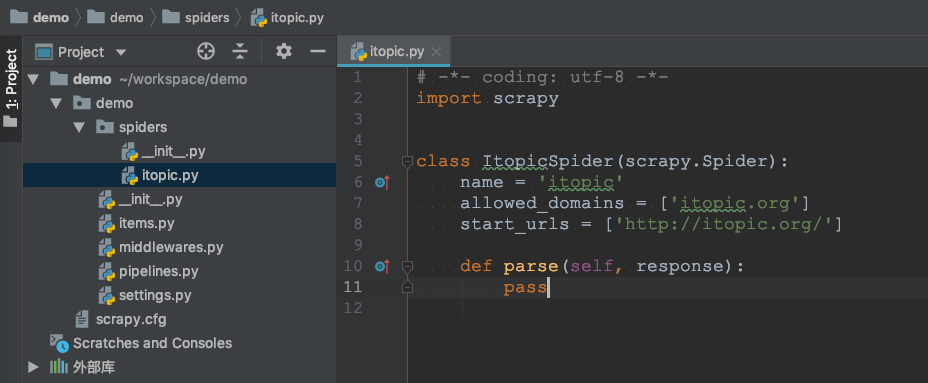

```
{
    "url": "scrapy",
    "time": "2017/05/24 23:12",
    "tag": "Python,爬虫"
}
```

# 一、关于Scrapy

## 1.1 文档地址
```
https://doc.scrapy.org/en/latest/
```

## 1.2 安装方式
```
pip install scrapy
```

# 二、抓取示例

装好之后先进行一次`Scrapy`使用初体验，从开发过程中熟悉`Scrapy`的流程及用法。

## 2.1 初始化

```
$ scrapy startproject demo
New Scrapy project 'demo', using template directory '...', created in:
    /Users/peng/workspace/demo

You can start your first spider with:
    cd demo
    scrapy genspider example example.com


$ cd demo/
$ scrapy genspider itopic itopic.org
Created spider 'itopic' using template 'basic' in module:
  demo.spiders.itopic
```



## 2.2 启动抓取
```
scrapy crawl itopic
```

当然在这一步执行抓取除了可以看到一些日志之外，并不会得到其他的东西。目前抓取的需求还没有明确，还需要对`itopic.org`页面返回的数据进行解析。

## 2.3 解析列表

解析文章和超链地址，在这一步之后若在次执行抓取，顺利的话在命令行就可以看到应有的内容了。

```
# -*- coding: utf-8 -*-
import scrapy
from lxml import html


class ItopicSpider(scrapy.Spider):
    name = 'itopic'
    allowed_domains = ['itopic.org']
    start_urls = ['https://itopic.org/']

    def parse(self, response):
        for x in html.fromstring(response.body).xpath('//div[@id="left-sider" or @id="right-sider"]/ul/li/a'):
            print(x.text, x.attrib.get('href'))
```


## 2.4 解析详情

拿到首页的超链接之后通过`yield scrapy.Request(url=url, callback=self.parse_itopic_detail)`即可将详情页的请求发到调度器，同时使用`self.parse_itopic_detail`进行解析。所以对于新的页面只需要通过`yield scrapy.Request`添加地址，并定义对应的解析器即可。

```
# -*- coding: utf-8 -*-
import scrapy
from lxml import html


class ItopicSpider(scrapy.Spider):
    name = 'itopic'
    allowed_domains = ['itopic.org']
    start_urls = ['https://itopic.org/']

    def parse(self, response):
        for x in html.fromstring(response.body).xpath('//div[@id="left-sider" or @id="right-sider"]/ul/li/a'):
            url = "https://itopic.org" + x.attrib.get('href')
            yield scrapy.Request(url=url, callback=self.parse_itopic_detail)

    def parse_itopic_detail(self, response):
        filename = response.url.split("/")[-1]
        with open(filename, "wb") as f:
            f.write(response.body)
        print(response.css(".title::text").extract()[0])
```

## 2.5 保存结果

### 2.5.1 编写Item
```
# -*- coding: utf-8 -*-

# Define here the models for your scraped items
#
# See documentation in:
# https://docs.scrapy.org/en/latest/topics/items.html

import scrapy


class ItopicDetailItem(scrapy.Item):
    # define the fields for your item here like:
    # name = scrapy.Field()
    title = scrapy.Field()
    url = scrapy.Field()
    pass
```

### 2.5.2 提取数据到Item
```
# -*- coding: utf-8 -*-
import scrapy
from demo.items import ItopicDetailItem
from lxml import html


class ItopicSpider(scrapy.Spider):
    name = 'itopic'
    allowed_domains = ['itopic.org']
    start_urls = ['https://itopic.org/']

    def parse(self, response):
        for x in html.fromstring(response.body).xpath('//div[@id="left-sider" or @id="right-sider"]/ul/li/a'):
            url = "https://itopic.org" + x.attrib.get('href')
            yield scrapy.Request(url=url, callback=self.parse_itopic_detail)

    def parse_itopic_detail(self, response):
        filename = response.url.split("/")[-1]
        with open(filename, "wb") as f:
            f.write(response.body)
        item = ItopicDetailItem()
        item['title'] = response.css(".title::text").extract()[0]
        item['url'] = response.url
        yield item
```

### 2.5.3 保存结果

执行抓取并保存结果到`itopic.json`文件。执行完成后查看`itopic.json`就可以看到抓取到的数据了。

```
$ scrapy crawl itopic -o itopic.json

[
    {
        "title": "Python常用库 - HTTP请求",
        "url": "https://itopic.org/python-requests.html"
    },
    {
        "title": "Python常用库 - 数据库",
        "url": "https://itopic.org/python-database.html"
    },
    {
        "title": "Python常用库 - 数据解析",
        "url": "https://itopic.org/python-data-parse.html"
    }
    ...
]
```

到这里一个简单的`Scrapy`抓取示例就算完成了，应该可以满足大部分抓取场景了。

# 三、抓取说明

## 3.1 流程说明

一个常规的抓取流程应该包括以下几步骤：

- 1. 从某一页面入口抓取解析出`URL`列表或者通过其他途径获取到需要抓取的`URL`列表。
- 2. 执行抓取动作，发送`Request`请求，获取返回的`HTML`内容
- 3. 通过`lxml`、`bs4`等解析页面元素，获取抓取内容
- 4. 将抓取到的内容持久化或者进行同步操作。

这个过程中可能会碰到需要分页抓取所有的`URL`列表，相当于重复走一遍上面的流程，只不过抓取的目的是为了获取`URL`列表，拿到之后在重复此步骤。配合上面的示例来看看`Scrapy`的流程图：


组件|说明
---|---
Scrapy Engine|引擎负责控制数据流在系统中所有组件中流动，并在相应动作发生时触发事件。 详细内容查看下面的数据流(Data Flow)部分。
调度器(Scheduler)|调度器从引擎接受request并将他们入队，以便之后引擎请求他们时提供给引擎。
下载器(Downloader)|下载器负责获取页面数据并提供给引擎，而后提供给`spider`。
Spiders|`Spider`是`Scrapy`用户编写用于分析response并提取item(即获取到的item)或额外跟进的URL的类。 每个`spider`负责处理一个特定(或一些)网站。
Item Pipeline|`Item Pipeline`负责处理被spider提取出来的item。典型的处理有清理、 验证及持久化(例如存取到数据库中)。
下载器中间件(Downloader middlewares)|下载器中间件是在引擎及下载器之间的特定钩子(`specific hook`)，处理`Downloader`传递给引擎的response。 其提供了一个简便的机制，通过插入自定义代码来扩展`Scrapy`功能。
Spider中间件(Spider middlewares)|`Spider`中间件是在引擎及`Spider`之间的特定钩子(`specific hook`)，处理`spider`的输入(response)和输出(items及requests)。 其提供了一个简便的机制，通过插入自定义代码来扩展`Scrapy`功能。

可以看到分工更细更清晰，将要抓取的`URL`发给调度器，将`Request`的动作交给下载器，增加数据的清洗流程，同时以扩展中间件的方式实现灵活的流程控制。`Scrapy`将这些组件串起来，我们只需要关注核心的几个步骤即可。


## 3.2 数据流(Data flow)

`Scrapy`中的数据流由执行引擎控制，其过程如下:

- 1. 引擎打开一个网站(open a domain)，找到处理该网站的`Spider`并向该`spider`请求第一个要爬取的`URL(s)`。
- 2. 引擎从`Spider`中获取到第一个要爬取的URL并在调度器(`Scheduler`)以`Request`调度。
- 3. 引擎向调度器请求下一个要爬取的`URL`。
- 4. 调度器返回下一个要爬取的`URL`给引擎，引擎将`URL`通过下载中间件(请求(`request`)方向)转发给下载器(`Downloader`)。
- 5. 一旦页面下载完毕，下载器生成一个该页面的`Response`，并将其通过下载中间件(返回(response)方向)发送给引擎。
- 6. 引擎从下载器中接收到`Response`并通过`Spider`中间件(输入方向)发送给Spider处理。
- 7. `Spider`处理Response并返回爬取到的Item及(跟进的)新的Request给引擎。
- 8. 引擎将(Spider返回的)爬取到的Item给`Item Pipeline`，将(Spider返回的)Request给调度器。
- 9. (从第二步)重复直到调度器中没有更多地request，引擎关闭该网站。

