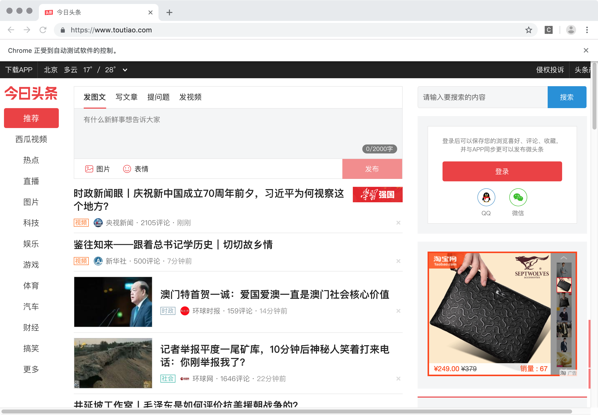

```
{
    "url": "selenium",
    "time": "2017/07/01 18:42",
    "tag": "Python,爬虫"
}
```

# 一、安装

## 1.1 安装selenium
```
pip install selenium
```

## 1.2 下载浏览器驱动

Chrome驱动：`https://chromedriver.storage.googleapis.com/index.html?path=76.0.3809.126/`


# 二、测试使用

```
# coding: utf-8

from selenium import webdriver

URL = "https://www.toutiao.com"
CHROME_DRIVER_BINARY = "/usr/local/bin/chromedriver"

op = webdriver.ChromeOptions()
op.add_argument('--headless')
op.add_argument('--disable-gpu')
driver = webdriver.Chrome(CHROME_DRIVER_BINARY, options=op)
driver.get(URL)

# 打印渲染之后的HTML源文件
print(driver.page_source)
driver.close()
```

如果是去掉`--headless`配置，则会看到启动`Chrome`浏览器，并打开`toutiao.com`



文档：https://selenium-python-zh.readthedocs.io/en/latest/