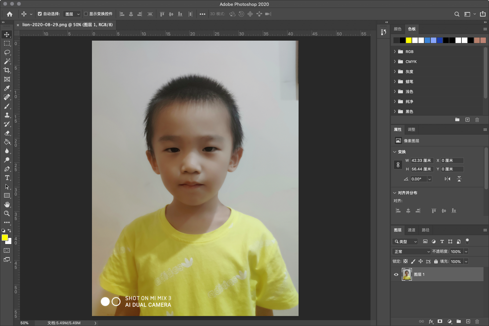
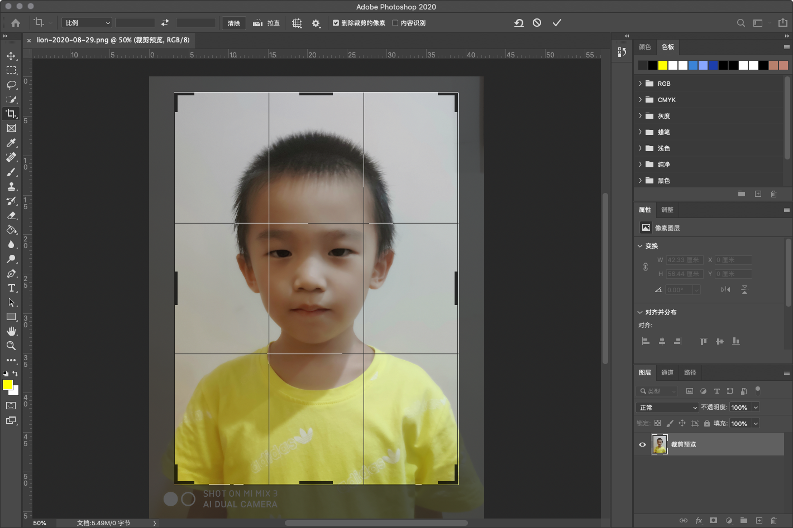
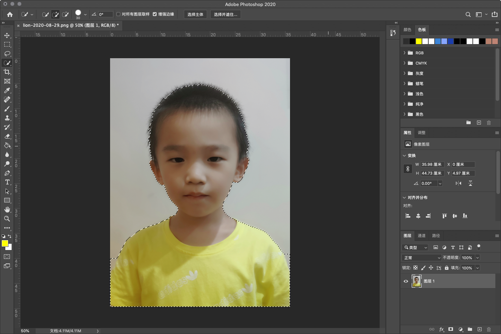
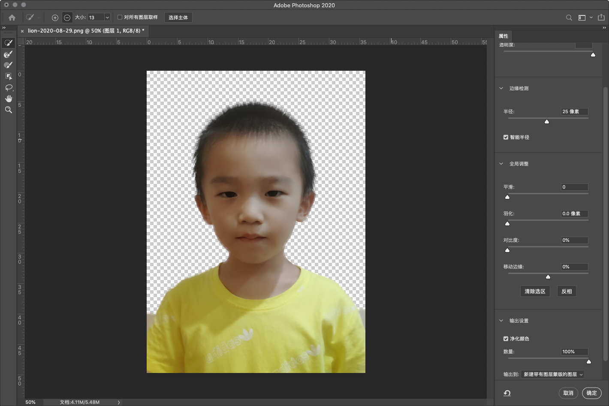
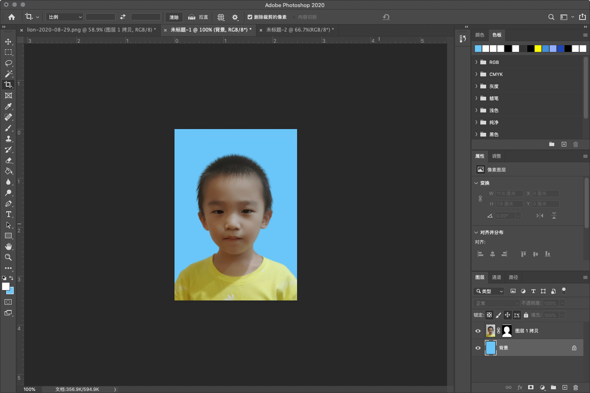
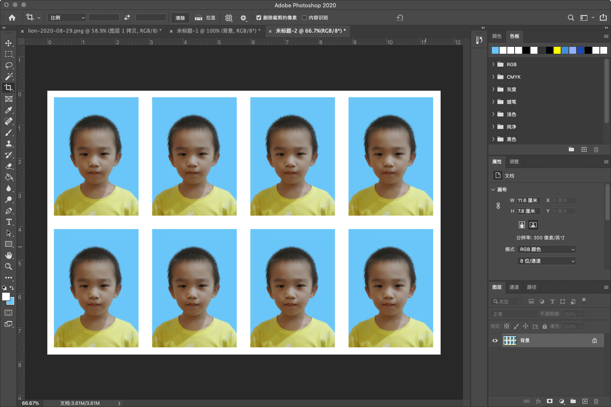

```
{
    "url": "ps-one-inch",
    "time": "2020/02/01 06:12",
    "tag": "Photoshop,小技能"
}
```

# 一、抠图

## 1.1 打开图片

用`Photoshop`打开一张原图，可以看到这张图片有水印以及背景偏灰。



## 1.2 图片微调

第一步，我们对图片做适当裁切。(左侧第五个工具选择裁切工具，裁切过程同时按住`Option + Shift`可以按比例裁切)



## 1.3 抠图

- 方法一：选择左侧第四个魔棒工具中的`快速选择工具`，在人身上按住拖动，会出现选区，选中人的基本轮廓。
- 方法二：选择左侧第四个魔棒工具中的`快速选择工具`，点击`选择主体`，Ps会自动识别出选区。

在文件名上面会有选区处理工具，添加选区或者删除选区（按住`Option`键可以减掉多余的选区）。如果选区弄错了可以通过`Command + D`取消重来。



点击工具条上的 `选择并遮住...`，背景就开始变透明了，可以通过右侧属性栏调节参数：

- 视图改为叠加，勾选`智能半径`，点击左侧第二个`调整边缘画笔工具（R）`在头发边缘进行涂抹头发丝边缘
- 勾选净化颜色，点击确定。



确认后，然后用`选区工具`或者`魔棒选择工具`对两个小角落进行一下处理。第一步抠图就完成了。

# 二、调整大小及背景色

## 2.1 调整图片大小

前面我们处理的图片还比较大，新建一张宽：`2.5厘米`，高：`3.5厘米`，分辨率：`300`的空白图片。

选择移动工具（V），将前一张图片移动过来，图片会比较大，需要进行 缩放。敲`Command+T`可调节图片大小, 按照`Option`键可以按比例调节。

调整之后再做一次整体裁切，多余的图片就不需要了。

## 2.2 调整图片背景色

选中背景图层，调整背景为需要的红色或蓝色。

- 蓝底：`6ac6f9` 或 `R:67 G:142 B:219`

- 红底：`ff0000` 或 `R:255 G:0 B:0`

`Option + Enter`设置为前景色，`Command + Enter`设置为背景色。调整后效果如下，



到这里一寸照片就制作好了

# 三、制作一版8张

## 3.1 定义图案

- `图像` -> `画布大小`，宽度：`0.4厘米`，高度：`0.4厘米`，勾选相对，画布扩展颜色选择白色。确定后图片会出现白边。

- `编辑` -> `定义图案`，输入名称后确定。

## 3.2 完成

创建一个新的空白图片， 宽度：`11.6厘米`(11.6 = 2.5 * 4 + 0.4 * 4)，高度：`7.8厘米`(7.8 = 3.5 * 2 + 0.4 * 2)，分辨率：`300`

点击 `编辑` -> `填充`，选中前面的图案，确定后效果就出来了。



5寸相纸的大小为`12.7cmX8.9cm`，如果要放8张，那画布调整大小为：

- 宽度：`0.675厘米`  (0.675 = (12.7 - 2.5 * 4)/4)
- 高度 = `0.95厘米`（0.95 = (8.9 - 3.5 * 2 )/ 2）

最后，就是图片存储打印了。

# 四、附录

## 4.1 照片尺寸

| 规则          | 尺寸                         | 说明         |
| ------------- | ---------------------------- | ------------ |
| 1寸           | 2.5 * 3.5 cm                 |              |
| 身份证大头照  | 3.3 * 2.2 cm                 |              |
| 2寸           | 3.5 * 5.3 cm                 |              |
| 小2寸（护照） | 3.3 * 4.8 cm                 |              |
| 3寸           | 5.5 * 8.4 cm                 |              |
| 5寸           | 5 * 3.5英寸 = 12.7 * 8.9 cm  |              |
| 6寸           | 6 * 4英寸 = 15.2 * 10.2cm    | 日常照片大小 |
| 7寸           | 7 * 5英寸 = 17.8 * 12.7 cm   |              |
| 8寸           | 8 * 6英寸 = 20.3 * 15.2 cm   |              |
| 10寸          | 10 * 8英寸 = 25.4 * 20.3 cm  |              |
| 12寸          | 12 * 10英寸 = 30.5 * 20.3 cm |              |
| 15寸          | 15 * 10英寸 = 38.1 * 25.4 cm |              |

照片的尺寸是以英寸为单位，1英寸 = 2.54cm，所以5寸为12.7cm，12寸就是30.5cm。把尺寸关系弄清楚，按上面流程，打印几寸照片应该都没问题了。

## 4.2 A4纸

| 纸   | 尺寸              | 说明                          |
| ---- | ----------------- | ----------------------------- |
| A5   | 21 * 14.8 厘米    | A4纸张一半大小，差不多8寸大小 |
| A4   | 21 * 29.7 厘米    | A4差不多12寸大小              |
| A3   | 29.7 * 42 厘米    |                               |
| A2   | 42 * 59.4 厘米    |                               |
| A1   | 59.4 * 84.1 厘米  |                               |
| A0   | 84.1 * 118.9 厘米 |                               |

