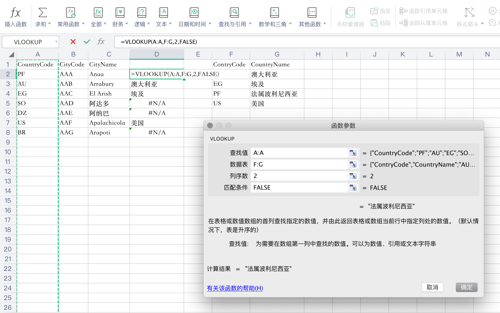

```
{
    "url": "excel-op",
    "time": "2020/01/25 09:12",
    "tag": "Excel,小技能"
}
```

# VLOOKUP

`vlookup`是一个纵向查找函数，可以将多个表格的数据进行快速引用，函数定义：

```
VLOOKUP(查找值, 数据表, 列序数, 匹配条件)
```

- **查找值**：要查找的对象，可以是数值、引用或文本字符串
- **数据表**：要查找的数据表区域。比如`A:C`表示ABC三列，`A1:B6`表示AB两列的第一行到第六行，`A:C+F:H`则表示ABCFGH列。
- **列序数**：返回数据在数据表区域的第几列，第一列写`1`，二列写`2`
- **匹配条件**：查找时是精确匹配还是大致匹配。如果为`FALSE`则是精确匹配，如果为`TRUE`或空则是大致匹配。

## 示例

两张数据表：城市表（`A:C`）、国家表(`F:G`)，在`D`列展示城市对应的国家名称。



**1. 去掉公式**：当前`D`列是对`G`列的引用，如果`A`列或者`G`列调整了，则`D`列也会随着变动。如果想去掉引用公式，让它固定下来：

```
复制D列 -> 右键 -> 选择性粘贴 -> 数值
```

**2. 去掉#N/A**：有时会出现找不到的情况，通过`IFERROR`函数规避显示的问题，比如默认显示空字符串

```
=IFERROR(VLOOKUP(A:A,F:G,2,FALSE), "")
```

当前示例是放在同一个`Sheet`中，如果处于不同`Sheet`或者不同文档也是一样的操作。