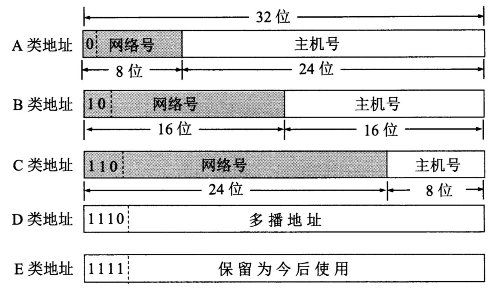

```
{
    "url": "ip",
    "time": "2018/08/18 06:12",
    "tag": "小知识"
}
```

我们日常配置IP时会同时配置IP地址+子网掩码，比如配置IP：`192.168.1.100`，子网掩码：`255.255.255.0`，人可以很方便的理解一个IP地址，但实际上IP和子网掩码都是32位的二进制数，按照每8位进行切分后转换为整数来表示，即所谓的点分十进制表示法：

`192.168.1.100`： `11000000`.`10101000`.`00000001`.`01100100`

`255.255.255.0`：`11111111`.`11111111`.`11111111`.`00000000`

转换之后就可以看到它的真面目了，

1、观察IP地址的二进制表示法中前三位为`110`，表示这是一个C类地址，其中`192.168.0.0/16`为C类地址中的私有地址。

2、观察子网掩码，左边是24个1，右边是8个0，为C类地址标准的子网掩码，支持1张子网。

3、将IP地址与子网掩码进行与运算得到：`11000000`.`10101000`.`00000001`.`00000000`，即`192.168.1.0`，表示该IP的网络地址，后8位为主机地址，可支持256个IP，可用254个。

最后用CIDR的方式来表示就是：IP/掩码位 = `192.168.1.0/24`

| 可用地址:  | 254           |
| ---------- | ------------- |
| 掩码       | 255.255.255.0 |
| 网络       | 192.168.1.0   |
| 第一个可用 | 192.168.1.1   |
| 最后可用   | 192.168.1.254 |
| 广播       | 192.168.1.255 |

### 地址分类

IP地址由网络号和主机号组成，IP地址可以分为5类，不同类别表示的IP区间不同，网络号和主机号的长度也不同。结合子网掩码则可以计算出两个IP是否在同一个局域网还是广域网上以及将网络划分为多个子网。



| 分类        | 说明                              | 范围                        | 私有网段                                              |
| ----------- | --------------------------------- | --------------------------- | ----------------------------------------------------- |
| **A类地址** | 8位网络号(0开头）+ 24 位主机号    | 1.0.0.0 - 126.255.255.255   | 其中10.0.0.0/8为私有网段，127.0.0.0/8网段为本地回路。 |
| **B类地址** | 16位网络号（10开头）+ 16 位主机号 | 128.0.0.0 - 191.255.255.255 | 其中172.16.0.0/12为私有网段。                         |
| **C类地址** | 24位网络号（110开头）+ 8 位主机号 | 192.0.0.0 - 223.255.255.255 | 其中192.168.0.0/16为私有网段。                        |

### 私有网段

来看看阿里云的专有网络IPv4网段：

>  创建专有网络时IPv4网段选择支持使用 192.168.0.0/16、172.16.0.0/12、10.0.0.0/8 及其子网作为专有网络地址段，子网掩码有效范围 16-24。填写示例：192.168.0.0/16。

| 各网段私有地址 | 192.168.0.0/16  | 172.16.0.0/12  | 10.0.0.0/8     |
| -------------- | --------------- | -------------- | -------------- |
| 可用地址       | 65534           | 1048574        | 16777214       |
| 掩码           | 255.255.0.0     | 255.240.0.0    | 255.0.0.0      |
| 网络           | 192.168.0.0     | 172.16.0.0     | 10.0.0.0       |
| 第一个可用     | 192.168.0.1     | 172.16.0.1     | 10.0.0.1       |
| 最后可用       | 192.168.255.254 | 172.31.255.254 | 10.255.255.254 |
| 广播           | 192.168.255.255 | 172.31.255.255 | 10.255.255.255 |

以172.16.0.0/12为例，来看看上面各个数据的计算：

- 掩码：12表示左边是12个1，按8位划分就是 `11111111` . `11110000`. `00000000` . `00000000`，对应的就是`255.240.0.0`
- 网络：将`172.16.0.0` 转成二进制后对应位和掩码取与运算得到`172.16.0.0`