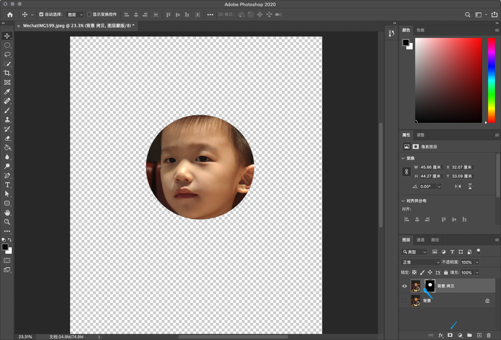

```
{
    "url": "ps-mask",
    "time": "2020/02/18 06:12",
    "tag": "Photoshop,小技能"
}
```

# 一、概述

## 1.1 蒙版介绍

PS里图层的效果，蒙版相当于是在图层上加了一层效果，蒙版的修改不会改变原图，但会改变原图最后呈现的效果。PS的蒙版可以分为：图层蒙版、适量蒙版、剪切蒙版、快速蒙版四类。通常可以实现以下效果：

- 渐隐效果：图片逐渐出现或消失的效果
- 抠图：配合选区，将图片上不需要的部分遮住，实现只显示部分区域的效果
- 图片拼接：想多个图片组合起来，通过渐变等效果使图片融合的效果更好
- 对图片进行局部调整：蒙版区域内的图片调整色阶、曲线、色彩平衡等效果

蒙版和选区一样，是个基础工具，可以发挥想象实现出不同效果来。

## 1.2 蒙版示例

- 1、快捷键`M`会选中选区工具，通过选区工具在原图上拉出一个选区
- 2、点击图层栏最下面的第三个像个相机的按钮会创建蒙版
- 3、切换到移动工具（`V`），可以拖动图层，图层与蒙版图层中间有一个锁链，默认是锁上的，直接拖动会一起拖动。可以点一下锁链关闭掉，然后拖动蒙版就可以感受到遮罩效果了。




同时可以看到，蒙版里有一个黑底白色的圆。黑色理解为黑名单完全遮住，白色理解为白名单完全显示，灰色介于黑白之间的透明度。所以如果用橡皮擦在蒙版区域内擦白色则会显示原图更多的区域，擦黑色则隐藏更多的区域，如果用渐变工具拉黑白渐变的颜色，则会出现从实到虚的效果。

@todo