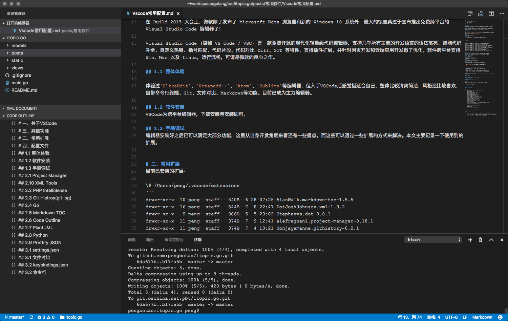

```
{
    "url": "vscode",
    "time": "2018/01/20 10:42",
    "tag": "常用软件",
    "toc": "yes"
}
```

# 一、关于VSCode
在 Build 2015 大会上，微软除了发布了 Microsoft Edge 浏览器和新的 Windows 10 系统外，最大的惊喜莫过于宣布推出免费跨平台的 Visual Studio Code 编辑器了！

Visual Studio Code (简称 VS Code / VSC) 是一款免费开源的现代化轻量级代码编辑器，支持几乎所有主流的开发语言的语法高亮、智能代码补全、自定义热键、括号匹配、代码片段、代码对比 Diff、GIT 等特性，支持插件扩展，并针对网页开发和云端应用开发做了优化。软件跨平台支持 Win、Mac 以及 Linux，运行流畅，可谓是微软的良心之作。

## 1.1 整体体验

体验过`UltraEdit`、`Notepadd++`、`Atom`、`Sublime`等编辑器，但入手VSCode后感觉挺适合自己，整体比较清爽简洁，风格还比较喜欢，自带命令行终端、Git、文件对比、Markdown等功能。目前已成为主力编辑器。效果图如下：



## 1.2 软件安装
VSCode为跨平台编辑器，下载安装包安装即可。

## 1.3 手感调试
编辑器安装好之后已可以满足大部分功能，这里从自身开发角度来看还有一些痛点。而这些可以通过一些扩展的方式来解决。本文主要记录一下使用到的扩展。


# 二、常用扩展
目前已安装的扩展：

\# /Users/peng/.vscode/extensions
```
drwxr-xr-x  10 peng  staff   320B  7 25  2017 AlanWalk.markdown-toc-1.5.6
drwxr-xr-x   9 peng  staff   288B  5  5  2017 Stephanvs.dot-0.0.1
drwxr-xr-x  11 peng  staff   352B  1 16 22:51 akamud.vscode-theme-onedark-2.1.0
drwxr-xr-x  17 peng  staff   544B  1 28 12:56 alefragnani.project-manager-10.10.0
drwxr-xr-x  14 peng  staff   448B 12 12 11:05 alexcvzz.vscode-sqlite-0.8.1
drwxr-xr-x  14 peng  staff   448B  4 24  2019 bierner.markdown-preview-github-styles-0.1.6
drwxr-xr-x  18 peng  staff   576B  2 25 13:30 donjayamanne.githistory-0.5.4
drwxr-xr-x  18 peng  staff   576B  2 28 05:57 donjayamanne.githistory-0.5.5
drwxr-xr-x  16 peng  staff   512B  6  1  2019 dotjoshjohnson.xml-2.5.0
drwxr-xr-x  15 peng  staff   480B 12 27 16:18 felixfbecker.php-intellisense-2.3.14
drwxr-xr-x   8 peng  staff   256B  8 16  2018 felixfbecker.php-pack-1.0.2
drwxr-xr-x   9 peng  staff   288B  2 15  2019 flesler.url-encode-1.1.0
drwxr-xr-x  16 peng  staff   512B  2 21 06:44 formulahendry.code-runner-0.9.16
drwxr-xr-x  13 peng  staff   416B  2 17 10:47 grapecity.gc-excelviewer-2.1.33
drwxr-xr-x  23 peng  staff   736B  2  1 18:06 gruntfuggly.todo-tree-0.0.167
drwxr-xr-x  23 peng  staff   736B  2 26 07:53 gruntfuggly.todo-tree-0.0.169
drwxr-xr-x   8 peng  staff   256B 11 21 12:20 hoovercj.vscode-power-mode-2.2.0
drwxr-xr-x  10 peng  staff   320B  2 21 05:43 jcbuisson.vue-0.1.5
drwxr-xr-x  26 peng  staff   832B  1  6 09:53 jebbs.plantuml-2.13.6
drwxr-xr-x  11 peng  staff   352B  9 18 11:08 liximomo.sftp-1.12.9
drwxr-xr-x  11 peng  staff   352B  8 28  2019 mkxml.vscode-filesize-2.1.3
drwxr-xr-x   9 peng  staff   288B  3 23  2017 mohsen1.prettify-json-0.0.3
drwxr-xr-x   8 peng  staff   256B  2 10 10:29 ms-ceintl.vscode-language-pack-zh-hans-1.42.2
drwxr-xr-x  35 peng  staff   1.1K  2 26 07:57 ms-python.python-2020.2.64397
drwxr-xr-x  17 peng  staff   544B  2  4 12:43 ms-vscode.go-0.13.0
drwxr-xr-x  17 peng  staff   544B  2 28 09:39 ms-vscode.go-0.13.1
drwxr-xr-x  30 peng  staff   960B  2 21 06:47 msjsdiag.debugger-for-chrome-4.12.6
drwxr-xr-x  15 peng  staff   480B  2 11 11:40 redhat.vscode-yaml-0.7.2
drwxr-xr-x  26 peng  staff   832B  9 24 03:28 shan.code-settings-sync-3.4.3
drwxr-xr-x  12 peng  staff   384B  2 25 15:44 sumneko.lua-0.15.5
drwxr-xr-x  27 peng  staff   864B  2 10 10:30 visualstudioexptteam.vscodeintellicode-1.2.5
drwxr-xr-x  15 peng  staff   480B  2 17 10:47 yzane.markdown-pdf-1.4.2
drwxr-xr-x  23 peng  staff   736B  2 20 17:11 zhuangtongfa.material-theme-3.2.3
```

## 2.1 Project Manager
Vscode本身是不可以在一个窗口打开多个文件夹的，要打开多个文件夹要在新建窗口中打开，并且下次打开时可能还需要重新添加这个文件夹。这个扩展主要用来解决多个Project的保存、以及Project之间的切换问题，将文件夹加入到Project之后可以快速的在不同文件夹之间切换。

## 2.2 PHP IntelliSense
PHP开发用到，可以补全及函数之间跳转。

## 2.3 Git Histroy(git log)
Vscode自带了Git功能，这个插件可以方便查看Git日志。

## 2.4 Go
用VScode开发Go语言程序很舒服，起初使用VScode也是因为Go开发。

## 2.5 Markdown TOC
Vscode已经自带关于Markdown的预览，但格式不是Github上的样式，调整为Github样式方法可参考：`https://github.com/Yukaii/vscode-markdown-github-css`，样式文件：

- [github-markdown.css](../../static/uploads/github-markdown.css)
- [github.css](../../static/uploads/github.css)


`Markdown TOC`主要用来生成TOC，有一些地方无法解析TOC语法，可以用这个扩展直接生成目录。

关于Markdown的一些其他插件也装过，但并不是十分顺手，主要还是用自带的预览或者专业的Markdown编辑器。

## 2.6 Code Outline
开发过程中有些人会习惯使用`Outline`的功能，没有大纲这个功能开发上感觉总别扭，还好VSCode上有这么个扩展可以看到函数、变量列表。

虽然自带的`Ctrl+Shift+O`可以列出一些，但感觉还是不太好用，一方面列的信息可能比较多，另一方面列出的信息无法固定在编辑器窗口。

## 2.7 PlantUML
画图扩展，可以用来画一些图，可以实时预览。Dot语法解析可以安装`Graphviz (dot) language support for Visual Studio Code`

## 2.8 Python
Python开发扩展。

## 2.9 Prettify JSON
格式化JSON内容，有些时候需要格式化JSON，可以直接拷贝内容到编辑器格式化比较方便。

## 2.10 XML Tools
格式化XML内容，同JSON。开发过程中经常碰到这些格式，使用的也还频繁。

# 三、其他功能
## 3.1 文件对比
在编辑器中打开两个文件，打开的编辑器文件列表中，选中一个文件后右键选择`选择以进行比较`，然后在另外一个文件选择与它对比即可。

## 3.2 命令行
`ctrl+反引号`可以打开终端，这个功能也非常赞。

# 四、配置文件

## 3.1 settings.json

```
{
    "editor.fontSize": 16,
    "editor.fontFamily": "'Courier New', monospace",
    "editor.wordWrap": "on",
    "editor.renderWhitespace": "all",
    "editor.renderControlCharacters": true,
    "editor.minimap.enabled": true,
    "editor.scrollBeyondLastLine": false,
    "editor.renderIndentGuides":false,
    "terminal.integrated.fontSize": 18,
    "terminal.integrated.cursorBlinking": true,
    "terminal.integrated.lineHeight": 1.3,
    "terminal.integrated.cursorStyle": "underline",
    "workbench.sideBar.location": "left",
    "workbench.activityBar.visible": true,
    "workbench.statusBar.visible": true,
    "workbench.editor.enablePreview": false,
    "window.zoomLevel": 0,
    "php.validate.executablePath": "/usr/local/server/php7.1.2/bin/php",
    "php.executablePath": "/usr/local/server/php7.1.2/bin/php",
    "window.title": "${activeEditorLong}",

    "go.gopath":"/usr/local/server/gopath:/Users/peng/workspace/golang",
    "go.goroot": "/usr/local/server/go1.8",
    "markdown.styles": [
        "/Users/peng/.vscode/github-markdown.css",
        "/Users/peng/.vscode/github.css"
    ],
    "workbench.colorTheme": "Visual Studio Light",
    "emmet.showExpandedAbbreviation": "never",
    "workbench.startupEditor": "welcomePage",
    "python.pythonPath": "/usr/local/bin/python"
}
```

## 3.2 keybindings.json
```
[
    { "key": "ctrl+shift+`", "command": "workbench.action.toggleMaximizedPanel" },
    { "key": "ctrl+shift+j", "command": "extension.prettifyJSON", "when": "editorTextFocus" },
    { "key": "ctrl+shift+x", "command": "xmlTools.formatAsXml" }
]
```

关于Vscode的基本用法可查看这篇文章：`https://nshen.net/article/2015-11-20/vscode/`