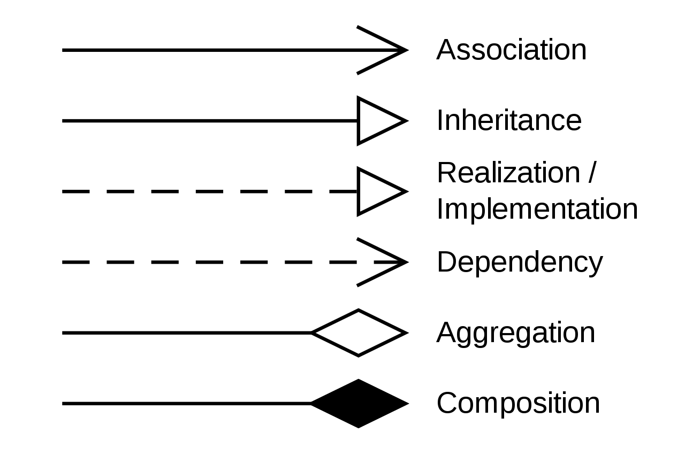

```
{
    "url": "plantuml",
    "time": "2022/01/15 07:38",
    "tag": "常用软件",
    "toc": "no",
    "public": "no"
}
```

# 一、关于PlantUML

PlantUML是通过从纯文本来绘图的开源软件。主要支持UML图，也支持一些其他的比如脑图、JOSN视图等。它与前面提到的Graphviz的关系是，Graphviz提供了一套开源工具包，可以通过Dot程序来从文本里渲染图片。而对于一些UML图（用例图、类图等）PlantUML是通过Graphviz来绘制的，所以需要安装Graphviz。不过看当前Window下的安装说明从`1.2020.21`版本之后内置了Graphviz不再需要额外安装。

## 1.1 安装

略...

## 1.2 示例

使用PlantUML绘图需要将Code写在一对标签内，通过标签名来确定用什么规则渲染，比如：


```
@startuml

Bob -> Alice : hello
Alice -->Bob : ok

@enduml
```


```
@startjson
{
    "User": {"Name": "Peng", "Age": 18},
    "Account": {"Balance": 666.66}
}
@endjson
```

# 二、UML

对比`PlantUML`可能会想到UML，PlantUML可以理解成一种UML实现，由于PlantUML主要用来绘制UML图，这里得先了解下UML的相关规则。

统一建模语言（英语：Unified Modeling Language，缩写UML）起初是一种方法，一系列最佳工程实践。2005年，UML被国际标准化组织接纳为一种标准。然而，在软件工程中，大多数从业者不使用UML，而是产生非正式的手绘图；不过，这些图例中仍往往包括UML的元素。

UML 2.2中一共定义了14种图示，常见的有这三类：类图、用例图、时序图

- 类图：用来描述类之间的关系
- 用例图：从用户角度描述系统功能
- 时序图：实体之间交互关系的图

## 2.1 类图

类图用来描述类的内部结构以及类之间关系的图形。常用标记关系的方式有：



**1. 关联（Association)**


**2. 泛化（Generalization）/ 继承（Inheritance）**


**3. 实现（Realization / Implementation）**


**4. 依赖(Dependency)**


**5. 聚合（Aggregation）**


**6. 组合(Composition)**


## 2.2 用例图


## 2.3 时序图


# 三、PlantUML绘图

## 3.1 编写Dot


```
@startdot
graph demo {
    "Browser" -- {"Chrome", "Fiefox", "Safari", "..."}
}
@enddot
```

## 3.2 思维导图


# 四、小结


---

- [1] [开源工具，使用简单的文字描述画UML图](https://plantuml.com/zh/)
- [2] [Go PProf Dot示例](../../static/uploads/dot.svg)

