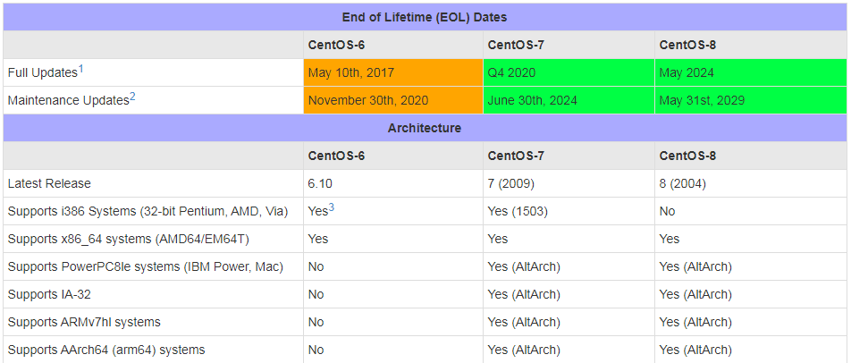
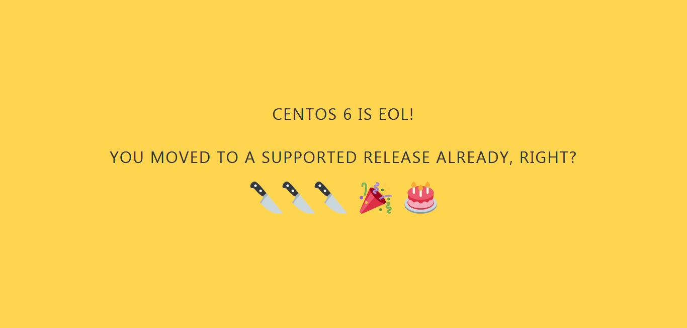

```
{
    "url": "centos-6-eol",
    "time": "2020/12/08 19:30",
    "tag": "运维,CentOS"
}
```

`CentOS`开发者邮件列表显示，`CentOS 6`已于11月30日`EOL`。



邮件还提到，`CentOS 6.10`的目录将在12月第一周被迁移至`vault.centos.org`。软件包仍在以下位置提供：

```
http://vault.centos.org/centos/6.10/
```

迁移工作完成后，vault.centos.org 中的目录不会再接收到任何更新，亦即意味着`CentOS 6`的安全问题不会再被处理。另外，mirrorlist.centos.org 中`CentOS 6`的节点将删除关于它的内容，如果你还是通过此前的镜像获取内容会收到Invalid release/repo/arch combination的提醒。



`CentOS`由`Red Hat Enterprise Linux`源代码重新编译而成，每个大版本的`CentOS`都会获得`10`年的支持（通过安全更新方式），`CentOS 6`正式发布的时间是2011年7月。


---

`EOL`之后再通过`yum`安装软件就会提示`404 Not Found`，需要切换`yum`源。

```
$ yum install vsftpd
已加载插件：security
设置安装进程
http://mirrors.cloud.aliyuncs.com/centos/6/os/x86_64/repodata/repomd.xml: 
[Errno 14] PYCURL ERROR 22 - "The requested URL returned error: 404 Not Found"

尝试其他镜像。
To address this issue please refer to the below wiki article

https://wiki.centos.org/yum-errors

If above article doesn't help to resolve this issue please use https://bugs.centos.org/.

http://mirrors.cloud.aliyuncs.com/epel/6/x86_64/repodata/repomd.xml: 
[Errno 14] PYCURL ERROR 22 - "The requested URL returned error: 404 Not Found"
尝试其他镜像。
http://mirrors.cloud.aliyuncs.com/centos/6/extras/x86_64/repodata/repomd.xml: 
[Errno 14] PYCURL ERROR 22 - "The requested URL returned error: 404 Not Found"
尝试其他镜像。
http://mirrors.cloud.aliyuncs.com/centos/6/updates/x86_64/repodata/repomd.xml: 
[Errno 14] PYCURL ERROR 22 - "The requested URL returned error: 404 Not Found"
```

```
$ yum makecache
已加载插件：auto-update-debuginfo, fastestmirror
Loading mirror speeds from cached hostfile
http://mirrors.cloud.aliyuncs.com/centos/6/os/x86_64/repodata/repomd.xml: 
[Errno 14] PYCURL ERROR 22 - "The requested URL returned error: 404 Not Found"
```

阿里云建议升级系统，继续使用的话需要切换到`vault`源，即历史源。

### vpc网络网络：

**/etc/yum.repos.d/CentOS-Base.repo**:

```
[base]
name=CentOS-6.10
enabled=1
failovermethod=priority
baseurl=http://mirrors.cloud.aliyuncs.com/centos-vault/6.10/os/$basearch/
gpgcheck=1
gpgkey=http://mirrors.cloud.aliyuncs.com/centos-vault/RPM-GPG-KEY-CentOS-6

[updates]
name=CentOS-6.10
enabled=1
failovermethod=priority
baseurl=http://mirrors.cloud.aliyuncs.com/centos-vault/6.10/updates/$basearch/
gpgcheck=1
gpgkey=http://mirrors.cloud.aliyuncs.com/centos-vault/RPM-GPG-KEY-CentOS-6

[extras]
name=CentOS-6.10
enabled=1
failovermethod=priority
baseurl=http://mirrors.cloud.aliyuncs.com/centos-vault/6.10/extras/$basearch/
gpgcheck=1
gpgkey=http://mirrors.cloud.aliyuncs.com/centos-vault/RPM-GPG-KEY-CentOS-6
```

**/etc/yum.repos.d/epel.repo**

```
[epel]
name=Extra Packages for Enterprise Linux 6 - $basearch
enabled=1
failovermethod=priority
baseurl=http://mirrors.cloud.aliyuncs.com/epel-archive/6/$basearch
gpgcheck=0
gpgkey=http://mirrors.cloud.aliyuncs.com/epel-archive/RPM-GPG-KEY-EPEL-6
```

### 经典网络

**/etc/yum.repos.d/CentOS-Base.repo**:

```
[base]
name=CentOS-6.10
enabled=1
failovermethod=priority
baseurl=http://mirrors.aliyuncs.com/centos-vault/6.10/os/$basearch/
gpgcheck=1
gpgkey=http://mirrors.aliyuncs.com/centos-vault/RPM-GPG-KEY-CentOS-6

[updates]
name=CentOS-6.10
enabled=1
failovermethod=priority
baseurl=http://mirrors.aliyuncs.com/centos-vault/6.10/updates/$basearch/
gpgcheck=1
gpgkey=http://mirrors.aliyuncs.comm/centos-vault/RPM-GPG-KEY-CentOS-6

[extras]
name=CentOS-6.10
enabled=1
failovermethod=priority
baseurl=http://mirrors.aliyuncs.com/centos-vault/6.10/extras/$basearch/
gpgcheck=1
gpgkey=http://mirrors.aliyuncs.com/centos-vault/RPM-GPG-KEY-CentOS-6
```

**/etc/yum.repos.d/epel.repo**

```
[epel]
name=Extra Packages for Enterprise Linux 6 - $basearch
enabled=1
failovermethod=priority
baseurl=http://mirrors.aliyuncs.com/epel-archive/6/$basearch
gpgcheck=0
gpgkey=http://mirrors.aliyuncs.com/epel-archive/RPM-GPG-KEY-EPEL-6
```

**更新**

```
$ yum clean all
$ yum makecache
```


---
- [CentOS 6 生命周期结束](https://www.oschina.net/news/122584/centos6-eol)
- [CentOS 6 EOL如何切换源](https://help.aliyun.com/document_detail/193569.htm)
- [CentOS vault](https://vault.centos.org/)