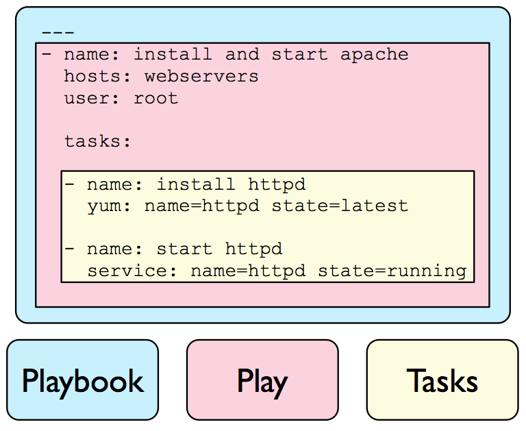

```
{
    "url": "ansible-2",
    "time": "2021/09/19 08:50",
    "tag": "运维",
    "toc": "yes"
}
```

# 一、概述

前面一章简单对Ansible做了个介绍，借助强大的模块可以进行一些日常操作，但操作方式相对零碎，需要更系统化的管理方式。它提供的Playbooks、Roles就可以帮我们来做系统化的管理。


# 二、剧本 - Playbooks

PlayBook可以通过Yaml的定义方式来告诉Ansible需要调用的模块、将这些模块调用组合起来就形成了一个PlayBook。针对Playbook、Play、Tasks的概念可以看下图。



先来看一个示例：

## 2.1 剧本示例

- 示例场景：安装Nginx服务并从本地模板拷贝个配置文件过去。
- 操作步骤：首先创建`main.yaml`文件和模板文件`./templates/test.conf.j2`

```
$ cat main.yaml
- name: Playbook Test
  hosts: test
  remote_user: root
  vars:
  - listen_port: 81
  tasks:
  - name: Install Nginx
    yum: name=nginx state=present
  - name: Copy Nginx Config File
    template:
      src: test.conf.j2
      dest: /etc/nginx/conf.d/test.conf
      owner: nginx
      group: nginx
    notify: 
    - restart nginx
  - name: Start Nginx
    service: name=nginx enabled=yes state=started
  handlers:
  - name: restart nginx
    service: name=nginx state=restarted

$ cat templates/test.conf.j2
server {
    listen {{listen_port}};
    server_name _;
    root /usr/share/nginx/html;
}
```

测试运行和查看输出：

```
$ ansible-playbook main.yaml

PLAY [Playbook Test] ********************************************************************************
TASK [Gathering Facts] ******************************************************************************
ok: [192.168.88.200]

TASK [Install Nginx] ********************************************************************************
ok: [192.168.88.200]

TASK [Copy Nginx Config File] ***********************************************************************
changed: [192.168.88.200]

TASK [Start Nginx] **********************************************************************************
ok: [192.168.88.200]

RUNNING HANDLER [restart nginx] *********************************************************************
changed: [192.168.88.200]

PLAY RECAP ******************************************************************************************
192.168.88.200: ok=5    changed=2    unreachable=0    failed=0    skipped=0    rescued=0    ignored=0
```

## 2.2 示例解读

- 定义了一个`PlayBook`，名字是`Playbook Test`，作用于分类为`test`的主机群组。
- 通过`vars`来定义了变量，用于传递给配置文件。这里的作用不明显，应该考虑加载变量文件`vars_files`，这样模块文件里能更充分发挥模板的作用。
- tasks定义了3个任务，分别是安装Nginx、通过模板`template`将配置文件传递到远端机器、启动Nginx
- handlers和notify对应，配置方式和Task一致，用于做回调处理，上面用于更新配置后重启Nginx。

剧本的基本用法如上，指定需要执行的主机、调用一组模块来实现功能，可以将模块的组合调用作用发挥出来。

# 三、角色 - Roles

角色的理解更像是可以单独使用的组件，独立于主机之上，可以将Nginx、Mysql这些组件都以角色的方式来编排，实现公用。

Roles有一套自定义的结构，按照结构来定义可以免去维护文件之间的调用关系，Role的初始化及结构：


接下来，把前面的例子通过Roles的方式来实现：

## 3.1 初始化

可以在系统默认的角色目录里创建角色，也可以自己指定，如果在自己指定的目录里创建，后面调用角色的Playbook需要和它同目录。通过`ansible-galaxy`来初始化角色目录结构。

```
[root@peng nginx]# mkdir roles && cd roles
[root@peng nginx]# ansible-galaxy init nginx
[root@peng nginx]# ls
defaults  files  handlers  meta  README.md  tasks  templates  tests  vars
```

## 3.2 创建任务

任务在`tasks`目录，`main.yml`为入口文件，可以通过`include_tasks`来调用其他任务，文件内也可以编写任务。

```
$ cat roles/nginx/tasks/main.yml
---
# tasks file for nginx

- name: include install.yml
  include_tasks: install.yml

- name: include conf.yml
  include_tasks: conf.yml

- name: include start.yaml
  include_tasks: start.yml

$ cat roles/nginx/tasks/install.yml
- name: Install Nginx
  yum: name=nginx state=present

$ cat roles/nginx/tasks/conf.yml
- name: Copy Nginx Config File
  template:
    src: test.conf.j2
    dest: /etc/nginx/conf.d/test.conf
    owner: nginx
    group: nginx
  notify: 
  - restart nginx

$ cat roles/nginx/tasks/start.yml
- name: Start Nginx
  service: name=nginx enabled=yes state=started
```

## 3.3 模板变量

模板变量在vars目录。前面是将变量放在Playbook中，变量较多时放在变量定义文件是更好的选择。

```
$ cat roles/nginx/vars/main.yml
---
# vars file for nginx

listen_port: 8801
```

变量文件中可以支持更多的类型：字典、数组等，定义方式和Yaml的写法是一致的。

## 3.4 建立模板

模板在`templates`目录，内容同前面。在playbook、inventory、模板变量文件中定义的变量以及facts收集到的变量都可以被模板文件访问到，Ansible使用的模板文件的语法是Python的Jinja2。

## 3.5 回调程序

回调程序目录在`handlers`

```
$ cat roles/nginx/handlers/main.yml
---
# handlers file for nginx

- name: restart nginx
  service: name=nginx state=restarted
```

## 3.6 调用角色

最后和`roles`目录同级别创建Playbook并执行:

```
[root@peng ~]# cat nginx.yml

- hosts: test
  roles:
  - nginx

[root@peng ~]# ansible-playbook nginx.yml

PLAY [test] ********************************************************************

TASK [Gathering Facts] *********************************************************
ok: [192.168.88.200]

TASK [nginx : include install.yml] *********************************************
included: /root/roles/nginx/tasks/install.yml for 192.168.88.200

TASK [nginx : Install Nginx] ***************************************************
ok: [192.168.88.200]

TASK [nginx : include conf.yml] ************************************************
included: /root/roles/nginx/tasks/conf.yml for 192.168.88.200

TASK [nginx : Copy Nginx Config File] ******************************************
changed: [192.168.88.200]

TASK [nginx : include start.yaml] **********************************************
included: /root/roles/nginx/tasks/start.yml for 192.168.88.200

TASK [nginx : Start Nginx] *****************************************************
ok: [192.168.88.200]

RUNNING HANDLER [restart nginx] ************************************************
changed: [192.168.88.200]

PLAY RECAP *********************************************************************
192.168.88.200             : ok=8    changed=2    unreachable=0    failed=0    skipped=0    rescued=0    ignored=0
```

---

# 四、剧本示例

## 4.1 设置机器IP

```
---
- name: 设置主机名
  hosts: all
  become: yes
  tasks:
    - name: 获取IP地址
      shell: ip -o -4 addr list eth0 | awk '{print $4}' | cut -d/ -f1
      register: ip_address
      changed_when: False

    - name: 解析IP地址
      set_fact:
        last_two_octets: "{{ ip_address.stdout.split('.')[-2:] | join('-') }}"

    - name: 主机名
      set_fact:
        new_hostname: "hd-www-{{ last_two_octets }}"

    - name: 设置主机名
      command: hostnamectl set-hostname "{{ new_hostname }}"
      notify: Update /etc/hosts

    - name: 更新hosts
      lineinfile:
        path: /etc/hosts
        regexp: '127\.0\.1\.1\s+.*'
        line: "127.0.1.1 {{ new_hostname }}"
        state: present

  handlers:
    - name: Update /etc/hosts
      lineinfile:
        path: /etc/hosts
        regexp: '127\.0\.1\.1\s+.*'
        line: "127.0.1.1 {{ new_hostname }}"
        state: present

```

## 4.2 设置内核参数

```
---
- name: 优化内核参数
  hosts: all
  become: yes
  tasks:
    - name: 加载nf_conntrack
      command: modprobe nf_conntrack
      ignore_errors: yes

    - name: 配置sysctl.conf
      lineinfile:
        path: /etc/sysctl.conf
        line: "{{ item }}"
        create: yes
        state: present
      loop:
        - net.ipv4.tcp_tw_reuse = 1
        - net.ipv4.tcp_fin_timeout = 30
        - net.ipv4.tcp_keepalive_time = 1200
        - net.core.somaxconn = 65535
        - net.netfilter.nf_conntrack_max = 1503232

    - name: Apply sysctl settings
      command: sysctl -p
      notify:
        - Reload sysctl settings

  handlers:
    - name: Reload sysctl settings
      command: sysctl -p
```

## 4.3 创建用户

创建一个新的`www`用户，并配置必要的SSH访问和sudo权限。

```
---
- name: 创建用户
  hosts: all
  become: yes
  tasks:
    - name: 创建www用户
      user:
        name: www
        shell: /bin/bash
        state: present
    - name: 创建ssh目录
      file:
        path: /home/www/.ssh
        state: directory
        owner: www
        group: www
        mode: '0700'
    - name: 添加公钥
      copy:
        content: "{{ lookup('file', '/home/www/.ssh/id_rsa.pub') }}"
        dest: /home/www/.ssh/authorized_keys
        owner: www
        group: www
        mode: '0600'
    - name: 添加sudo
      lineinfile:
        path: /etc/sudoers
        state: present
        regexp: '^www ALL='
        line: 'www ALL=(ALL) NOPASSWD: ALL'
        validate: '/usr/sbin/visudo -cf %s'

```

[1] [Ansible-playbook 运维笔记](https://www.cnblogs.com/kevingrace/p/5569648.html)