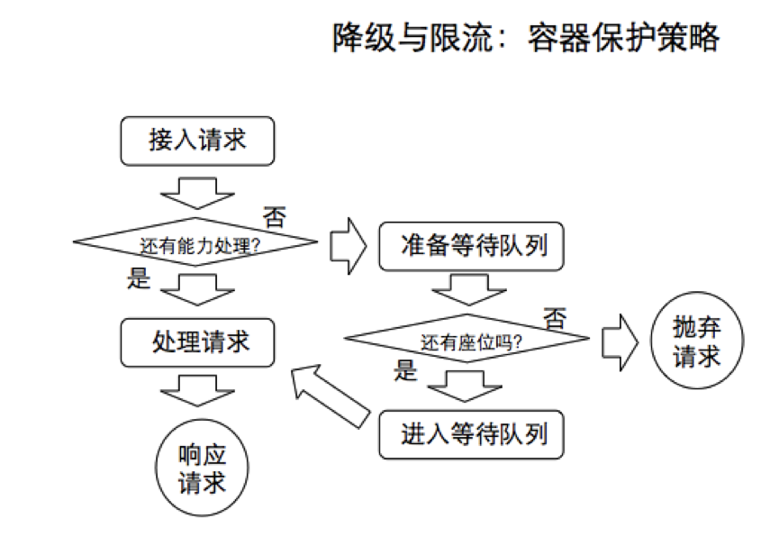
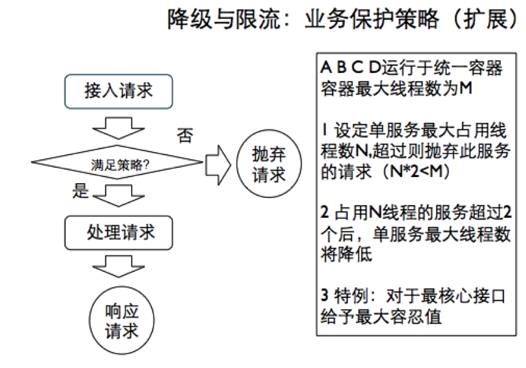
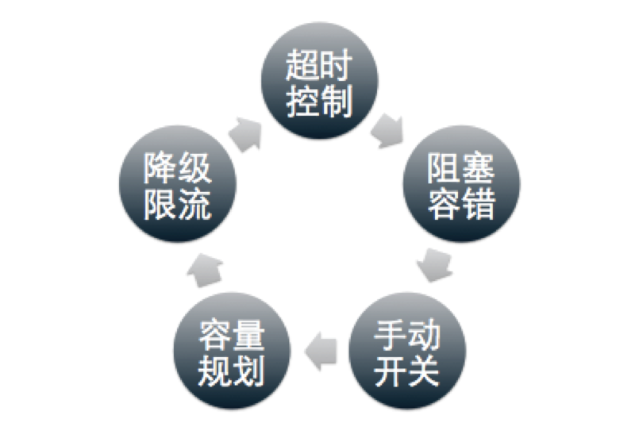
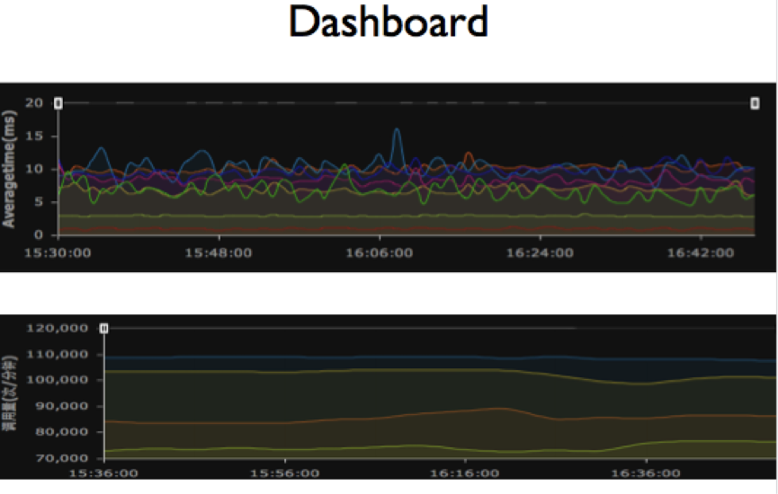

```
{
    "url": "weibo-platform-availability-9999",
    "time": "2014/05/14 17:24",
    "tag": "阅读",
    "toc": "no"
}
```

随着 2014 年元旦微博平台抗峰的顺利通过，2013 年微博平台核心服务接口的可用性指标被定格在 99.991%。

微博服务可用性提升是 2013 年微博平台技术团队的一个重要目标，为此，平台内部还特别建立的微博平台的 SLA 指标体系，其中微博平台核心服务接口（主要以 feed 服务相关接口为主）的可用性指标为：全年平均接口请求性能 <100ms 的比例 >99.99%，即 4 个 9 的可用性指标。

## 我们的挑战在哪里？

说到 feed 服务大家都知道，feed 服务是微博最核心，最有价值的服务，于是它也是产品经理们花心思最多的地方，各种产品功能策略逐步在 feed 服务中实现，“Feed 置顶”、“关键词屏蔽”、“热门推荐”等等，伴随而来的是服务依赖的增多，虽然微博平台对内部的各个依赖资源及服务模块都有 SLA 指标的要求，但就算所依赖的各个服务的可用性都是在合理性能下的 99.99%，假设 feed 服务依赖于 9 个服务模块，理论上 feed 服务的可用性只能达到 99.99% ^9＝99.91%，即只能保证 3 个 9 的可用性。更何况，feed 服务实际依赖不止 9 个资源或服务模块，甚至有些依赖的服务模块由于某些限制确实还不能达到 4 个 9 的可用性指标。这些情况都对服务的可用性形成很大的威胁，对我们的完成目标造成很大的挑战。

## 我们做了什么？

为了完成 4 个 9 可用性的目标，一方面微博平台内部建立标准的 SLA 指标体系，无论是资源，还是服务，都严格定义 SLA 指标（主要包括性能标准和可用性），并且实行服务分级策略，对于一般重要的（弱依赖）资源或服务执行标准的 SLA 标准，而对于非常重要的（强依赖）资源或服务，实行高要求的 SLA 标准，同时投入足够的资源和人力确保关键依赖服务的 SLA 指标的优化保障。另一方面，根据 feed 服务自身的业务特点，以所依赖资源或服务的 SLA 指标数据为基础，制定合理的容错和保障策略，通过在架构方面的策略改造，保证服务的健壮性，提升服务的可用性。

对于服务的 SLA 指标，最主要的就是明确性能标准和到达这一标准的服务调用比例（即可用性），以 mysql 资源为例：单次请求性能 <50ms, 整体满足此性能标准的请求比例 >99.99%,（当然，这个指标需要根据具体的业务特点、sql 的复杂程度等具体情况进行不同的定义，不能一概而论）。 明确了依赖服务的 SLA 指标，我们就可以从架构上通过一些策略保障整体服务品质，而不必过份依赖特定的资源和服务，具体有如下几个方面：

### 1. 超时控制：

从 connect timeout 到 socket timeout 细化超时指标和处理策略。Feed 服务依赖了 10 多个资源或服务模块，偶尔会有某个服务出现问题，或者网络的抖动导致请求超时，如果 feed 服务无差别的进行等待，那将是一个噩梦。所以，feed 服务根据业务特点，把这些依赖进行分级，然后再依据强弱依赖关系，对 SLA 指标进行分级，最后对各个依赖的请求分别设定异常处理阈值。以 Feed 置顶功能对资源的依赖为例，置顶微博 ID 存放在缓存 memcached 中，在 feed 聚合时需要从 memcached 取出这个数据，而平台对这个资源的 SLA 要求为 <50ms,>99.99%，正常情况下都能满足整体服务性能，但当遇到特别情况比如网络抖动，很多获取置顶微博 ID 的请求将超过阈值，如果对请求超时不进行有效控制，就会影响到整个 feed 的请求。所以，在这种情况下，feed 服务从架构上，对置顶功能的资源依赖明确了超时控制，一旦对这个资源请求时间超过 80ms（一般情况下，这个阈值要比依赖资源确认的 SLA 标准稍微放宽一些，确保正常情况下这个超时控制策略不会误伤正常业务功能），则断开请求，避免影响到整个 feed 请求，而这种策略，就是通过资源的 connect timeout 和 socket timeout 来实现的。尽管在这种资源问题的情况下，置顶微博可能会偶发不显示，但 feed 的最主要功能没有受到影响。可见，这种对依赖隔离非常重要，对于任何依赖不能无止境的信任。

### 2. 阻塞与容错：

对于必要的依赖，要有一定的容忍度（限定在 SLA 之内），通过请求队列，自动容错降级等方式容忍短期的服务波动，同时还需要一定的自动修复策略，保证依赖服务恢复后，主服务能够快速自动恢复。

Feed 服务中最典型的阻塞容错策略是 feed 的发表模块，当你发表一条微博时，微博内容并不是直接存入 mysql 中，而是暂存在消息队列中，然后再由专门的消息处理模块对这些消息进行处理，进行更新入库。这样做把 feed 服务对 3 个左右的 mysql 依赖降低到对一个轻量级的消息队列的依赖，可靠性一下子提高了一个档次。当前类似这样通过阻塞及容错策略进行依赖降级或隔离的场景还有不少。

### 3. 手动开关：

然而，在一些特殊的情况下，有些依赖的资源或服务可能长时间不可用，这样导致服务一直受到影响。尽管我们有前面所说的比如超时控制等一些保护策略，但这些保护策略也在消耗这一定的时间。短时间波动的问题可以非常好解决，但对于相对持续较长的问题，则很难达到效果。这是就需要我们手动切断依赖，等依赖问题恢复后再打开。

有人可能提出，为什么不能在超时控制的策略之上，自动增加这种开关机制能？实际上，对于非常核心的资源服务依赖，一般性的问题都不允许进行降级，如果采用自动降级策略风险将非常大，因为自动降级的边界非常难以判断，这种情况最好的方式就是采用手动降级的方式。（一旦实施了这个，一般都是出现了非常严重的问题，服务品质已经收到影响，只是尽可能的把影响降到较小范围。类似于“断臂保命”）

### 4. 容量规划：

容量规划是每个系统必须认真面对的问题，单机容量（qps）＝最大处理线程数／单次请求平均响应时间，系统容量（qps）＝单机容量＊机器数＊r（容量系数），特别值得一提的是，分布式系统中的容量系数需要细致评估。另外，对于容量评估也要根据系统的演进经常的进行 review，微博平台一般每个季度进行一次容量评估，同时明确定义一下 SLA 指标的修正，特别是重大活动之前需要提前评估。比如，对于微博服务，在元旦，春节都需要提前规划准备。而对于冗余量的问题，日常 30% 的冗余，确保一般突发事件引起的流量增长可以正常承受。

### 5. 降级与限流：

容量评估能够解决可以预见的流量峰值请求，但作为开放的互联网服务，经常会有你不能预见的流量请求来冲击你，甚至有时你预见了将有超出你系统容量的请求，却来不及完成扩容。这时候就需要我们考虑如何避免流量超出容量导致整体服务 crash。就像说，吃掉你能吃掉的，对于吃不掉的就快速扔掉； 这就需要一定的降级和限流策略。

对于这个降级与限流，实际处理时一般分为两级：单一实例的容器保护策略，整体集群服务的业务保护策略。

对于单一实例的容器保护策略（以 tomcat 为例）主要涉及 maxThreads，acceptCount，具体处理策略如下图：（阈值处理指标需要根据具体业务场景来定）（如图：容器保护策略）



对于整体集群服务的业务保护策略，重点保证服务间的隔离，避免相互影响，主要涉及 single task count，single task limit，具体处理策略如下图：（如图：业务保护策略）



以上通过具体的业务场景，简单介绍了在已知 SLA 标准的基础上，通过五个方面策略，确保服务可用性的提升，而这五个策略中任何一个策略都只能解决一方面的问题，他们是相辅相成，相互补充的：（如图：）



另外，在确定的 SLA 体系下，为了保障以上架构策略的稳定有效，还需要有完善的监控体系，以及一定的压测及演练机制。

对于服务的监控体系，就像我们的眼睛，可以快速的发现潜在的问题和风险，比如：容量问题，资源异常状态，等等，同时配合一些提前制定的处理预案，能够将系统的问题消灭在萌芽状态，将大事化小，小事化了。

有关监控系统的建设，这里边有个非常重要，又容易被大家忽视的问题，就是易用性问题，我们的经验是，一定要能把监控数据转化成易于理解的图标。好的监控系统应该让运维人员一眼就能看出问题。这样的系统，运维同学才喜欢用，才有生命力。 比如：微博平台的 dashboard。



对于服务的压测与演练机制，主要是根据 SLA 数据及架构策略预案，制定演练计划，尽早发现架构或策略的问题。用以确定阀值是否有效？ 容错是否合理？ 开关是否生锈？ 容量是否准确？当前微博平台主要使用的是自己开发的 touchstone 系统，通过 tcpcopy 的方式模拟线上真实流量及场景，确保压测和演练的有效性。（有关 touchstone 系统在 @微博平台架构 官方微博上有专门的文章介绍，这里不再赘述）

以上是微博平台在服务可用性提升方面的一些实践经验，其实还有很多可以进一步提高的方面，2014 年我们继续努力！也欢迎感兴趣的同学一起就这个话题交流探讨！

感谢[丁雪丰](http://www.infoq.com/cn/author/丁雪丰)对本文的审校。

---

- 作者：李庆丰
- 链接：https://www.infoq.cn/article/weibo-platform-availability-9999