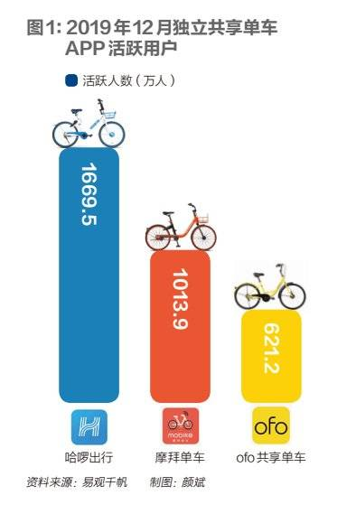
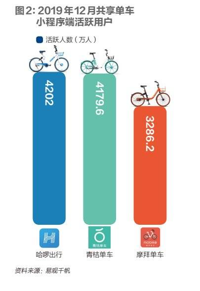

```
{
    "url": "bike-sharing-v2",
    "time": "2020/07/26 23:22",
    "tag": "阅读",
    "toc": "no"
}
```

>曾经堆满大街小巷的摩拜、ofo单车几近消失，哈啰、美团、青桔等“后起之秀”成为新的市场主宰者。疯狂烧钱、铺车的景象成为历史，共享单车进入了理性发展的新阶段。


> 本文来自于微信公众号：[财经十一人（ID：caijingEleven）](https://mp.weixin.qq.com/s/TPOwIHRg5V0UEpEvPctfRA)，作者：马霖


从资本竞逐的“风口”游戏，到“泯然众人”的出行工具，共享单车的形象在短短三年内发生了一场剧变。


这种变化对一个新兴行业自身的发展有积极的一面：企业不再被盲目催熟，浮躁退去，理性回归。进入2.0时代的共享单车，需要在真实的市场环境中证明它对用户到底有多大的价值。


ofo陨落，摩拜被美团“收编”，小蓝单车等销声匿迹。曾经在资本市场上掀起巨浪的第一代共享单车企业几乎全军覆没，但这个行业并没有消亡，反而走向了成熟。**现在，哈啰单车、美团单车、青桔单车组成的行业新格局已经逐渐清晰。三家公司均表示，在用户端，共享单车提供中短途出行服务的便利性和接受度已经得到验证。**


根据交通运输部2019年公布的数据，目前共享单车已进入全国360个城市，注册用户数超过3亿。交通运输部科学研究院城市中心规划部副主任尹志芳告诉《财经》记者，发生疫情以来，共享单车单次平均骑行距离同比增长了一倍，从1.4公里—1.7公里增长至3公里—3.7公里。从数据上看，共享单车服务的消费黏性有所提升。


随着行业趋于成熟，以及政策管理的介入，1.0时代高调的“铺车”和资本竞赛成为历史，共享单车行业升级至存量市场争夺。“曾经大家认为共享单车拼的是投放密度和速度，现在被证明这个思路也许是不对的。”一位来自蚂蚁金服的哈啰单车投资人对《财经》记者表示，“这个行业的本质是通过技术推动效益，最终用户会用脚投票，资本只是助力。”


**共享单车2.0时代与1.0时代有两点不同。首先，几个玩家均与巨头“绑定”，**哈啰是阿里和蚂蚁金服在大出行领域的战略投资项目；摩拜被美团收购后，创始团队出局，美团希望未来美团App是共享单车服务的唯一入口，支撑起美团对标支付宝，做流量平台和支付产品的梦想；而为了挖深在大出行领域的护城河，滴滴投资ofo失利后成立了青桔。如何让单车业务和巨头的整体打法形成共振，成了每一家都要重点考虑的问题。


**其次，盈利目标被提上日程，各公司也在跨赛道寻求增长**。电单车（又称“电助力车”）作为单车之外一项顺理成章的业务，成为了新的“必争之地”；同时，三玩家和背后的巨头公司都在基于主业，向竞争对手的优势领域延伸，寻求新增长点——美团、哈啰已经跨入网约车、顺风车市场，滴滴、哈啰在近半年进入了美团、阿里擅长的生活服务领域。虽然这些跨界还暂时无法构成很大威胁，但在相似的扩张思路下，大小巨头之间的交叉竞争在未来势必会越来越胶着。


# 一、争夺存量市场


共享单车注定是印刻在中国创业和创投史上重要的一笔，自共享单车一役后，基于新概念和新模式的创业投资氛围明显趋于谨慎，美团对摩拜的收购相当于给火热一时的共享经济定了价，共享单车领域自身也进入调整期。


对于新投资，共享单车公司和投资方都不再高调官宣投资进展。一位投资人向《财经》记者确认，今年4月，君联资本加入共享单车战局，与软银共同向青桔注资，据多家媒体报道，数额可能在1.5亿美元，此外滴滴也向青桔输血8.5亿美元。


同月，哈啰出行董事长杨磊在内部分享中透露，哈啰在2019年底完成了新一轮融资，哈啰未官宣这一消息，几乎主导了每一轮哈啰投资的蚂蚁金服亦保持低调。接近上述投资的人士表示，共享单车领域的战事还未结束，但是打法变了，从攻城略地转为深耕存量市场。


**根据外界预估，目前三家公司用户数量和单车数量的大致情况是：哈啰最多，美团次之，青桔由于成立最晚，数量最少。**


三家公司并不对外透露精确数据，根据易观分析的监测数据，哈啰在活跃用户数量方面优势明显。数据显示，在共享单车独立App端，2019年12月哈啰活跃用户数量为1669万人，摩拜活跃用户数量为1013万人，（青桔App上线较晚，未列入统计；美团App端单车数据由于法律要求无法监测到）；在微信和支付宝端，哈啰活跃用户数为4202万人，青桔4179万人，摩拜3286万人。





**哈啰在用户数量和单车数量上占据比较大的优势，这得益于它入局早，且穿越了共享单车的1.0和2.0时代，团队稳定，在众多低线城市和县域市场拥有较多车辆配额。目前哈啰已经将共享单车铺设到了200个县城。美团、青桔则分别依托摩拜、小蓝打下的江山，市场主要集中在一、二线城市。**


目前，各城市是根据自身空间承载力，以及对共享单车在城市交通中的作用定位来决定单车可投放数量，三家公司的市场份额和重点运营市场基本固定，没有太多悬念，但据《财经》记者采访了解，玩家们都对未来“势力范围”的巩固和扩张可能性抱有野心。哈啰依然希望在高线城市争取更多配额；滴滴回复称，今后会加大在中小城市的开拓力度，配合政府公开招标及动态考核，争取更多投放额度；美团公司也表示2020年会继续扩大对单车的投入。


尹志芳表示，随着城市骑行环境改善，比如自行车道的完善和停车位增加，共享单车会有较大的骑行需求。此外，在公共交通相对没那么发达的中小城市，共享电单车可以满足更长距离的出行需求，使用率在提高。据记者了解，目前三大玩家都在争取包括电单车在内的更多配额。


在运营方面，共享单车玩家们已经积累了一些经验：做共享单车的投放和调度，需要考虑城市核心区人口密度、道路交通情况、地铁线延伸、公交站密度、可骑行区域等。


**总的来说，人流量越大、公交地铁覆盖越密集的区域，需求越多，运营价值越高，**例如，市中心人流量大，运营难度小，越往郊区，交通线分布越稀疏，效率越低，稀疏到一定程度运营效率就会过低；超大城市、大城市公共交通体系发达，公交点到目的地之间的点对点接驳需求旺盛，单车铺设半径更大，骑行频次更高；县城需求主要是家至目的地，骑行频次比一线城市低，因此需要把车投放在县城核心区域。运营效率高的县城，骑行频次并不会输给中等规模城市。


**在共享单车主战场上，亲历过疯狂抢占市场阶段的各玩家已经达成共识：共享单车是一门对资本投入、团队学习和服务能力要求非常高的生意，团队需要培养起运营上百个城市业务的能力，而非大量投放完车即可了事。**


哈啰单车事业部负责人褚轶群向《财经》记者解释了哈啰的投车逻辑：超量投放会影响单车的使用频次，也会影响城市公共交通，哈啰会在运营过程中不断利用积累的数字，计算城市的车辆会不会超量。每进入一个新城市也不会大量地投放新车，而是抽出原有城市中车效不高的车辆，调到其他城市。以2018年—2019年为例，两年间，哈啰大概做了100万辆车的调度。


**“这个行业的本质，是通过技术驱动运营，匹配供需，从这个角度讲，共享单车的运营效率远远没到优化上限，在降本增效、骑行体验方面还有很大的提升空间。”**褚轶群说，随着城市化和城市公共交通建设继续，北上广等大型城市向外扩张，地铁“动脉”延伸，会需要“毛细血管”将人送到他们要去的地点，城市里还有比较大的自然增长空间。


今天再反思ofo的失败，可以检讨出团队、市场等多方面的问题，其中一个比较严重的问题是产品，ofo的产品智能性不足。蚂蚁金服投资人认为，提供租赁服务的单车应当是一台IT设备，实现运营与运维的实时通讯。


**保证车辆维持良好状况也需要技术支持：首先，通过数据积累分析、AI图像识别，提升用户报障准确率；其次，如果出现用户短时间骑行后换车，或者有一辆车始终不动，需要通过数据第一时间捕捉到异常，打上疑似故障标识，再用智能派单的方式，快速将维修任务分配给运维人员及时处理。**


对于目前共享单车行业的服务能力，他表示，这个行业提供的服务并没有过多，而是依然不够，用户会反馈需要车时找不到车，可能是数量不够，也可能是车没有及时出现在用户所在的位置。“如果用户看到车好骑，需求产生的时候身边有车，那么会有更多人的习惯被扭转到共享单车上。”


# 二、盈利目标提上日程


更重视服务质量的同时，共享单车公司也在回归商业逻辑，盈利目标被提上日程。


哈啰率先公布盈利时间表。4月哈啰董事长杨磊对媒体透露，2019年哈啰的两轮车业务（共享单车和共享电单车）已经获得了一些毛利，随着业务规模持续发展及效率提升，2020年的目标是集团首次实现盈亏平衡，业务100％增长，且疫情不会影响这一目标的实现。他并不希望人们认为哈啰只是支付宝的一个流量入口，强调“哈啰一直以纯粹商业的角度来看待共享单车，期望它能提供用户价值，同时可自我造血，实现可持续发展、长期服务于用户”。


美团对单车减亏也有要求。“已经到了下半场，企业承受不了野蛮生长，都在谋取盈利。”一位接近美团的人士表示，“美团内部对单车项目的要求是控制成本，毕竟亏损额比较高。”2019年12月王兴曾表示，出行业务短期内的优先任务是减少亏损，创造战略价值，而非获得市场份额，要进一步提高共享单车、网约车的运营效率，提升出行业务与美团平台的战略协同。


“美团对美团单车的期许是对核心机票酒店、外卖业务起到助力作用，美团外卖业务盈利性仍有待增强，盈利能力更强的机酒在今年疫情的情况下受到冲击，因此美团对各个板块业务盈利性的要求会更高，包括共享单车。”易观分析出行分析师孙乃悦表示。


美团回复《财经》记者称，共享单车是否盈利，在于行业是否进入健康的发展轨道，也考验着企业的运营基本功。**如果说1.0时代是烧钱、粗放式管理，拼数量抢市场的阶段，共享单车很难盈利，那么现在行业已经不打价格战，让单车的价格回到价值上，进入了趋于理性追求可持续发展的时期。**这种情况下，美团单车的亏损是持续收窄的。


滴滴同样认为共享单车可以盈利。滴滴表示，共享单车的本质是租赁生意，对线下管理、运营效率有着很高的要求，如果能控制住成本，提高营收，就能盈利，青桔目前通过提高运营效率来提升商业价值，用户骑行付费为主要收入来源，也在尝试广告等变现方式。


站在IPO门前的滴滴，可能并不像哈啰和美团那么迫切地追求单车业务盈利。孙乃悦表示，因为有上市目标，滴滴更紧要的任务是把出行的故事做大，让企业更有看点，它追求的是包括单车、网约车、长短租车各领域的综合发力，通过所有板块协同去占更大的出行市场，因此相比于盈利，滴滴给青桔现阶段设定的更重要的目标是抢占更多用户和市场份额，做大单车业务，同时看重青桔对网约车主营业务的协同作用。


关于盈利预期，一位前摩拜投资人表示，共享单车行业出现了几点值得注意的积极变化：


**第一，2019年，共享单车服务提价，提价幅度少则1.5元/30分钟，多则1.5元/15分钟。**滴滴告诉《财经》记者，青桔订单量的一半以上由常用户贡献，三家公司均表示，调价对需求影响不大，且已经培养出稳定的用户基础。


**第二，目前各家把高频忠实用户转化成月季卡、年卡会员，初步培养起了用户黏性。**“押金在严肃的财务审计里面不能确认成收入，只是一个现金流流入的概念，早期摩拜内部就有讨论，从押金过渡到会员模式，转为会员模式的前提是你已经培养起高度的用户黏性了。”


**第三，单车的需求量远超当年投资方的预期。**“我们当时投的时候上海只有几百辆车，没有想到用户数量会增长这么多。”


“以美团单车为例，2018年4月摩拜卖给美团时，现金流已经为正，当时单月资金流入2亿元，支出1.8亿元，情况是理想的。”上述前摩拜投资人说。但他也说，在目前三分天下的局面下，几家公司能否盈利，也与竞争的激烈程度相关，如果出现过度竞争，就会拉长盈利预期。如果没有激进扩张，财务模型就会回到比较健康的状态。**共享单车能否持续涨价？他认为涨价的前提条件是达到相对垄断，“只要不超过地铁价格，最多3元钱，就是一个合理的价格。”**


从收押金，到赚骑行费，共享单车经历了“赚快钱”到赚“辛苦钱”的转变，多位采访对象表示，共享单车可以盈利，但这不是一门高利润生意，从前端运营到后端供应链，成本一样不能少，同时每一笔收入都是微额的支付，这也是为什么这门生意需要利用技术去优化运营成本，例如降低单车业务在城市之间的扩展成本，争取在不大幅提升骑行费的情况下，提升公司财务效率。


**为了获得更多成长机会，拓展多元化业务成为各玩家的必选项。**在出行赛道上，哈啰、美团和青桔一项重要的发力点就是从短途单车拓展到中短途电单车，疫情提升了消费者尝试用电单车代替网约车或者公共交通做中短途和稍长距离出行的意愿。一位出行行业人士表示，目前受限于政策，电单车市场以二三线及以下市场为主。


**此外，共享单车玩家和背后的巨头公司也开始基于主业，向竞争对手的优势领域延伸。**在出行领域哈啰正在做的是，通过共享单车主营业务这一高频流量入口，切入网约车、顺风车等整个出行领域，与滴滴争抢地盘；美团2017年已经从外卖主业延伸至网约车领域。此外，哈啰还与蚂蚁金服、宁德时代共同投资了哈啰换电这一公司，开发可以为全行业所用的两轮车换电基础服务。


滴滴、哈啰也在试水生活服务这一美团的主战场，滴滴和哈啰2019年上半年分别上线和测试了跑腿业务，对标“美团跑腿”。哈啰单车近日还做起了社区团购业务，在山东淄博桓台县“试水”社区便利店，取名“哈先生”。这印证了杨磊在4月公司内部分享时的表态，当时他表示要将哈啰App打造成中国主流的三个App之一，未来共享单车业务最好只占哈啰整体业务的一成。一位哈啰人士告诉《财经》记者，哈啰在本地生活方面有几项业务在跑，还没有到可以对外披露的阶段。


杨磊此前表示，出行的优势在于，和生活密不可分，无论是骑车还是打车，出行都是最能描绘出一个人生活轨迹的场景。“一个人常去哪，起点和终点有什么，都是可以确定的，如果将数据范围进行延伸并深入分析，可以拓展出更多可能性。”他表示，本地生活服务是哈啰基于目前出行领域已经积累的业务、口碑基础和3亿用户去做的一项延伸和探索，“哈啰这些年在下沉市场所积累的运维、站点等优势，为延伸提供到店、到家服务提供了可能”。


不过目前看来，本地生活服务还谈不上是哈啰、滴滴的“阵地”，美团、哈啰能切掉的网约车份额也很小。前述摩拜投资人表示，上述玩家在各自领域或处于纷争格局，或需要巩固阵地，对主业的投入不敢减少，市场不大可能产生重大变动。“如果某家公司能做到绝对的一家独大，多元化业务才有可能发生更大变动。”


# 三、阿里、美团、滴滴会“增持”单车业务吗？


孙乃悦认为，站在共享单车业务背后的美团、滴滴和阿里支付宝，它们在出行业务上存在着针锋相对的竞争关系，同时共享单车是一个被验证有效的流量利器，这对想要做大出行故事的滴滴，“没有出行亲儿子”但觊觎大出行市场的阿里，以及希望打造流量平台的美团，都可以产生助力作用，这决定了它们对单车业务的态度是“全力支持”。


滴滴2019年上半年公布的新战略目标是，“三年内全球每天服务1亿单”，以及“在国内出行市场获得8％的渗透率”。**滴滴公司对《财经》记者表示，共享单车作为高频使用产品，能够扩大用户规模，提升用户使用频次，与主营业务可以形成互补优势，提升滴滴的出行生态竞争力。**


**美团2018年收购摩拜的初心是获得更多用户，增强App用户黏性和使用频率，创造战略协同效应。**美团回复称，目前共享单车仍是美团主要投资业务之一，可以丰富平台用户的消费场景，单车业务贯穿在美团Food+Platform（外卖+平台）的战略中，美团会继续加大供应链、品牌和营销投入，通过单车业务拓宽用户群，进一步使用户通过共享单车入口进入到美团生态体系中，带来的流量会为销售其他本地生活服务创造更多机会，各业务线之间也有合作的可能。


**阿里、支付宝则凭借哈啰和2014年收购的高德，得以对中国人的衣食住行服务市场进行全方位占领，哈啰可以说是阿里在出行领域挑选到的最好投资。**


上述摩拜投资人长期关注互联网大小巨头的业务模式，他倾向于认为，单车业务对美团的重要性大于对阿里支付宝和滴滴的重要性，这从美团收购摩拜，蚂蚁金服仅参股哈啰，以及滴滴为青桔引入外部投资，不再全资拥有青桔这两点可以看出，而阿里2014年收购了高德，有收购出行业务的先例。


他表示，**出行与美团的战略有最直接的关系，美团进入互联网公司第一梯队后，王兴迫切希望将美团App打造成匹敌支付宝、日打开率更高的流量型平台，摆脱依赖商户抽佣的盈利模式，出行则可以带来流量和用户黏性，丰富收入模式，也会产生其他基于内容的变现方式**；理解美团对单车的态度，要看美团更大的“业务画像”是什么，美团对做支付野心勃勃，如果单车出行这类高频业务带来的流量，未来可以帮助美团App切下支付宝、微信20％在支付场景中的份额，美团的市值将会远远高于今天所在的位置。


再审视对哈啰的投资，前述蚂蚁金服投资人表示，如今依然看好哈啰，投资目标也并不是在单车上赚大钱。“在移动互联时代，用技术推动绿色出行，这符合蚂蚁金服用技术拓展商业边界的投资思路，支付宝和哈啰可以相互成就。”


目前哈啰跟阿里及支付宝的业务合作包括数据算法应用方面，以及提升哈啰单车和电单车在热门站点定位、车辆智能调度的精准度等。同时，哈啰出行也是最活跃的支付宝小程序之一，为支付宝贡献了日活流量，哈啰也通过支付宝渠道获得了大量用户。“站在支付宝角度，阿里和蚂蚁金服更关注这个行业是否健康，只有给人们带来广泛的价值，这项服务对支付宝才会有意义。”他说。


不少采访对象都表示，总体看来，共享单车经历了一个转变，从无序发展的纯商业项目，到必须与城市发展、政府规划配合的基础交通工具，无论是做单车，还是电单车，未来都不应该再回到无序的状态，只有持续提升服务质量，消费者才会买单，大小巨头公司才可能沿着各自的商业目标继续走下去。

---

- 作者：财经十一人
- 链接：https://www.huxiu.com/article/370765.html