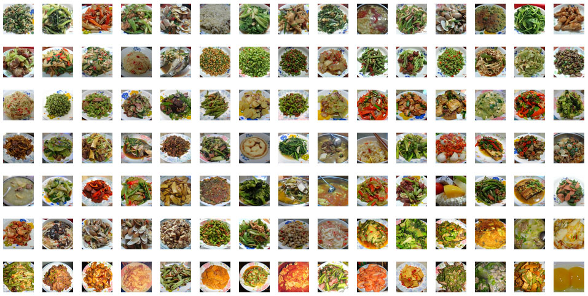

```
{
    "url": "2013-thinking",
    "time": "2014/01/23 07:18",
    "tag": "随笔",
    "toc": "no"
}
```

伴随着2013的结束，博客到今天也恰好一年了！

曾经的suchshow毕业后就没怎么管了，后来一直想弄个博客，写点技术心得体会，也终于在年初弄起来了，一度也荒废过两个月，但整体上还算满意吧，也胡乱写了几篇乱七八糟的东西，还算踏实。

常在想闲的时候可以学点什么东西，有更多的时间去整理、去思考，但当真正闲下来的时候却又什么都不想做了，反而是忙的时候可以挤出时间学一些东西，努力让自己忙起来吧。

年初从七天离职来到铁人，工作变得忙碌了，也算好事，一些编码习惯也慢慢形成，知识也更成熟了一点，不过广度有待扩展！

一度让人窝心的驾照也在今年拿到了！生活上其他的事也都过去了，还算充实。。。

晒下1314的幸福，结婚照：


那些美食：



最后，道德经五千真言在2014能记住不？