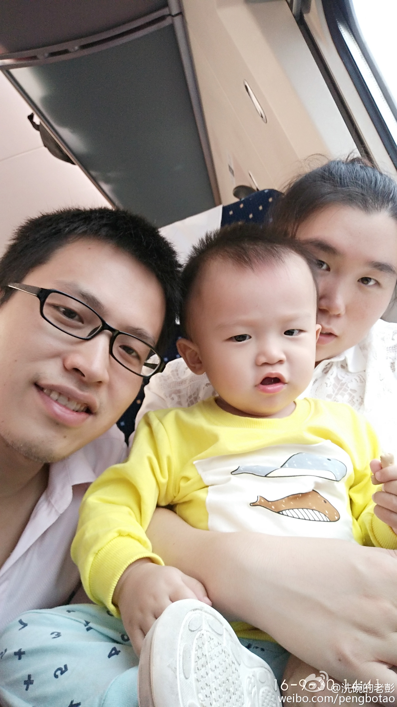

```
{
    "url": "thirty-years-old",
    "time": "2016/12/04 11:39",
    "tag": "随笔"
}
```

终于闲下来，算算已经工作七年半了，来广州也有七个年头了，带着老婆孩子漂泊在外始终没有归属感，想尝试下回武汉看看，等一些手续办完就可以了，时间定在本月中。这段时间可以回头看看走过的路，做一个七年小结。

# 工作方面
一直以来从事的是PHP相关的工作，做过的项目也不少了，待过几家公司，下面梳理下这几家公司。

## Web开发入门
说到技术就不得不提在大学的那个阶段。院里有个工作室叫伊水工作室，主要负责一些学校专题网站及校园资讯平台 - 香榭园。凭着对计算机的兴趣加入了伊水工作室，虽然只是个小工作室，但基本上也是各司其责。有同学负责做图、切图，有同学负责`Flash`，有同学负责实现功能套页面。

那一年是2006！

从这往后的大学生涯里，Web开发就占据了一席之地。中间做过一些专题，记忆深刻还是香榭园的改版，一个人埋头苦干了一个多月，算是对PHP入门的一个检测。包括后来的参赛作品 - `商评网`以及毕业设计 - `基于Ajax的博客系统`相对都更得心应手些。现在来看， 大学期间基本上掌握了`Web`开发涉及到的知识面：PHP、Msyql、CSS、HTML、JS、`Photoshop`、Flash等。能用`PHP`写整个系统，能独自完成一整套系统的开发，当然对于代码质量这个阶段是远远不够的。同时还接触到了各种其他语言：C、`C++`、C#、`Java`等，这些也都是学校开设的课程，在后面工作中用到的很少，但也帮助拓宽了一些眼界。

正是这个选择让自己走上了`Web`开发这条路，毕业临近的那个阶段开始找工作，可谓是信心满满，觉得自己的能力拿个两千没有问题。可发现在武汉PHP好像并不是太好找工作，机会比较少。面试几家后意识到要调整下姿态，抱着学习的心态先进入职场。通过面试、电话面试来到了武汉易瑞特。面试的时候对薪酬没有提要求，入职的时候说的是一千五，但实际上转正后给了两千，自我满足了好一会。

## 开启职场生涯
进入的第一家公司是武汉易瑞特。武汉易瑞特是一家做`CPA`广告营销平台的公司，帮助广告主将广告投放到相关网站上。技术团队上前期由两个人组成，项目在大牛才哥的带领下从零开始，大约三个月后上线。

这个阶段比较纯粹，进一步夯实基础，涉及到的业务比学校要复杂一些。团队之间使用`cvs`进行版本控制，测试环境在`Linux`下。所以也开始去了解Linux，装一些常用的软件。Disckson是公司创始人也是`DBA`，住在国外，每周都会开视频会议，跟着他也学到很多数据库相关的知识。

项目做了一年之后，才哥提出了离职。整个项目就压在了我的头上，可并没有担心，相信自己有能力撑起这个系统，接下来的几个月也做到了。招来了两个开发入手后我也有了自己的想法。一来是项目的起色并不明显，二来大学室友韦剑涛（也是伊水成员）觉得应该来广州看看，这边的机会多很多。经过考虑后还是决定来广州看看，于是乘上K435踏上了南下的旅途。

## 南下广州
相比武汉，广州这边的机会确实多得多，待遇翻了快两倍。过来进了一家外包公司，被派遣到七天连锁酒店，工作一年后转为七年的正式员工。七天的信息中心有几十号人，拆分成了`DB`、接口、官网等几个组。所在的组为官网组，主要负责官网、淘宝店相关的一些东西。这家公司没有加班文化，偶尔重要的版本才需要留下来。两年的时间相对还比较轻松，有时间自己去琢磨一些东西，可能也是这个原因，代码思维上有一些提升。在这边两年多的时间里主要有两点感受：

一是沟通方式主要是邮件，各个部门、门店发邮件常会群发，每天都可以收到很多邮件。一度很反感为什么要收到这么多不相关的邮件，现在看来公司大了，部门多了之后这可能也是相对快速、较好的一种沟通方式。

另一个是技术思维、代码质量有一些变化，自己不断打磨后的程序恰好跟`设计模式`吻合，容易扩展方便维护，这也引导自己去研究下各种设计模式。设计模式是前人总结的一些开发经验，值得我们去学习，但也并不是说开发一定要用到设计模式，可根据业务情况去评测，要解耦拆分到什么程度。

可以看到由于认知的一些局限，不同阶段对事情的看法也不一样。觉得邮件多可能更多的是从自己的角度，觉得自己被打扰了。从整体的角度看，算是一种成本比较低的方式。内部也有一些辅助平台，但都没有邮件来的直接，再适当的给予一些引导就更好了。

最后，在七天还有值得庆幸的是遇到了现在的老婆^_^

## 综合能力提升
离开七天后来到了`PP助手`，这里和七天有很大的反差。这是一家由技术主导的公司，技术氛围浓厚，有一定的加班文化。进公司前面一年在尚东办公，后面并入`UC`后搬到广电，最大的一点是有了自己的食堂，早中晚还有水果、饮料、下午茶，解决大家的吃饭问题，这点现在回想起来还是挺不错的。在PP待了三年的时间，做过很多系统，统计系统和支付平台相对更长些。

统计系统涉及到很多数据库、服务器相关的东西，数据量比较大，有些时候主从会同步出错，有些时候需要进行大批量数据处理，以及读写分离、统计时效性的一些优化。来回折腾了一段时间，收获还是挺多。后面支付中心缺少一个主导的人，被选中主导支付相关的一些工作，支付是PP的主要收入来源，需要有耐心和比较细心，当时倒觉得自己挺合适。

支付平台已经运行了几年的时间，已经接入了很多家游戏也不敢随便重构，隐藏的问题挺多。首先做的就是规范流程、整理文档。之前发布的时候没做回滚处理，如果出问题去线上查询日志或者重新去拉相应版本比较耗时，影响到用户支付体验是不被允许的。做好开发计划，明确上线过什么内容，什么时间上线，还有哪些未上线内容。进入的时候也基本上没有什么文档，后面将支付中心的相关文档进行整理，也帮助自己理解支付平台。其次是做代码REVIEW，也发现了很多漏洞，可以直接影响到用户的账户和余额。最后慢慢的去重构了一些东西。当然还有一些与UCSDK的整合，财务整合等日常需求。这里跟服务器相关的也很多，每天都需要去服务器上看一下相关日志，也做了多台Web服务器、数据库的主从等方便有问题及时切换。

还有很多其他的系统，也学习了下`C++`，采用`Python`做接口中间件等等，学到很多东西，同时也感受到有一种文化在里面。纸笔可以自取，考勤、工作汇报关系、会议室预订等都可以通过系统处理，每个人桌上都有自己的名字，上班时间弹性到九点半，还有很多辅助办公的工具，知识共享系统，不定期的分享、讲座等。在里面的时候这些可能都觉察不到，但离开了后发现这些细节都做的挺好的，这也得感谢后面做支撑的部门。

## 关注点的变化
刚从美丽元出来，美丽元主要做美业`O2O`方面。该项目从14年底就开始负责，只不过三月份正式转入美丽元。撑了两年的时间后公司决定不继续做了，听到这个消息感觉甚是意外。总的来说，转入过来后收获更多的不是技术方面的东西了，更多的是流程优化、团队培养及对事情关注点的一些变化。

- 通过`Git`管理代码，钩子来触发测试环境代码同步，通过`Confluence`来实现团队之间的知识共享帮助团队成长，`Jira`用于Bug跟踪。
- 常常说要有团队意识，把自己的事情做好。但这个事情不是自己做的就不闻不问、呵呵的姿态是不好的，这个问题可能是本小组或者本部门其他人的负责的，我们也可以帮忙通知下或者收集一些错误信息之类的。我们所处的角色从不同角度看会不同。
- 每个人都需要个成长的过程，对于技术的学习也是一样，只能一步一个脚印。有些人可能领悟力高一点快一点，但大部分都是比较普通的。能帮助的很有限，还是得靠自己。
- 做一定决定之前可以看一下所处的环境，以及是否能跳出环境来看看。

# 生活方面
经过几年的打拼生活上也改善许多，有了自己的房子，也有了小彭有，并不算富裕，但足以过上温饱生活。下一个阶段应该是怎样积累更多的资本，提高生活的品质。

也许下面的图片更能表达现在的状态，整个生活都围绕着这位公子哥转。



最后，用同事的话来自评 - 一个比较纯粹的技术。