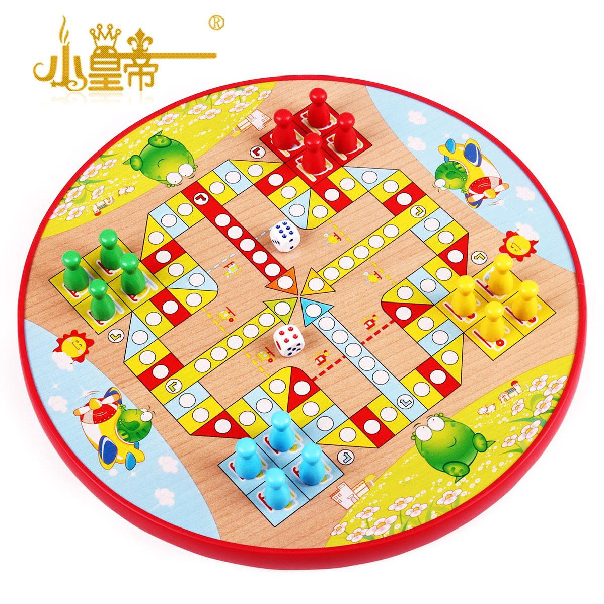
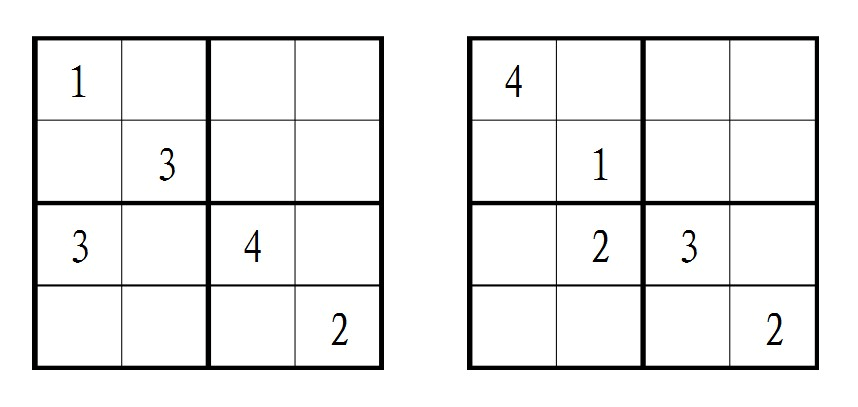
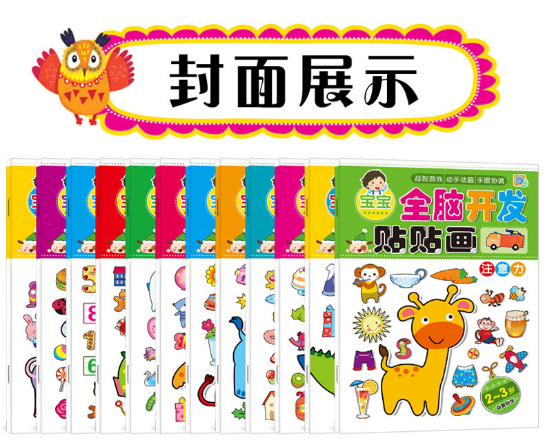
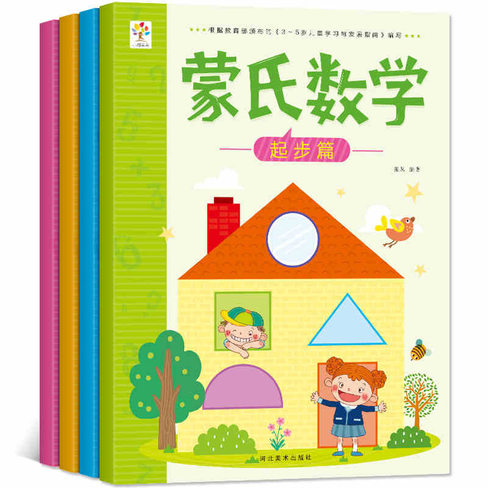
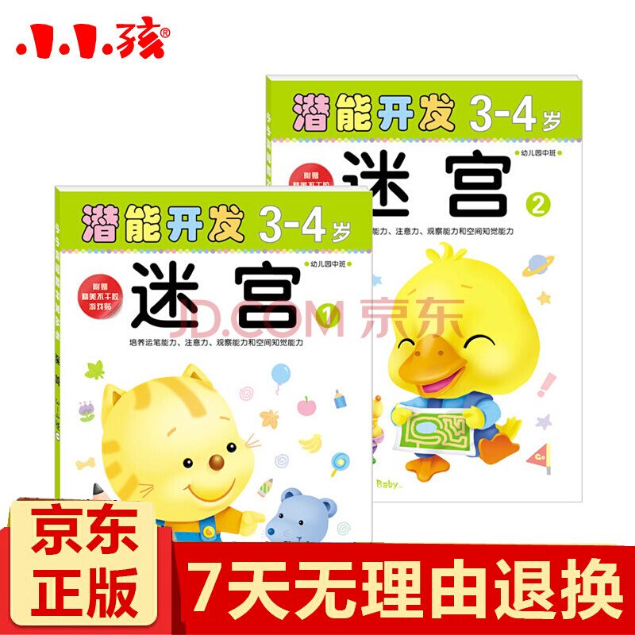
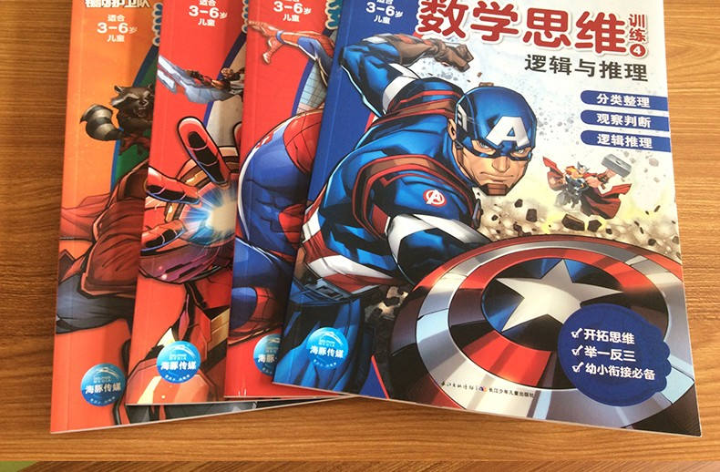
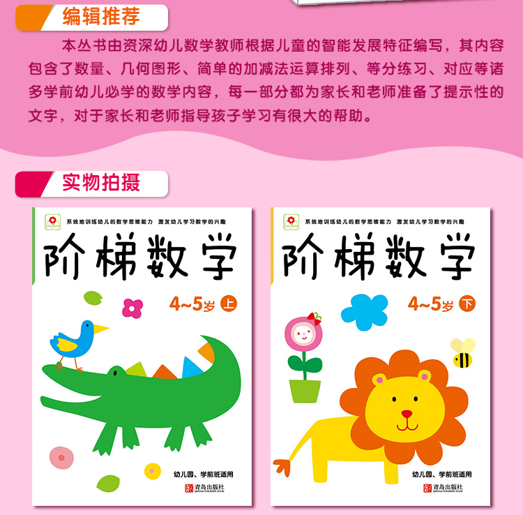
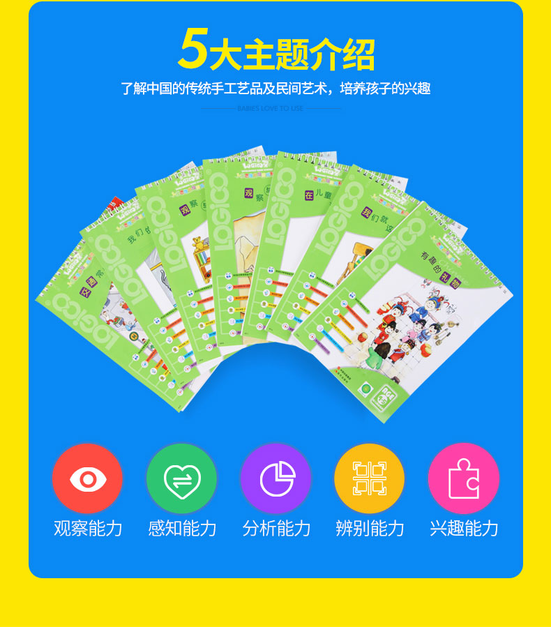

```
{
    "url": "math-thinking",
    "time": "2019/09/25 13:22",
    "tag": "随笔",
    "toc": "yes"
}
```

小彭有4岁上中班了，周围的家长各种班的开始报起了，自己的焦虑感也跟着产生了，担心在不知不觉中差距就产生了。所以最近也在思考这些基础学科的教育问题，怎么做到能学到知识，又不至于产生为了学而学的厌烦情绪。 小孩子对新鲜的事情都比较感兴趣，小彭有对很多事情都有一种“我能行”的性格，也都想去尝试，初生牛犊不畏虎。这里记录一下最近生活中对数学的一些启蒙教育，一方面做一些梳理，另一方面从梳理中看看哪些方面还有欠缺，形成背后一套理论的知识支撑。记录主要来源于以下三方面：游戏、棋牌、书籍。

# 一、游戏

小一些的时候也买过各种数字的书籍，已经有了数的基本概念，但对数字的大小、多少、规律这些其实概念并不强。所以通过一些日常中游戏的方式慢慢加强理解。

## 1.1 猜手指游戏

伸出手指头让对方数一数，用数字来表示伸出来的手指头的个数。用文字可能无法表达其中的意境，但小彭有特别喜欢这个游戏。因为在出手指的过程中通常会伴随着一些手势、POS，很有一种谁更帅的感觉，有时候手指也会动一动干扰对方数数。基础的数字只有`0-9`十个数字，所有后续的数字都以这些为基础，所以对基本数字的认识尤为重要，而两只手正好可以表示出来这所有的数字。各种书籍上也都有这种题，萝卜有几个、香蕉有几根，其实也都是差不多的道理，要做的就是让小孩子一遍一遍的熟悉这些基础数字，加减法也藏在这些手势中了。目前小彭有单只手基本可以不用数就可以看出来，两只手指还要数一数。对数字更熟悉之后，也许会知道反过来看收起来的手指头就知道伸出来手指的个数了。

## 1.2 数一数/加油向前冲

逻辑就是简单的数数字，从1到100，1数到200等。有时候晚上会关掉灯躺着床上数，有时候会骑着单车去上课的过程中数，小彭有喜欢骑单车，正好可以在这个过程中让他数一数，数对了就加油踩踏板，数错了就单车没油了慢慢停下来，这个过程在开车过程中可享受不到，所以很多时候宁愿陪他踏单车。

对四岁的小孩子来说想要不出错也挺难的。数到100还可以，数到200总会有几个点出错。其实过来人都知道数字是有规律的，0-9之后就是10+[0-9]，然后依次20、30，如果碰到了39不知道下一个是多少，就提示1、2、3的后面是数字4，就跳到40了。在我的脑海里，数字是一圈一圈的环绕过来的，然后数字是会走路的，1向前走一步就变成了2。

## 1.3 数字跳一跳

如果有人要你数数，数到一千你可能也不乐意，因为是单方面的在数，这个时候应该有陪伴，可以玩出一些花样来。比如你数单数、他数双数，或者反过来，这就出现了数的分类，把数分为了单数和双数。当然也可以玩的更多花样，往后面多跳几步，比如1、3、5、7的这么数下去。慢慢就有了规律的概念了，按指定步长前进。

## 1.4 比谁大

两个人说出一个数字，后面人说出的数字要比前面的人说出的数字大。用意是想让小孩子理解大小的概念。有些时候还挺好，有些时候就说偏了，成千上万了。

## 1.5 数学加减法

加减法对小孩子来说是比较难的题了，最简单的方式是伸出两只手来数，但数到10就不够了。目前小彭有也会伸出手指来数，但是在一个数字的基础上来数，比如`9+2`，就告诉他可以在较大的数9的基础上往后面走两步，如果是减法就往前面走两步。省去被加数的手指，突破10的上限。加数在10以内加法基本可以搞定。但之后的借位、更大的数还要摸索一下教育方式。

## 1.6 我要去北极

这个游戏是在晚上躺着无聊出来的，他经常说要去北极，所以这个游戏就叫我要去北极，其实就是天马行空的乱想，然后在中间穿插一些卡顿的点拿出来细聊一下，大意就是想随意发散下思维吧。小彭有倒是挺喜欢这个游戏。


# 二、棋牌

目前玩的比较多的两个游戏就是飞行棋和数独，华容道、五子棋这些规则意识还不够。其实感觉这种棋牌游戏挺好，可以提高注意力，也益智。

## 2.1 飞行棋


## 2.2 数独


四宫的数独，只有1、2、3、4然后进行数字补全。目前估计玩过有100局了吧，一般4宫的问题不大，对逻辑思维应该有一些提升，对于缺多个数字的更多的是排除法。

# 三、书籍

看过的几套数学书籍，这种类型的题倒是刷的很快，小孩子愿意去看。

## 3.1 全脑开发 - 贴贴画



小孩子都喜欢贴纸这种，纯娱乐用。

## 3.2 蒙氏数学


## 3.3 潜能开发 - 迷宫


## 3.4 复仇者联盟 - 数学思维


会陪小彭有看一些漫威的电影，对里面的超级英雄很敢兴趣，在超市看到后自己想要买这套书。蜘蛛侠的这套对目前的来说确实是难了点，但兴趣让他看的也差不多了。

## 3.5 阶梯数学


这本书还不错，穿插着会有一些贴纸，让学习过程更加生动。

## 3.6 逻辑狗


这套书也挺好，不同于常规的书籍，挺考验观察能力。

在和小彭有游戏的过程中会得到一些反馈，也让我去思考更好的方式，在陪伴的过程中能体会到他的进步。目前侧重在数学方面多了些，发现英语也要开始补了，顿时感觉压力很大。