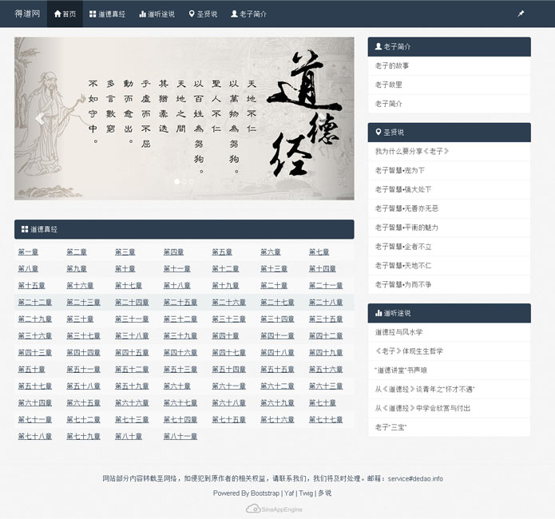

```
{
    "url": "dedaoinfo",
    "time": "2014/04/28 19:58",
    "tag": "随笔"
}
```

前几天申请新浪开发者认证被驳回，驳回原因是需要上传原创应用，并建议通过cloudbbs等级申请。作为一名开发者通过泡论坛的方式来申请认证这无疑是一种讽刺。于是在想做点什么好呢？

去年看到鬼脚七的老子智慧文章，后来又看到曾仕强教授的道德经的奥秘，觉得道德经是一门伟大的哲学，想从中领悟一些做人做事的道理。最近也在微博上发道德经，坚持了一个月。本着兴趣看能不能做个关于道德经的网站呢？

于是周末捣鼓了两天，选择了开源的Bootstrap，SAE自带的YAF，模版使用了TWIG，评论使用了多说，一个网站就差不多成型了，就差个域名。一早起来想注册个域名，尝试多个后选择了dedao.info，Godaddy支付宝付款，DNSPod域名解析，OK 搞定！得道网开通了。。。

**得道网** - http://www.dedao.info



得道网只是兴趣使然，希望后面可以弄的更好，更多的还是希望可以领悟一些人生道理。

过几天再申请开发者认证看看怎么说^_^

**2014-04-30**

前后台的程序基本上无大问题，但搜索引擎都还没索引，想想还是尝试申请开发者认证试试吧， 如果不合格也应该只是UIP的问题。

结果顺利完成SAE开发者认证。。。！